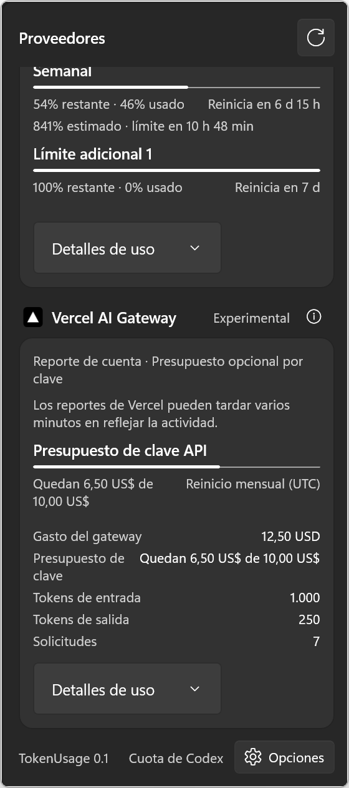

# TokenUsage

TokenUsage is a Windows app for viewing AI coding-tool quota, token use, and spend from sources already available on the computer. It does not require a TokenUsage account.

> TokenUsage is in active pre-release development. Project names and namespaces still use `WOpenUsage` while the product name changes.



## What works today

- Codex quota and reset windows through the official local `app-server` process.
- Local usage and cost views for Codex, Claude, Grok Build, and OpenCode.
- Vercel AI Gateway quota and spend with keys stored in Windows Credential Locker.
- Daily usage heatmaps, provider details, configurable colors, and quota alerts.
- English and Spanish UI.
- A packaged `wusage` command for usage, limits, provider status, and diagnostics.

Provider data can be authoritative, local, estimated, incomplete, stale, blocked, or unavailable. The UI labels the source and state instead of treating each value as a remote quota.

## Privacy and security

TokenUsage reads the smallest useful local data source for each provider. It does not index prompts, conversations, tool calls, or commands. Provider support requires a public contract, an approved local aggregate, or an explicit key supplied by the user.

- User-supplied keys go to Windows Credential Locker.
- Local API access and telemetry stay off by default.
- Credentials and customer content must not enter logs, diagnostics, fixtures, or the repository.

See [SECURITY.md](SECURITY.md) to report a security issue.

## Requirements

- Windows 10 version 1809 or later, on `x64` or `ARM64`.
- .NET 10 SDK.
- Visual Studio with MSBuild, Windows app packaging tools, and Windows SDK `10.0.26100.0` for the full packaged build.

The app uses C#, WinUI 3, Windows App SDK, and a full-trust MSIX package. `AnyCPU` and `x86` are not supported.

## Build and run

From PowerShell at the repository root:

```powershell
.\BuildAndRun.ps1 src\WOpenUsage.App\WOpenUsage.App.csproj -SkipRun /p:Platform=x64
```

Build and launch with package identity:

```powershell
.\BuildAndRun.ps1 src\WOpenUsage.App\WOpenUsage.App.csproj -Detach /p:Platform=x64
```

The build helper launches the packaged app through `winapp`. Do not run the packaged executable directly.

Run the local quality gate:

```powershell
.\scripts\check.ps1 -Platform x64 -Configuration Release
```

Use `-Platform ARM64` for a cross-architecture package build. Tests still run on the `x64` host.

## Command line

After installing the package and enabling its execution alias:

```powershell
wusage usage --days 7 --format human
wusage limits --format json
wusage providers --format human
wusage doctor --format human
```

The JSON contracts are versioned as `wusage.usage.v1`, `wusage.limits.v1`, `wusage.providers.v1`, and `wusage.doctor.v1`.

## Project map

- `src/WOpenUsage.App`: WinUI application and composition.
- `src/WOpenUsage.Core`: portable domain contracts.
- `src/WOpenUsage.Providers`: provider adapters.
- `src/WOpenUsage.Platform.Windows`: Windows services.
- `src/WOpenUsage.Runtime.Windows`: shared Windows runtime composition.
- `src/WOpenUsage.Cli`: packaged command-line app.
- `tests`: architecture, core, provider, platform, and CLI tests.
- `docs`: product, architecture, provider, research, design, and evidence records.

Start with the [product specification](docs/PRODUCT-SPEC.md), [provider matrix](docs/PROVIDER-MATRIX.md), [implementation plan](docs/IMPLEMENTATION-PLAN.md), and [Windows architecture decision](docs/architecture/ADR-0001-windows-native-baseline.md).

## Provider policy

TokenUsage has no shared login service. Each provider must expose a source that can be used without copying another app's session token or reading its credential store. If the remaining quota cannot be read under that rule, TokenUsage may show observed local usage or spend with clear coverage and pricing notes.

Research gates for planned providers live under [`docs/research`](docs/research). A documented gate does not mean that the provider is implemented.

## Contributing

Read [CONTRIBUTING.md](CONTRIBUTING.md) before opening a change. Keep secrets and real customer data out of issues, commits, screenshots, and tests.

## License status

The project owner has not selected a license for TokenUsage yet. Until a license file is added, copyright law reserves the project code and assets. Third-party material and its terms are listed in [THIRD-PARTY-NOTICES.md](THIRD-PARTY-NOTICES.md).

TokenUsage is an independent project. Provider names and marks belong to their owners. OpenUsage is a reference implementation and does not endorse this project.
