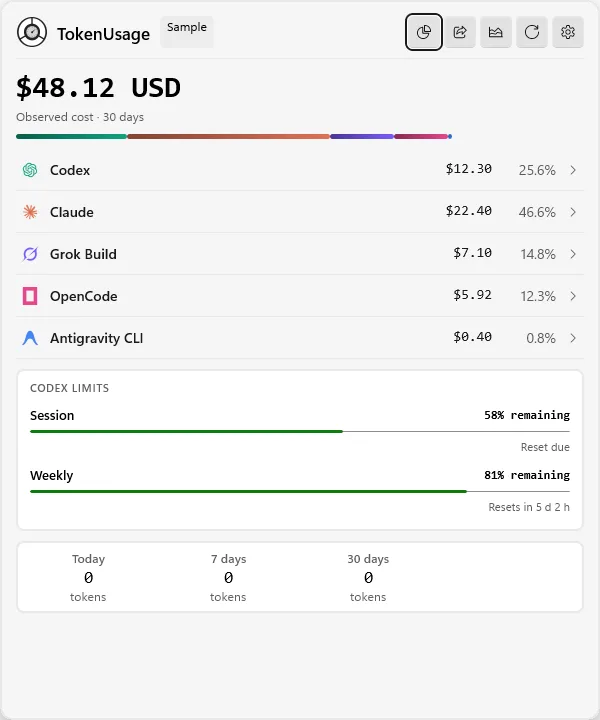
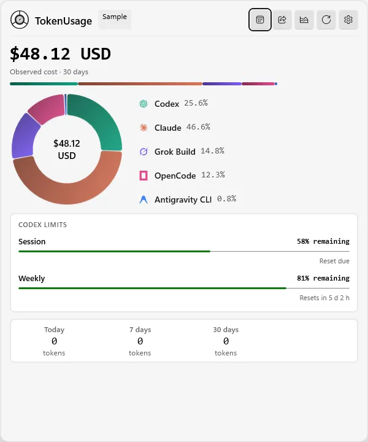
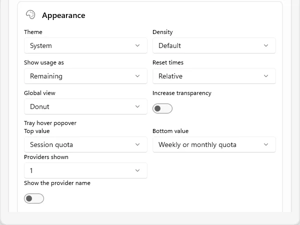
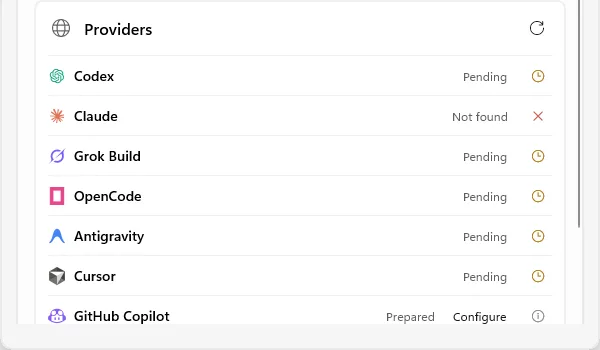

<p align="center">
  <picture>
    <source media="(prefers-color-scheme: dark)" srcset="https://shieldcn.dev/header/document.svg?title=TokenUsage&subtitle=Quota%2C+tokens%2C+cost%2C+and+reset+cycles+for+AI+coding+tools&logo=windows&theme=green&align=center&mode=dark" />
    
  </picture>
</p>

<p align="center">
  <a href="https://github.com/gvastethecreator/tokenusage/actions/workflows/ci.yml"></a>
  <a href="https://gvastethecreator.github.io/tokenusage/"></a>
  
  <a href="https://github.com/gvastethecreator/tokenusage/stargazers"></a>
  <a href="LICENSE"></a>
</p>

<p align="center">
  <a href="https://gvastethecreator.github.io/tokenusage/">Project site</a> ·
  <a href="#product-tour">Product tour</a> ·
  <a href="#provider-support">Providers</a> ·
  <a href="#build-and-run">Build</a> ·
  <a href="#command-line">CLI</a>
</p>

TokenUsage turns the usage data already available on your computer into one clear view. Open the tray panel for a quick check. Open the report for trends, provider comparisons, costs, tokens, and reset cycles. Use the CLI for scripts and diagnostics.

No TokenUsage account is required. Provider data stays local unless you enable a documented opt-in connection.

> [!IMPORTANT]
> TokenUsage `0.0.1` is in active pre-release development. Provider coverage varies by product version, account type, and available data source.

## What you get

- **Fast tray view** — check total spend, provider activity, Codex limits, and selected provider quotas.
- **Detailed reports** — compare providers, ranges, metrics, charts, and tables, then export a clean capture.
- **Honest data states** — reported, estimated, partial, stale, unavailable, and unpriced values remain distinct.
- **Reset history** — inspect observed Codex reset cycles, including early resets detected before the expected date.
- **Stable CLI output** — read usage, reports, limits, provider status, and diagnostics as human text or versioned JSON.
- **Local-first and English-only** — keep the interface predictable without indexing conversations or commands.

## Product tour

| Compact overview | Spend distribution |
| --- | --- |
|  |  |
| **Appearance settings** | **Provider coverage** |
|  |  |

The dashboard screenshots use the app's deterministic sample mode. They do not contain account data, local paths, or real usage totals.

## Provider support

TokenUsage maintains a 56-provider catalog. A catalog entry is not the same as a working integration.

| State | Count | Meaning |
|---|---:|---|
| Active | 10 | A bounded reader produces real local usage data. |
| Opt-in, held | 1 | The adapter is retained, but the provider is currently disabled. |
| Prepared | 36 | Identity, capabilities, and status exist. No reader runs. |
| Policy blocked | 9 | The known source is unsafe, private, unstable, or not permitted. |

### Active readers

| Provider | Local usage | Cost | Live quota |
|---|---|---|---|
| Codex | Yes | Reported or estimated | Yes, through the official local `app-server` |
| Claude Code | Yes | Reported or estimated | Not available through an approved interface |
| Cursor | Yes, partial | Estimated when the model matches | Not available through the current contract |
| Grok Build | Yes | Reported or estimated | Not available through an approved interface |
| Grok Bot | No | Not available through an approved interface | Not available through an approved interface |
| OpenCode | Yes | Reported | No common quota source |
| Antigravity | Yes, experimental | Estimated | Blocked by policy |
| Amp | Yes, partial | Credits stay separate from USD | No stable public source |
| Mux | Yes | Reported | No common quota source |
| Goose | Yes, partial | Estimated when pricing exists | No common quota source |
| Hermes | Yes, partial | Reported or estimated | No common quota source |

See the [provider matrix](docs/PROVIDER-MATRIX.md) for sources, limits, planned providers, and publication gates.

TokenUsage never creates fake activity for prepared or blocked providers. Missing data appears as missing data.

## How the data works

Each provider adapter reads the smallest approved source that can answer a usage question. Sources include official local APIs, bounded numeric logs, and read-only aggregate database queries.

TokenUsage keeps these values separate:

- provider-reported cost
- cost estimated from known model pricing
- tokens without a known price
- coverage and freshness
- quota remaining and reset time
- observed local usage.

An API-rate estimate is not a subscription invoice. A local usage total is not a remote account quota.

## Privacy and security

- No prompt, response, conversation, command, tool call, email, or account identifier enters usage storage.
- TokenUsage does not copy another application's session token or read its credential store.
- User-supplied keys use Windows Credential Locker.
- Local API access and telemetry stay off by default.
- Logs, diagnostics, fixtures, issues, and pull requests must not contain credentials or customer content.

Read [SECURITY.md](SECURITY.md) before reporting a vulnerability.

## Requirements

- Windows 10 version 1809 or later.
- An `x64` or `ARM64` computer.
- .NET 10 SDK.
- Visual Studio with MSBuild, Windows app packaging tools, and Windows SDK `10.0.26100.0` for packaged builds.

TokenUsage uses C#, WinUI 3, Windows App SDK, and a full-trust MSIX package. `AnyCPU` and `x86` are not supported.

## Release downloads

Published releases can include two Windows x64 files:

- A signed MSIX package for normal installation
- A portable ZIP that does not require installation

The portable ZIP contains the app and CLI. Run `tokenusage.cmd` from its root to use the CLI.

Both executables use the `Data` folder beside the app executable.

Keep `TokenUsage.portable` in the extracted folder. Move the complete folder when you move or update the portable app.

The MSIX and portable builds use separate data folders. Installing one build does not delete or import data from the other build.

Read the [release procedure](docs/RELEASING.md) for build, signature, and publication details.

## Build and run

Build from PowerShell at the repository root:

```powershell
.\BuildAndRun.ps1 src\TokenUsage.App\TokenUsage.App.csproj -SkipRun /p:Platform=x64
```

Build and launch with package identity:

```powershell
.\BuildAndRun.ps1 src\TokenUsage.App\TokenUsage.App.csproj -Detach /p:Platform=x64
```

The helper launches the packaged app through `winapp`. Do not run the packaged executable directly.

Run the complete local gate before requesting review:

```powershell
.\scripts\check.ps1 -Platform x64 -Configuration Release
```

Use `-Platform ARM64` for a cross-architecture package build. Tests still run on the `x64` host.

For a quick dependency and security pass on active projects:

```powershell
.\scripts\deps-check.ps1
.\scripts\audit.ps1
```

The repository uses the .NET SDK and MSBuild; no Bun or pnpm runtime is part
of this native project. Archived probes under `.scratch` are retained as
evidence and are not part of the active dependency graph.

## Command line

Install the package and enable its execution alias. Then run:

```powershell
tokenusage refresh
tokenusage usage --days 7 --format human
tokenusage report --days 30 --format human
tokenusage report --from 2026-07-01 --to 2026-07-31 --agent codex --format json
tokenusage limits --format json
tokenusage providers --format human
tokenusage doctor --format human
```

Run `tokenusage refresh` before a report when the app has not updated the local store. Refresh writes normalized numeric records from installed providers.

The JSON contracts use versioned names such as `tokenusage.usage.v1`, `tokenusage.report.v1`, and `tokenusage.providers.v1`.

## Documentation

- [Documentation index](docs/README.md)
- [Provider matrix](docs/PROVIDER-MATRIX.md)
- [Architecture decisions](docs/architecture)
- [Contributor testing guide](docs/CONTRIBUTOR-TESTING.md)
- [Maintenance dependency notes](docs/DEPENDENCY_UPDATES.md)
- [Quality audit](docs/QUALITY_AUDIT.md)

### Repository map

| Path | Responsibility |
|---|---|
| `src/TokenUsage.App` | WinUI views, view models, and application composition |
| `src/TokenUsage.Core` | Portable domain, storage, cache, and coordination contracts |
| `src/TokenUsage.Providers` | Provider adapters and pricing support |
| `src/TokenUsage.Platform.Windows` | Windows integration |
| `src/TokenUsage.Runtime.Windows` | Shared Windows runtime composition |
| `src/TokenUsage.Cli` | Commands and stable JSON output |
| `src/TokenUsage.Package` | MSIX manifest and packaged payloads |
| `tests` | Architecture, core, provider, platform, app, and CLI tests |

## Contributing

Contributions and pull requests are welcome.

**Open an issue before writing the change.** Every pull request must link its issue and stay within the agreed scope.

Provider contributions need reproducible evidence. This rule is especially important when maintainers cannot access the provider. A mock fixture alone does not prove a real integration.

Read [CONTRIBUTING.md](CONTRIBUTING.md) and the [contributor testing guide](docs/CONTRIBUTOR-TESTING.md) before starting.

## Acknowledgements

The provider catalog and documentation structure take inspiration from [OpenUsage](https://github.com/janekbaraniewski/openusage), [CodexBar](https://github.com/steipete/CodexBar), and [CodeBurn](https://github.com/getagentseal/codeburn). TokenUsage adapts those ideas to a native Windows app with its own privacy and evidence rules.

These projects do not endorse TokenUsage. Provider names and marks belong to their owners.

## License

TokenUsage is available under the [MIT License](LICENSE). Third-party material and terms appear in [THIRD-PARTY-NOTICES.md](THIRD-PARTY-NOTICES.md).

<h4 align="right">Support continued development</h4>
<p align="right">
  <a href="https://github.com/sponsors/gvastethecreator/"></a>
  <a href="https://ko-fi.com/gvaste"></a>
  <a href="https://x.com/gvastebb"></a>
</p>
