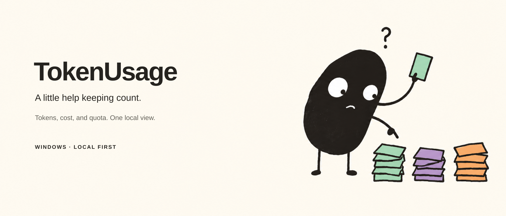
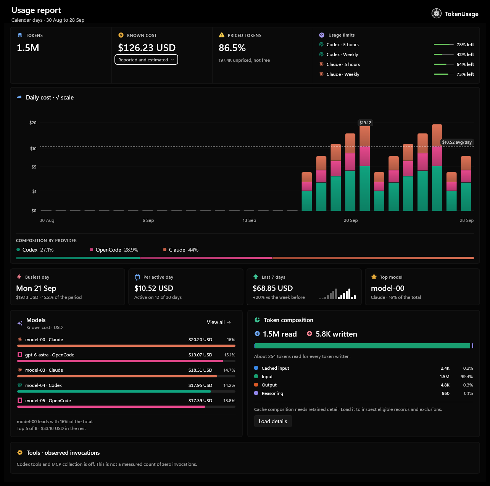
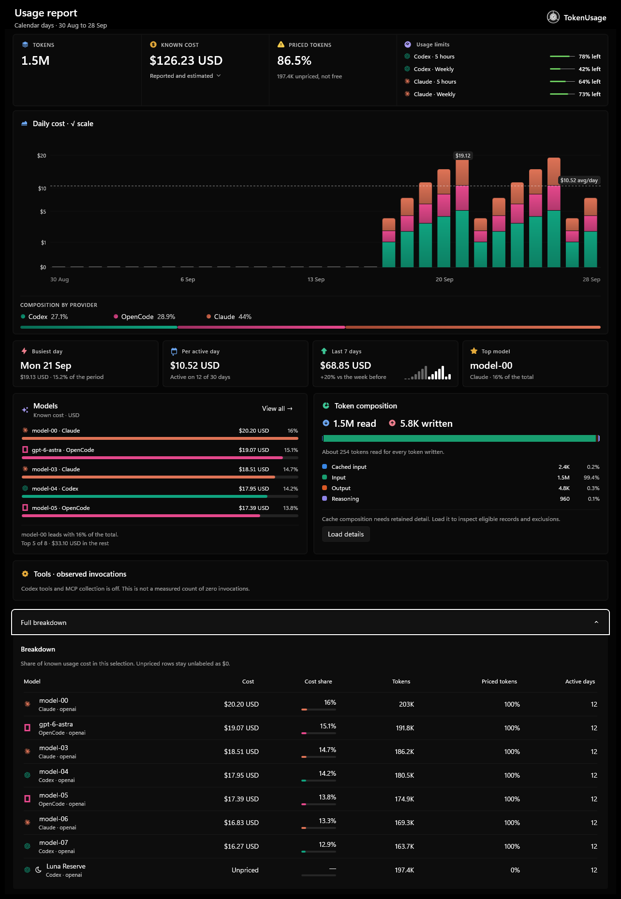

<p align="center">
  
</p>

<p align="center">
  <a href="https://github.com/gvastethecreator/tokenusage/actions/workflows/ci.yml"></a>
  <a href="https://gvastethecreator.github.io/tokenusage/"></a>
  
  <a href="https://github.com/gvastethecreator/tokenusage/stargazers"></a>
  <a href="LICENSE"></a>
</p>

<p align="center">
  <a href="https://gvastethecreator.github.io/tokenusage/">Project site</a> ·
  <a href="#release-downloads">Download</a> ·
  <a href="#product-tour">Product tour</a> ·
  <a href="#provider-support">Providers</a> ·
  <a href="CHANGELOG.md">Changelog</a> ·
  <a href="#build-and-run">Build</a> ·
  <a href="#command-line">CLI</a>
</p>

A Windows tray app for keeping track of AI coding usage. See your tokens, known cost, and available quota in one place, then open the report when you want the detail. The CLI exposes the same local data for scripts and diagnostics.

No TokenUsage account is required. Provider data stays local unless you enable a documented opt-in connection.

> [!IMPORTANT]
> The current release is an **unsigned Windows x64 portable preview**. [Download preview 5](https://github.com/gvastethecreator/tokenusage/releases/tag/v0.0.1-preview.5). Provider coverage depends on the tool, account, and available data source.

## What you get

- **Fast tray view** — check total spend, provider activity, Codex limits, and selected provider quotas.
- **Detailed reports** — compare providers, ranges, metrics, charts, and tables. Shared captures respect which sections you have expanded.
- **Honest data states** — reported, estimated, partial, stale, unavailable, and unpriced values remain distinct.
- **Reset history** — inspect observed Codex reset cycles, including early resets detected before the expected date.
- **Stable CLI output** — read usage, reports, limits, provider status, and diagnostics as human text or versioned JSON.
- **Local-first and English-only** — keep the interface predictable without indexing conversations or commands.

## Product tour

### The report

Tokens, known cost, priced tokens, and compact provider limits share the first row. Compare daily activity below, then expand the full breakdown when you need individual models and providers.



Shared captures include expanded sections and leave collapsed sections out. They preserve the report's current selection.

### Open the detail you want to share



These are fresh captures of the native application with synthetic sample data. They contain no account data or personal paths. The banner mascot is an illustration generated with imagegen.

## Provider support

TokenUsage maintains a 56-provider catalog. A catalog entry is not the same as a working integration.

| State | Count | Meaning |
|---|---:|---|
| Active | 12 | A bounded reader produces real local usage data. |
| Opt-in | 2 | A remote reader runs after you save your own API key. |
| Prepared | 33 | Identity, capabilities, and status exist. No reader runs. |
| Policy blocked | 9 | The known source is unsafe, private, unstable, or not permitted. |

### Active readers

| Provider | Local usage | Cost | Live quota |
|---|---|---|---|
| Codex | Yes | Reported or estimated | Yes, through the official local `app-server` |
| Claude Code | Yes | Reported or estimated | Yes, opt-in, from the documented status line `rate_limits` (5-hour and weekly) |
| Cursor | Yes, partial | Estimated when the model matches | Not available through the current contract |
| Grok Build | Yes | Reported or estimated | Not available through an approved interface |
| ZCode | Yes, counters per request | Estimated when the model matches | Not available through an approved interface |
| OpenCode | Yes | Reported or estimated | No common quota source |
| Antigravity | Yes, experimental | Estimated | Blocked by policy |
| Amp | Yes, partial | Credits stay separate from USD | No stable public source |
| Mux | Yes | Reported | No common quota source |
| Goose | Yes, partial | Estimated when pricing exists | No common quota source |
| Hermes | Yes, partial | Reported or estimated | No common quota source |
| GitHub Copilot | Yes, VS Code chat sessions, partial | Recorded AI credits before plan allowances | No remaining-quota source |

OpenRouter and Vercel AI Gateway are opt-in remote connections. OpenRouter reads
key limits and UTC spending totals. Vercel reads the saved key's usage, available
budget, and team credit balance. These account readings stay separate from local
usage totals. Save or remove your key in Settings; keys use Windows Credential Locker.

See the [provider matrix](docs/PROVIDER-MATRIX.md) for sources, limits, planned providers, and publication gates.

TokenUsage never creates fake activity for prepared or blocked providers. Missing data appears as missing data.

## How the data works

Each provider adapter reads the smallest approved source that can answer a usage question. Sources include official local APIs, bounded numeric logs, and read-only aggregate database queries.

TokenUsage keeps these values separate:

- provider-reported cost
- cost estimated from known model pricing
- tokens without a known price
- coverage and freshness
- quota remaining and reset time
- observed local usage.

An API-rate estimate is not a subscription invoice. A local usage total is not a remote account quota.

## Privacy and security

- No prompt, response, conversation, command, tool call, email, or account identifier enters usage storage.
- TokenUsage does not copy another application's session token or read its credential store.
- User-supplied keys use Windows Credential Locker.
- Local API access and telemetry stay off by default.
- Logs, diagnostics, fixtures, issues, and pull requests must not contain credentials or customer content.

Read [SECURITY.md](SECURITY.md) before reporting a vulnerability.

## Requirements

The portable preview runs on Windows x64 and includes its .NET and Windows App SDK runtimes. The app targets Windows 10 version 1809 or later. This preview has been checked on Windows 11; clean-machine qualification is still pending.

Building from source also requires the .NET 10 SDK, Visual Studio with MSBuild and Windows app packaging tools, and Windows SDK `10.0.26100.0`. Source builds support x64 and ARM64; this release includes x64 only.

## Release downloads

[Download v0.0.1-preview.5](https://github.com/gvastethecreator/tokenusage/releases/tag/v0.0.1-preview.5), extract the ZIP, and open `TokenUsage.App.exe`.

This preview is **unsigned and portable-only**. Windows may show a publisher or SmartScreen warning. It has no MSIX installer and is not delivered by automatic updates. See the [release notes](docs/releases/0.0.1.md) for fixes and limits.

The portable ZIP contains the app and CLI. Run `tokenusage.cmd` from its root to use the CLI.

Both executables use the `Data` folder beside the app executable.

Keep `TokenUsage.portable` in the extracted folder. Move the complete folder when you move or update the portable app.

The MSIX and portable builds use separate data folders. Installing one build does not delete or import data from the other build.

Read the [release procedure](docs/RELEASING.md) for build, signature, and publication details.

### Automatic updates

In Options → General, enable automatic updates to check GitHub once every
24 hours while TokenUsage runs. Startup checks respect the same interval.
Updates are off by default. You can also
check and install manually. Only newer stable releases for your architecture are
accepted; downloads must pass GitHub SHA-256 and size verification.

Portable updates apply after exit and preserve the Data folder. Direct MSIX
updates also require a trusted package signature and Windows 10 version 2004 or
later. Store installations use Microsoft Store updates; development builds do
not self-update. Builds released before this updater need one manual upgrade.

## Build and run

Build from PowerShell at the repository root:

```powershell
.\BuildAndRun.ps1 src\TokenUsage.App\TokenUsage.App.csproj -SkipRun /p:Platform=x64
```

Build and launch with package identity:

```powershell
.\BuildAndRun.ps1 src\TokenUsage.App\TokenUsage.App.csproj -Detach /p:Platform=x64
```

The helper launches the packaged app through `winapp`. Do not run the packaged executable directly.

Run the complete local gate before requesting review:

```powershell
.\scripts\check.ps1 -Platform x64 -Configuration Release
```

Use `-Platform ARM64` for a cross-architecture package build. Tests still run on the `x64` host.

For a quick dependency and security pass on active projects:

```powershell
.\scripts\deps-check.ps1
.\scripts\audit.ps1
```

The repository uses the .NET SDK and MSBuild.

## Command line

Install the package and enable its execution alias. Then run:

```powershell
tokenusage refresh
tokenusage usage --days 7 --format human
tokenusage report --days 30 --format human
tokenusage report --from 2026-07-01 --to 2026-07-31 --agent codex --format json
tokenusage limits --format json
tokenusage providers --format human
tokenusage doctor --format human
tokenusage pricing audit --format human
tokenusage pricing refresh --dry-run
```

Pricing evidence keeps direct API rates separate from host-specific rates. The
weekly refresh checks only allowlisted official pages and never stores their
content or edits a price. See [pricing evidence and refresh](docs/PRICING.md).

Run `tokenusage refresh` before a report when the app has not updated the local store. Refresh writes normalized numeric records from installed providers.

The JSON contracts use versioned names such as `tokenusage.usage.v1`, `tokenusage.report.v1`, and `tokenusage.providers.v1`.

## Documentation

- [Documentation index](docs/README.md)
- [Provider matrix](docs/PROVIDER-MATRIX.md)
- [Contributor testing guide](docs/CONTRIBUTOR-TESTING.md)
- [Release procedure](docs/RELEASING.md)
- [Maintenance dependency notes](docs/DEPENDENCY_UPDATES.md)

### Repository map

| Path | Responsibility |
|---|---|
| `src/TokenUsage.App` | WinUI views, view models, and application composition |
| `src/TokenUsage.Core` | Portable domain, storage, cache, and coordination contracts |
| `src/TokenUsage.Providers` | Provider adapters and pricing support |
| `src/TokenUsage.Presentation` | Shared dashboard and report presentation |
| `src/TokenUsage.Platform.Windows` | Windows integration |
| `src/TokenUsage.Runtime.Windows` | Shared Windows runtime composition |
| `src/TokenUsage.Cli` | Commands and stable JSON output |
| `src/TokenUsage.Package` | MSIX manifest and packaged payloads |
| `tests` | Architecture, core, provider, platform, app, and CLI tests |

## Contributing

Contributions and pull requests are welcome.

**Open an issue before writing the change.** Every pull request must link its issue and stay within the agreed scope.

Provider contributions need reproducible evidence. This rule is especially important when maintainers cannot access the provider. A mock fixture alone does not prove a real integration.

Read [CONTRIBUTING.md](CONTRIBUTING.md) and the [contributor testing guide](docs/CONTRIBUTOR-TESTING.md) before starting.

## Acknowledgements

The provider catalog and documentation structure take inspiration from [OpenUsage](https://github.com/janekbaraniewski/openusage), [CodexBar](https://github.com/steipete/CodexBar), and [CodeBurn](https://github.com/getagentseal/codeburn). TokenUsage adapts those ideas to a native Windows app with its own privacy and evidence rules.

These projects do not endorse TokenUsage. Provider names and marks belong to their owners.

## License

TokenUsage is available under the [MIT License](LICENSE). Third-party material and terms appear in [THIRD-PARTY-NOTICES.md](THIRD-PARTY-NOTICES.md).

<h4 align="right">Support continued development</h4>
<p align="right">
  <a href="https://github.com/sponsors/gvastethecreator/"></a>
  <a href="https://ko-fi.com/gvaste"></a>
  <a href="https://x.com/gvastebb"></a>
</p>
