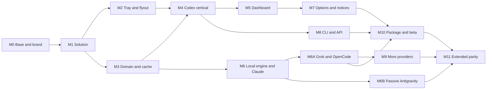

# Implementation plan

Status: ready to run

Base date: 2026-07-21

Formal product: TokenUsage
Technical identity: TokenUsage
Reference upstream: `robinebers/openusage@9d2bf09f10e21f769494a525a9d65c84d7aeb1df`
Spend references: `getagentseal/codeburn@6e3c57a9ff95a624f1d9affa7384d32a67f359b7` and `kenn-io/agentsview@1ee2de88e2dae54326d8b47aeb2de2f58b5944f9`

## Goal

The work delivers a native Windows app that opens from the tray. The app shows quota, tokens, and spend from existing sessions. It keeps reliable data during failures. It can grow toward the OpenUsage provider set.

The public and technical identity uses `TokenUsage` from the name cutover of 2026-08-04. ADR-0002 records the scope and the pending package risks.

## Scope by delivery

### Technical MVP

- repo and WinUI solution
- tray, flyout, single instance, and startup
- domain, cache, refresh, and states
- Codex through `app-server`
- Codex panel with Used/Remaining, reset, pace, and daily usage
- minimum Options and diagnostics
- tests and x64 MSIX beta package

### Product beta

- complete dashboard UI and customization
- theme, high contrast, keyboard, and screen reader
- notifications
- CLI
- optional secure local API
- first-party local usage and spend engine
- local Claude, Grok Build, and OpenCode usage
- x64 and ARM64
- installation, update, and uninstall tested

### Extended parity

- Total spend, coverage, and detail by model
- OpenRouter with a manual key. Z.ai only after its gate reopens
- Cursor Teams and Enterprise with a manual Admin API. Individual blocked
- Copilot paid personal billing and organization with a manual token. No remaining quota
- live Claude only after the provider gate
- passive local Antigravity and organization Devin ACUs as experimental channels
- Kilo Code and Zed only after their gates reopen. Outside the current parity beta

## Execution rules

1. Read `README.md`, the research, the specification, the ADR, and the matrix before code.
2. Keep unrelated changes. Inspect `git status --short --branch` before you edit.
3. Create small work with a test. When the work is green, make its own commit.
4. Use the stack and the scripts of the `winui-mvvm` template.
5. Build for `x64` or `ARM64`. Do not use `AnyCPU`.
6. Keep `Package.appxmanifest`.
7. Start the app with the template build script. Do not open the packaged `.exe` directly.
8. Add packages without a manual version. Make sure that restore succeeds at once.
9. Do not read, print, or copy secrets in tests or logs.
10. A gated provider fails closed and keeps the rest of the app.
11. Update docs, fixtures, and diagnostic text for each behavior change.
12. Run long suites at the close of a milestone.

## Dependency map



## M0 — Prior decisions and legal base

Effort: 1–2 days. It does not block prototypes that use the internal name.

### Tasks

- `M0.1` Keep `TokenUsage` as the approved formal name. Choose the final domain and logo before external signing.
- `M0.2` Define Publisher ID, company, and support contact.
- `M0.3` Choose beta distribution: private App Installer or Store flight.
- `M0.4` Create `THIRD-PARTY-NOTICES.md` with the OpenUsage MIT license and every copied dependency.
- `M0.5` Record the upstream SHA and a function table in `docs/UPSTREAM-BASELINE.md`.
- `M0.6` Define a policy review process per provider.
- `M0.7` Contact OpenAI before enterprise use of the Codex client, per the `clientInfo` note of app-server.
- `M0.8` Ask Anthropic for a read-only quota interface or permission.
- `M0.9` Ask xAI for a read-only quota output that is suitable for another app.
- `M0.10` Record the ban on third-party Antigravity login. Review its FAQ before each beta.

### Tests

- review of names and packages against existing trademarks
- audit of copied files and notices
- review that no OpenUsage name or logo appears as the product

### Output

- identity ready for packaging
- third-party and provider documents that are traceable
- external gates with an owner and a status

## M1 — WinUI scaffold and repo discipline

Effort: 2–3 days.

### Tasks

- `M1.1` Make sure that .NET, the `winui-mvvm` template, Windows App SDK, and Developer Mode are present. If something is missing, run the WinUI preparation flow before you continue.
- `M1.2` Create the app from the root with `dotnet new winui-mvvm -n TokenUsage.App -o src/TokenUsage.App`. Do not create the folder by hand.
- `M1.3` Create the solution and the `Core`, `Providers`, `Platform.Windows`, and `Cli` projects.
- `M1.4` Create the five test projects defined in the ADR.
- `M1.5` Add references with the direction from the ADR.
- `M1.6` Create `Directory.Build.props`, nullable analysis, warnings, and shared style. Do not break the generated XAML.
- `M1.7` Keep `Package.appxmanifest`. Declare only required capabilities.
- `M1.8` Add `scripts/check.ps1` that runs restore, short tests, and an x64 build.
- `M1.9` Configure Windows CI with NuGet cache and test artifacts.
- `M1.10` Add an architecture test that forbids `Core` references to UI or Windows.

### Verification

```powershell
dotnet restore
dotnet test tests\TokenUsage.Core.Tests -p:Platform=x64
dotnet build TokenUsage.slnx -p:Platform=x64
powershell -ExecutionPolicy Bypass -File .\BuildAndRun.ps1 src\TokenUsage.App\TokenUsage.App.csproj -SkipRun /p:Platform=x64
```

Launch uses asynchronous mode during work with tools. A person starts and closes the generated shell by hand.

### Output

- solution builds on x64
- generated app opens through the script
- basic CI is green
- manifest and references are correct
- first scaffold commit

## M2 — Tray, flyout, and single instance

Effort: 5–8 days.

Approved target: OpenUsage parity for Windows. The shell uses 320 DIPs, height by content, headers outside the cards, and Fluent controls.

### Tasks

- `M2.1` Implement `TrayIconHost` with `Shell_NotifyIconW` and version 4.
- `M2.2` Handle click, keyboard, context menu, and `TaskbarCreated`.
- `M2.3` Create icon resources for neutral, amber, red, and high contrast.
- `M2.4` Get the HWND of the WinUI window and wrap the interop.
- `M2.5` Configure `AppWindow` with no frame, not resizable, and able to hide.
- `M2.6` Position with `Shell_NotifyIconGetRect`, monitor, DPI, and work area.
- `M2.7` If the icon is in overflow or there is no rectangle, define a fallback.
- `M2.8` Hide on lost focus. Protect modal dialogs.
- `M2.9` Implement single instance and activation redirection.
- `M2.10` Add a menu with Update, Options, and Exit.
- `M2.11` Add a mock shell with loading, data, empty, and error states.
- `M2.12` Record a manual test list by taskbar position, monitor, and DPI.

### Focused tests

- unit tests for position calculation with synthetic rectangles
- unit tests for tooltip summary and worst state
- integration of tray messages with a fake host
- UI automation: click opens, second click closes, `Esc` closes, keyboard opens the menu
- manual: restart Explorer and make sure that the icon returns
- manual: each taskbar position that the system allows
- manual: two monitors with different scales

### Output

- one instance only
- reliable and accessible tray
- panel always inside the monitor
- zero console window
- screenshot evidence for light, dark, and high contrast

## M3 — Domain, cache, and refresh

Effort: 5–7 days.

### Tasks

- `M3.1` Create IDs, metrics, snapshots, provenance, and outcomes.
- `M3.2` Create `IProviderRuntime`, `IClock`, `IFileSystem`, `IProcessRunner`, `ISecretStore`, and network.
- `M3.3` Implement `RefreshCoordinator` with a result per provider.
- `M3.4` Add TTL, force refresh, timeout, and cancellation.
- `M3.5` Add backoff with jitter and respect for `Retry-After`.
- `M3.6` Create JSON `SnapshotStore` with a mutex and atomic replacement.
- `M3.7` Create `SettingsStore` and v1 migration.
- `M3.8` Calculate freshness, last valid value, and stale state.
- `M3.9` Implement the pace engine with an injectable clock.
- `M3.10` Publish incremental events to ViewModels.
- `M3.11` Create a deterministic fake provider for UI and tests.

### Focused tests

- all metric and outcome variants
- valid, stale, damaged, migrated, and interrupted-write cache
- two processes compete for the same document
- slow provider, crash, timeout, and cancellation
- a partial batch publishes fast providers
- normal pace, near, exhaustion, new window, and a clock that changes
- last valid value remains during failures
- `No data` never becomes zero

### Output

- `Core` with no Windows references
- cache visible before the network
- parallel and cancelable refresh
- deterministic tests with no real waits
- documented snapshot contract

## M4 — End-to-end Codex vertical

Effort: 6–9 days.

### Tasks

- `M4.1` Implement safe resolution of the Codex binary and an explicit override.
- `M4.2` Create `CodexAppServerProcess` with Job Object, stdio, and safe close.
- `M4.3` Create a JSONL client with handshake, IDs, timeouts, and a line limit.
- `M4.3a` Read `account/read` with `refreshToken: false`. Discard email. Classify absent session, ChatGPT, and auth without quota.
- `M4.4` Implement `account/rateLimits/read`.
- `M4.5` Implement `account/usage/read`.
- `M4.6` Map primary, secondary, and additional limits without assuming fixed names.
- `M4.7` Map daily buckets and summary.
- `M4.8` Distinguish missing login, unsuitable auth, absent CLI, throttle, and incompatible protocol.
- `M4.9` Add a first-party `clientInfo`. Add an integration version that is visible in diagnostics.
- `M4.10` Create a fake server that reorders responses, sends events, and closes in the middle of a line.
- `M4.11` Add an opt-in real smoke that prints only success and field names.
- `M4.12` Show the first Codex card in the shell.
- `M4.13` Add an action for a missing login. The action opens the original tool. The app does not start login.

### Fixtures

- response with one window
- two windows
- several `limitId`
- limit without reset
- percent 0, 100, and decimal
- credits absent, empty, and with detail
- buckets without days, with time zone, and with new fields
- JSON-RPC error, invalid line, and early exit

Create fixtures by hand, or sanitize them with a review. Make sure that the fixtures do not contain a token, email, account ID, or real figures from a user.

### Verification

- contract tests against the fake
- process is not orphaned after a forced close
- manual refresh correlates the correct response
- local smoke with an existing session and output limited to the schema
- packaged test that the child process starts
- card capture with synthetic data and a real test without publishing figures

### Output

- Codex quota and usage from an existing login
- no direct access to `auth.json`
- no login flow or irreversible action
- crash and timeout recovery
- permitted claim: `Codex compatible on Windows with CLI installed and an existing ChatGPT session`

## M5 — Dashboard and visual parity

Effort: 8–12 days.

### Tasks

- `M5.1` Extract tokens for size, space, radius, color, and typography from the capture and upstream docs, with its own identity.
- `M5.2` Create header, cards, bars, values, badges, warnings, and tooltips.
- `M5.3` Add global Used/Remaining and relative/exact time.
- `M5.4` Add an on-demand block and expansion persistence.
- `M5.5` Create an accessible 30-day trend.
- `M5.6` Create `Usage and cost` with fake data and empty, partial, and unpriced states.
- `M5.7` Implement customization, accessible drag, keyboard, and reset.
- `M5.8` Add up to two summary metrics per provider for tooltip and tray state.
- `M5.9` Implement undo for the session.
- `M5.10` Keep interface resources in English.
- `M5.11` When the screen changes, adjust dynamic height without jumps.
- `M5.12` Create a visual baseline at 100% and 200% in light, dark, and high contrast.

### States that must have a capture

- first start
- Codex with one and two windows
- refresh with cache
- no login
- `No data`
- partial data
- stale data
- throttle
- contract error
- Total spend empty and populated
- spend reported, estimated, and with unpriced models
- customization and reset confirmation

### Tests

- ViewModels with order, hide, reset, and undo
- snapshot tests of strings and formats with different cultures
- UI automation by keyboard
- Accessibility Insights: names, roles, contrast, and order
- visual diff with documented tolerance
- 200% text and a narrow window without a cut of quota or reset

### Output

- hierarchy and central functions of the upstream panel are recognizable
- Fluent and Windows conventions are respected
- own name and logo
- real states covered
- visual baseline approved

## M6 — Local usage engine, prices, and Claude

Effort: 10–15 days.

### Contracts and persistence

- `M6.1` Create `UsageEvent`, `TokenBreakdown`, `CostObservation`, `Coverage`, and `DailyUsageRollup`.
- `M6.2` Separate `AgentId`, model provider, and model.
- `M6.3` Create `usage.v1.db` with normalized events, rollups, cursors, prices, and migrations.
- `M6.4` Retain events for 400 days. Keep rollups. Offer deletion from Options.
- `M6.5` Implement idempotent deduplication by `EventKey` and short transactions.
- `M6.6` Create an incremental streaming scanner with limits for files, bytes, and time.
- `M6.7` Define buckets by local time zone. After a zone change, recompute.

### Price and coverage

- `M6.8` Give priority to cost reported by the agent.
- `M6.9` Create an embedded versioned catalog from LiteLLM, plus reviewed exact overrides.
- `M6.10` Forbid substring matches and mark models without a price.
- `M6.11` Calculate coverage by tokens and cost in each aggregate.
- `M6.12` Separate reported cost, estimated cost, and a row without cost in UI and JSON.

### Local Claude

- `M6.13` Resolve `%USERPROFILE%\.claude` and `CLAUDE_CONFIG_DIR`.
- `M6.14` Detect `projects`. Do not read `.credentials.json`.
- `M6.15` Parse only model, date, tokens, cost, and deduplication keys.
- `M6.16` Aggregate today, yesterday, 7 days, 30 days, and the current month.
- `M6.17` Explain that `--no-session-persistence`, deleted sessions, and other computers do not appear.
- `M6.18` If quota is blocked, label the card `Local usage`.

Status 2026-07-22: Ticket 17 delivered Windows paths, private read, deduplication, cost, and persistence. Ticket 20 closed Today, Yesterday, 7 days, 30 days, Current month, cost per million, coverage, and agent/model breakdown. The incremental cursor remains pending.

### Tests

- migration, logical rollback, and simultaneous UI/CLI access to `usage.v1.db`
- reported cost wins over the catalog and is not added twice
- a model without a price stays visible and reduces coverage
- a prompt or response with similar fields does not change the count
- deduplication and subagent
- DST, year change, and time zone
- a file is added while the scanner runs
- a budget of 10,000 files without a UI block
- differential with OpenUsage, CodeBurn, or AgentsView on the same permitted corpus

### Output

- small first-party engine, with no transcript index
- local Claude metrics with provenance and coverage
- zero remote use of Claude OAuth
- reusable catalog and scanner
- measured and recorded performance

## M6A — Grok Build and local OpenCode

Effort: 7–11 days.

### Grok Build

Status 2026-07-22: Ticket 18 delivered the Windows session scanner, reported cost in ticks, unified fallback, snapshot replacement, and real composition next to Claude. The incremental cursor and a separate card per provider remain pending.

- `M6A.1` Resolve `GROK_HOME` and the `%USERPROFILE%\.grok` root. Do not open `auth.json`.
- `M6A.2` Discover sessions by `summary.json`. Observe `signals.json` and `updates.jsonl`.
- `M6A.3` If `params.update.usage`, model, tokens, and `costUsdTicks` exist, prefer them.
- `M6A.4` Add `unified.jsonl` as fallback with a byte cursor and line limits.
- `M6A.5` Avoid double counting between session and fallback.
- `M6A.6` If reported cost is missing, estimate. Mark the algorithm and catalog.
- `M6A.7` Keep quota and balance in `PolicyBlocked`. Do not read auth or call private billing.

### OpenCode

Status 2026-07-22: Ticket 19 delivered the native Windows scanner for the current SQLite schema, the previous database, and legacy JSON storage. Real composition, differential smoke, and the UI test are closed. WSL remains outside this cut and requires consent.

- `M6A.8` Resolve `%USERPROFILE%\.local\share\opencode` and the documented override.
- `M6A.9` Detect `opencode.db` and `storage`. Do not open `auth.json`.
- `M6A.10` Open foreign SQLite in read-only mode with a short `busy_timeout` and without a full copy.
- `M6A.11` Read only event identity, date, model, tokens, and cost from the message or `step-finish`.
- `M6A.12` Join SQLite and legacy JSON with stable deduplication.
- `M6A.13` Compare totals with `opencode stats` in an opt-in smoke. Do not parse its output for production.
- `M6A.14` Design WSL detection as a later task with consent and roots per distro.

### Tests

- Grok fixtures before and after `params.update.usage`, compaction, truncation, and multiple models
- OpenCode fixtures for SQLite, WAL, legacy JSON, valid zero cost, and a session in both formats
- a locked OpenCode database or a new schema keeps the last aggregate
- the scanner does not read `auth.json`, text, commands, or parts without counters
- differential of totals and coverage on shared fixtures
- opt-in Windows smoke without printing figures or content

### Output

- Grok Build and OpenCode cards with tokens, spend, trend, and coverage
- Grok quota visible as blocked, with no private access
- native OpenCode on Windows is covered. WSL is declared outside this output
- scanner measured on a large OpenCode database without a copy of it

## M6B — Passive Antigravity CLI spike

Effort: 4–7 days after a real `.db` is obtained.

### Tasks

- `M6B.1` Detect `%USERPROFILE%\.gemini\antigravity-cli` and documented variants. Do not open Credential Manager.
- `M6B.2` Copy to fixtures only sanitized `gen_metadata` rows from an authorized conversation `.db`.
- `M6B.3` Make sure that the schema is valid. Extract model, date, and tokens per generation.
- `M6B.4` Estimate cost with the catalog and mark placeholders or unpriced models.
- `M6B.5` Fail closed on `.pb`, encryption, daemon, token, CSRF, or a need for RPC.
- `M6B.6` Keep `/usage` and `/credits` outside the adapter.
- `M6B.7` Evaluate a minimum statusline only with explicit installation and without email, cwd, or text.

### Tests

- SQLite fixture with valid, corrupt, duplicate, and different-schema rows
- zero network, process, or Credential Manager calls
- an encrypted source produces `PolicyBlocked` or `NotConfigured`, never a zero
- token differential against the visible CLI counter, done by hand
- smoke inside the MSIX with an authorized test account

### Output

- experimental parser for local tokens and cost, or a block record with evidence
- no claim of quota or credits
- feature flag off until fixtures, policy, and smoke close

## M7 — Options, notices, and privacy

Effort: 5–8 days.

### Tasks

- `M7.1` Create internal navigation for Dashboard, Customization, and Options.
- `M7.2` Appearance: theme, density, transparency, format, and Used/Remaining mode.
- `M7.3` StartupTask with real status and visible errors.
- `M7.4` Configurable global shortcut and an explained conflict.
- `M7.5` App Notifications for threshold, projection, stale, and credential.
- `M7.6` Deduplicate notices by window and state change.
- `M7.7` Add the system proxy and a tested override.
- `M7.8` Create rotated logs and sanitized diagnostics.
- `M7.9` Create a saved-data screen and a delete action.
- `M7.10` Keep telemetry off. Any future change requires consent and an ADR.
- `M7.11` If Windows offers a reliable path, add screen-capture privacy. If it does not, document the limit.
- `M7.12` Close initial i18n for `en-US` and `es-ES`: persistent selector, resource parity, formats by culture, fallback, and a long-text test.

Status 2026-07-22: Ticket 47 initially completed `M7.12` with a persistent selector, canonical fallback, and formats by culture. Superseded on 2026-08-14: the public interface is English-only. The selector and `es-ES` resources were removed.

### Tests

- settings migration
- startup enabled, denied, and managed by Windows
- free shortcut and occupied shortcut
- notice not repeated during each refresh
- correct proxy and redacted proxy credential
- diagnostic export reviewed by a secret detector
- delete removes cache, index, and own keys without touching provider data

### Output

- settings survive an update
- useful notices that are not repeated
- the user controls startup and data
- diagnostics suitable for support

## M8 — CLI and local API

Effort: 5–7 days.

### CLI

- `M8.1` Implement the `limits`, `usage`, `providers`, and `doctor` commands.
- `M8.2` Share cache and mutex with the app.
- `M8.3` Define JSON `tokenusage.limits.v1` and `tokenusage.usage.v1` with golden files.
- `M8.4` Add `--force`, provider ID, and human output.
- `M8.5` Define codes 0, 2, and 4.
- `M8.6` Declare the execution alias in MSIX.

### API

- `M8.7` Implement a loopback host that is off at install.
- `M8.8` Create a first-party bearer token. Show it with confirmation. Rotate it.
- `M8.9` Reject `Origin` by default and add an exact allowlist.
- `M8.10` Implement `/v1/health`, `/v1/limits`, `/v1/usage`, and filters by provider/days.
- `M8.11` Add limits for method, concurrency, size, and timeout.
- `M8.12` Add a busy-port status and a port selector.
- `M8.13` Design OpenUsage compatibility mode as a separate option. Do not turn it on in the initial beta.

### Tests

- golden JSON and compatibility of optional fields
- CLI with the app closed, open, and a simultaneous refresh
- token absent, wrong, correct, and rotated
- request with Origin, unsuitable method, and invalid path
- 16 requests and controlled rejection of excess
- bind only on loopback
- a browser cannot read by default
- the API never includes a token, email, path, or log

### Output

- stable local automation
- API with conscious, authenticated activation
- versioned contract with examples

## M9 — Next providers

Effort: 3–10 days per provider plus the time of the external gate.

Order and scope:

1. Manual OpenRouter.
2. If a public contract or written permission exists for a separate app, reevaluate Z.ai.
3. Cursor Teams and Enterprise through Admin API. Keep Individual without a remote provider.
4. GitHub Copilot billing for a paid personal account and an organization. Exclude private quota.
5. Claude live quota after approval.
6. Grok live quota after a public interface or permission.
7. Devin organization ACUs through API v3 on an experimental channel.
8. ZCode, blocked by Ticket 48 until a suitable source and a policy that permits its use are published.
9. Kimi Code, blocked by Ticket 50 until a read-only API or export is published. It must be documented for third parties, without sessions or credentials, and authorized for automatic queries.
10. Command Code, blocked by Ticket 52 until a read-only API or export is published. It must be documented for third parties, without sessions or credentials, and authorized for automatic queries.
11. After schema and permission are fixed, Cline uses only a public read API and an API key supplied by the user explicitly. Local task data remains excluded.
12. Kilo Code, gated by Ticket 56: `kilo stats` is a candidate source, with no structured output and no read-only contract. `kilo.db` and local sessions are excluded.
13. Zed, blocked by Ticket 58: local threads mix transcript and counters. The gate reopens only with an official aggregated source for third parties.
14. Gemini CLI, source gate in Ticket 61.
15. Kiro, separate gate for CLI, IDE, and account in Ticket 62.
16. Roo Code and its candidate successor ZooCode, identity, privacy, and deduplication gate in Ticket 63.
17. Goose, Windows and aggregated-source gate in Ticket 64.
18. Kimi CLI, identity separate from Kimi Code in Ticket 65.
19. Cursor Agent, identity separate from Cursor Admin API in Ticket 66.
20. Forge, Windows and storage gate in Ticket 67.
21. Hermes Agent, identity and attribution gate in Ticket 68.
22. OpenClaw, aggregated-source gate in Ticket 69.
23. Pi, identity and deduplication gate with OMP in Ticket 70.
24. Qwen Code, gate separate from the Qwen model provider in Ticket 71.
25. Warp, gate that excludes terminal history and commands in Ticket 72.
26. Vercel AI Gateway, gate of aggregated reporting, key permissions, and gateway spend in Ticket 73. Integration remains in Ticket 74.
27. Mistral Vibe, aggregated-source gate that excludes session content in Ticket 75. Integration remains in Ticket 76.
28. DeepSeek TUI / CodeWhale, identity and migration gate in Ticket 77.
29. Windsurf, Windows and aggregated-source gate in Ticket 78.
30. Trae, Windows variants and privacy gate in Ticket 79.
31. Aider, consent and opt-in roots gate in Ticket 80.
32. OpenHands CLI, identity and source gate in Ticket 81.
33. Amp, low-priority gate for local threads in Ticket 82.
34. Codebuff, aggregated accounting gate in Ticket 83.
35. Piebald, Windows and storage gate in Ticket 84.
36. Crush, identity and Windows source gate in Ticket 86.
37. Droid, canonical identity gate in Ticket 87.
38. IBM Bob, current-product and minimum-export gate in Ticket 88.
39. LingTai TUI, identity and Windows support gate in Ticket 89.
40. Mux, aggregated-source gate in Ticket 90.
41. Open Design, gate that decides whether it is an agent or an auxiliary format in Ticket 91.
42. Quick Desktop, gate of the `quickdesk` identifier in Ticket 92.
43. Zerostack, product and metrics-contract gate in Ticket 93.
44. Zencoder, identity and suitable-source gate in Ticket 94.
45. Qoder, gate that excludes project transcripts in Ticket 95.
46. Cortex Code, gate separate from Snowflake billing in Ticket 96.
47. gptme, Windows and aggregated-output gate in Ticket 97.
48. iFlow, identity and source gate in Ticket 98.
49. IcodeMate, current-product gate in Ticket 99.
50. MiMoCode, gate separate from MiMo models in Ticket 100.
51. Posit Assistant, gate separate from Positron in Ticket 101.
52. Positron Assistant, Windows gate in Ticket 102.
53. QClaw, relationship and deduplication gate with OpenClaw in Ticket 103.
54. QwenPaw, gate separate from Qwen Code in Ticket 104.
55. Reasonix, Windows gate that excludes sessions in Ticket 105.
56. Shelley, database and Windows support gate in Ticket 106.
57. WorkBuddy, identity and aggregated-source gate in Ticket 107.
58. OpenClaude, relationship gate with Claude Code in Ticket 108.
59. Claude Cowork, gate inside the Claude family in Ticket 109.

The GitHub Copilot gate is closed in Ticket 32. Implementation is in Ticket 33. Authorized smoke is in Ticket 45. A duplicate provider is not created.

ZCode, Kimi Code, Command Code, and Zed closed their research with blocked status in Tickets 48, 50, 52, and 58. Cline closed Ticket 54. The provider remains blocked: the candidate Enterprise API lacks a published schema and a proven monitor permission.

Kilo Code closed Ticket 56 with an open gate: `kilo stats` has no structured output and no read-only guarantee. Tickets 55, 57, and 59 remain in `needs-info`. Before an adapter is written, each provider must record the canonical name, target editor or CLI, and Windows paths. It must also record the quota contract, usage contract, spend contract, license, and policy.

Cline gate: [Cline source research](research/2026-07-22-cline-source-gate.md).

New gates: [Kilo Code](research/2026-07-22-kilo-code-source-gate.md), [Zed](research/2026-07-22-zed-source-gate.md), and [coverage inventory](research/2026-07-22-provider-reference-inventory.md).

The local inventory opened Tickets 61–66. Gemini CLI, Kiro, Roo Code, and Goose form the next wave. Kimi CLI and Cursor Agent keep their own identities until their gates establish their relationship with Kimi Code or Cursor.

A second comparison opened Tickets 67–72 for Forge, Hermes Agent, OpenClaw, Pi, Qwen, and Warp. All six appear in CodeBurn and AgentsView. Their repeated presence only defines the research order.

The complete review of the records opened Tickets 73–76. Vercel AI Gateway has a candidate aggregated report with a manual key in CodeBurn. Mistral Vibe appears in CodeBurn and AgentsView, but its adapters read sessions. Both require primary sources and a gate before a descriptor is created.

The last pass of the fixed indexes opened Ticket 85 to resolve families and priority, and Tickets 86–109 for remaining candidates. Copilot, Kiro, and Antigravity variants stay under their families. ChatGPT and Claude.ai stay out. The references treat them as history imports. They have no local agent identity and no quota contract.

The second review opened Tickets 77–84. It prioritizes Windows paths and an identity decision for DeepSeek TUI / CodeWhale. These tickets authorize research only. They do not authorize readers of chats, threads, or IDE databases.

Each provider is split into commits:

- descriptor and local detection
- parser or client with fixtures
- mapper and tests
- UI and status texts
- packaged integration
- docs and release gate

A private provider can be developed behind a feature flag. It is not turned on in public builds while any gate checkbox is missing.

Cursor does not use a private source. Its adapter only accepts an Admin API key created by the user, several named connections, and the public endpoints under `api.cursor.com`. It must show usage and spend. It must not infer remaining quota. Public activation requires an authorized smoke. The DB, session, dashboard, and private export stay outside the binary.

Copilot uses only the public AI credits reports under `api.github.com`, with a manual fine-grained token and a declared scope. The app does not read the editor session or `gh`. It does not call `/copilot_internal/user`. It does not convert spend into remaining quota.

Personal and organization use different connections and texts. Public activation requires an authorized smoke.

Devin uses only v3 daily consumption of an organization on `api.devin.ai`. The key belongs to a service user of that organization and lives in Credential Locker. The app does not read CLI or DB. It does not call private RPC. It does not request Session Insights. It shows ACUs, not balance or dollars, and requires an authorized smoke.

### Output per provider

- updated matrix
- contract and fixtures
- threat review
- Windows x64 and ARM64 tested
- exact coverage claim
- If the source changes, rollback by remote flag or build

## M10 — Packaging, update, and beta

Effort: 5–8 days.

### Tasks

- `M10.1` Close identity, icons, splash, and package resources.
- `M10.2` Create Release x64 and ARM64 profiles.
- `M10.3` Configure CI signing with a secret outside the repo.
- `M10.4` Build MSIX and bundle.
- `M10.5` Run a test of clean install, upgrade, rejected downgrade, and uninstall.
- `M10.6` Run a test of StartupTask, CLI alias, notifications, and file access inside the package.
- `M10.7` Run Windows App Certification Kit.
- `M10.8` Generate SBOM, hashes, and notices.
- `M10.9` Create a beta channel and a rollback process.
- `M10.10` Write release notes with provider limits.
- `M10.11` Create a support checklist and diagnostic collection.

### Minimum matrix

- supported Windows 10, x64
- current Windows 11, x64
- Windows 11 ARM64
- standard user
- light, dark, and high contrast theme
- one and two screens
- DPI 100, 150, and 200%
- Codex absent, without login, and with login
- Grok Build and OpenCode absent, with data, and with an unrecognized schema
- spend with reported cost, estimated cost, and no price
- direct network, no network, and proxy
- update from the previous beta

### Output

- signed, installable MSIX
- WACK with no failures
- reversible beta
- documentation of privacy, license, support, and uninstall

Publishing the artifact requires explicit authorization. Creating the local package does not authorize upload to Store, GitHub Releases, or a server.

## M11 — Extended and stable parity

Effort: continuous. Provider breadth can take 4–6 months for one person because of gates and real tests.

### Tasks

- close M9 providers one by one
- add detail by model and real Total spend
- compare functions with the upstream SHA and update the baseline
- measure consumption during seven days
- resolve accessibility and beta failures
- make sure that migration from the two previous betas succeeds
- freeze public v1 schemas
- complete the security review
- publish stable only with approved providers

### Stable output

- zero known blocking crash in the main flow
- valid-refresh rate measured and documented
- no secret in logs, crash dumps, or API
- main accessibility approved
- x64 and ARM64 green
- install, upgrade, and rollback tested
- each provider claim tied to evidence

## Test strategy

### Per commit

- a test that fails first, or a static test that shows the gap
- tests of the affected project
- x64 build of the affected project
- inspection of `git diff` and secrets

### Per milestone

- unit and contract tests
- full x64 build
- launch through `BuildAndRun.ps1`
- UI smoke of the affected path
- update of docs and screenshots
- logical commit with a descriptive message

### Before beta

- the full x64 matrix
- ARM64 build and smoke
- UI automation
- Accessibility Insights
- WACK
- install, upgrade, and uninstall
- secret scanner and SBOM
- seven-day test of cache, refresh, and consumption

## Performance budget

Measure from M4 and set gates with reference hardware:

| Metric | Initial target |
|---|---|
| Show cache on open | < 500 ms |
| Panel interaction | 60 Hz with no network work on the UI |
| Idle memory | < 150 MB |
| Idle CPU | near 0% |
| Codex refresh | own timeout. The UI never waits |
| Scanner of 10,000 files | cancelable, no freeze |
| OpenCode DB of 2.5 GB | incremental query with no copy and no freeze |
| Cache and settings | atomic write < 100 ms typical |

If a target fails, record the measurement before you adjust the number.

## Risk register

| ID | Risk | Prob. | Impact | Control | Milestone |
|---|---|---:|---:|---|---|
| R1 | Private endpoint changes | High | High | Gate, fixtures, flag, and last valid value | M9 |
| R2 | Token rotation closes the session | Medium | High | Official interface and do not write foreign credentials | M4/M9 |
| R3 | Policy blocks an integration | Medium | High | Review before activation and a local alternative | M0/M9 |
| R4 | Tray disappears after Explorer | Medium | Medium | `TaskbarCreated` and a manual test | M2 |
| R5 | Flyout off screen | Medium | Medium | calculation by monitor/DPI and tests | M2 |
| R6 | MSIX changes paths or processes | Medium | High | smoke inside the package | M4/M10 |
| R7 | CORS exposes quota to the browser | High for an upstream copy | High | API off, token, and Origin deny | M8 |
| R8 | Local log double-counts | Medium | Medium | deduplication and differential | M6 |
| R9 | Incomplete price looks like an invoice | Medium | High | provenance, coverage, and text | M5/M6 |
| R10 | CLI and app damage the cache | Low | Medium | mutex, atomic replacement, and multiprocess test | M3/M8 |
| R11 | Name or logo infringes a trademark | Low | High | own identity and review | M0 |
| R12 | Update breaks settings | Medium | High | migrations and upgrade matrix | M7/M10 |
| R13 | Local agent schema changes | High | Medium | versioned parser, fixtures, and partial state | M6/M6A/M6B |
| R14 | Large or locked OpenCode database | High | Medium | read-only mode, minimum query, timeout, and no copy | M6A |
| R15 | Estimated spend differs from the charge | High | High | reported cost first, fixed catalog, and visible coverage | M5/M6 |
| R16 | Passive reader crosses a policy limit | Medium | High | list of forbidden sources, review, and feature flag | M0/M6A/M6B |
| R17 | OpenCode WSL stays outside the Windows scanner | High | Medium | coverage state and a WSL phase with consent | M6A/M11 |

## Estimate

For one person with C# and Windows experience:

- Codex technical MVP: 30–45 engineering days
- product beta with UI, CLI, API, and local Claude: 20–30 additional days
- spend engine, Grok Build, and local OpenCode: 17–26 days inside the beta
- passive Antigravity spike: 4–7 days after a real database is obtained
- each simple provider: 3–6 days after contract and fixtures exist
- each private or multi-account provider: 7–15 days plus external time
- broad provider parity: 4–6 months as an order of magnitude

The estimate excludes wait for permissions, signing, Store, and test accounts. When M4 closes with real data, review the estimate.

## Completeness criterion

A milestone is complete after all of these are true:

- its tasks and output criteria are closed
- relevant tests and the build pass
- a real path that exists was tested
- error states and accessibility are covered
- docs and matrix match the code
- the diff was reviewed
- the changes were split into logical commits

A function with a missing test, an external gate, or pending smoke is marked `Implemented, not fully proven`.

## First recommended batch

The next session must run only M1:

1. Make sure that WinUI prerequisites are present.
2. Create the app from the template.
3. Create the solution, projects, and references.
4. Build and start x64.
5. Add architecture tests.
6. Document commands and evidence.
7. Review the scaffold. Then commit it.

M2 starts after a clean build of the template. A provider is not added before tray, flyout, and domain have testable contracts.
