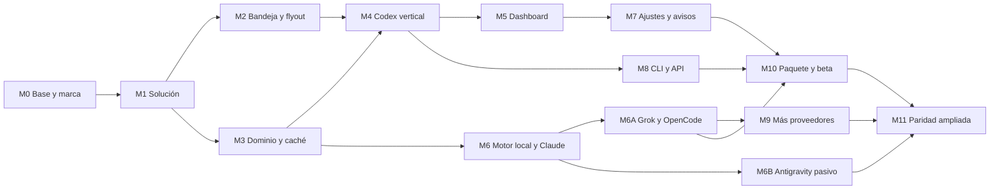

# Plan de implementación

Estado: listo para ejecutar

Fecha base: 2026-07-21

Producto formal: TokenUsage
Identidad de implementación transitoria: WOpenUsage
Upstream de referencia: `robinebers/openusage@9d2bf09f10e21f769494a525a9d65c84d7aeb1df`
Referencias de gasto: `getagentseal/codeburn@6e3c57a9ff95a624f1d9affa7384d32a67f359b7` y `kenn-io/agentsview@1ee2de88e2dae54326d8b47aeb2de2f58b5944f9`

## Meta

Entregar una app Windows nativa que abra desde la bandeja, muestre cuota, tokens y gasto desde sesiones existentes, conserve datos fiables durante fallos y pueda crecer hacia el conjunto de proveedores de OpenUsage.

La primera versión pública usará `TokenUsage`. `WOpenUsage` se conserva en código,
paquete y prototipos hasta cerrar el trabajo ya documentado. Un corte posterior
hará el cambio de forma atómica y con pruebas de actualización.

## Alcance por entrega

### MVP técnico

- repo y solución WinUI;
- bandeja, flyout, instancia única y arranque;
- dominio, caché, refresco y estados;
- Codex por `app-server`;
- panel Codex con usado/restante, reinicio, ritmo y uso diario;
- ajustes mínimos y diagnóstico;
- pruebas y paquete MSIX x64 beta.

### Beta de producto

- UI completa de dashboard y personalización;
- tema, alto contraste, teclado y lector de pantalla;
- notificaciones;
- CLI;
- API local segura opcional;
- motor propio de uso y gasto local;
- uso local Claude, Grok Build y OpenCode;
- x64 y ARM64;
- instalación, actualización y desinstalación probadas.

### Paridad ampliada

- gasto total, cobertura y detalle por modelo;
- OpenRouter con clave manual; Z.ai solo tras reabrir su gate;
- Cursor Teams y Enterprise con Admin API manual; Individual bloqueado;
- Copilot billing personal pagado y organización con token manual; sin cuota restante;
- Claude en vivo solo tras el gate del proveedor;
- Antigravity local pasivo y Devin ACUs de organización como canales experimentales.

## Reglas de ejecución

1. Leer `README.md`, la investigación, la especificación, ADR y matriz antes de código.
2. Conservar cambios ajenos y comprobar `git status --short --branch` antes de editar.
3. Crear trabajo pequeño, con prueba y commit propio cuando esté verde.
4. Usar el stack y los scripts de la plantilla `winui-mvvm`.
5. Compilar por `x64` o `ARM64`; no usar `AnyCPU`.
6. Conservar `Package.appxmanifest`.
7. Lanzar la app con el script de build de la plantilla; no abrir el `.exe` empaquetado de forma directa.
8. Agregar paquetes sin versión manual y comprobar restore de inmediato.
9. No leer, imprimir ni copiar secretos en pruebas o logs.
10. Un proveedor con gate falla cerrado y conserva el resto de la app.
11. Cada cambio de comportamiento actualiza docs, fixtures y texto de diagnóstico.
12. Las suites largas se ejecutan en el cierre de un hito.

## Mapa de dependencias



## M0 — Decisiones previas y base legal

Esfuerzo: 1–2 días. No bloquea prototipos con el nombre interno.

### Tareas

- `M0.1` Conservar `TokenUsage` como nombre formal aprobado; elegir dominio y logo finales antes de firma externa.
- `M0.2` Definir Publisher ID, empresa y contacto de soporte.
- `M0.3` Elegir distribución beta: App Installer privado o Store flight.
- `M0.4` Crear `THIRD-PARTY-NOTICES.md` con MIT de OpenUsage y toda dependencia copiada.
- `M0.5` Registrar el SHA upstream y una tabla de funciones en `docs/UPSTREAM-BASELINE.md`.
- `M0.6` Definir un proceso de revisión de política por proveedor.
- `M0.7` Contactar a OpenAI antes de un uso empresarial del cliente Codex, según la nota de `clientInfo` de app-server.
- `M0.8` Consultar a Anthropic por una interfaz o permiso de cuota de solo lectura.
- `M0.9` Consultar a xAI por una salida de cuota de solo lectura apta para otra app.
- `M0.10` Registrar la prohibición de login Antigravity de terceros y revisar su FAQ antes de cada beta.

### Pruebas

- revisión de nombres y paquetes contra marcas existentes;
- auditoría de archivos copiados y avisos;
- revisión de que no aparece nombre o logo OpenUsage como producto.

### Salida

- identidad lista para empaquetado;
- documentos de terceros y proveedor trazables;
- gates externos con dueño y estado.

## M1 — Scaffold WinUI y disciplina de repo

Esfuerzo: 2–3 días.

### Tareas

- `M1.1` Comprobar .NET, plantilla `winui-mvvm`, Windows App SDK y Developer Mode. Si falta algo, ejecutar el flujo de preparación WinUI antes de seguir.
- `M1.2` Crear la app desde la raíz con `dotnet new winui-mvvm -n WOpenUsage.App -o src/WOpenUsage.App`; no crear la carpeta a mano.
- `M1.3` Crear la solución y proyectos de `Core`, `Providers`, `Platform.Windows` y `Cli`.
- `M1.4` Crear los cinco proyectos de test definidos en el ADR.
- `M1.5` Agregar referencias con la dirección del ADR.
- `M1.6` Crear `Directory.Build.props`, análisis nullable, warnings y estilo común sin romper el XAML generado.
- `M1.7` Mantener `Package.appxmanifest`; declarar solo capacidades necesarias.
- `M1.8` Agregar `scripts/check.ps1` que ejecute restore, tests cortos y build x64.
- `M1.9` Configurar CI Windows con caché NuGet y artifacts de test.
- `M1.10` Añadir una prueba de arquitectura que prohíba referencias de `Core` a UI o Windows.

### Verificación

```powershell
dotnet restore
dotnet test tests\WOpenUsage.Core.Tests -p:Platform=x64
dotnet build WOpenUsage.sln -p:Platform=x64
powershell -ExecutionPolicy Bypass -File src\WOpenUsage.App\BuildAndRun.ps1 -Platform x64
```

El lanzamiento usa modo asíncrono durante trabajo con herramientas. Se confirma inicio y cierre manual del shell generado.

### Salida

- solución compila en x64;
- app generada abre mediante el script;
- CI básica verde;
- manifiesto y referencias correctos;
- primer commit de scaffold.

## M2 — Bandeja, flyout e instancia única

Esfuerzo: 5–8 días.

Blanco aprobado: [paridad OpenUsage para Windows](design/2026-07-21-selected-flyout.md). El shell usa 320 DIPs, alto por contenido, cabeceras fuera de las tarjetas y controles Fluent.

### Tareas

- `M2.1` Implementar `TrayIconHost` con `Shell_NotifyIconW` y versión 4.
- `M2.2` Manejar clic, teclado, menú de contexto y `TaskbarCreated`.
- `M2.3` Crear recursos de icono neutro, ámbar, rojo y alto contraste.
- `M2.4` Obtener HWND de la ventana WinUI y encapsular el interop.
- `M2.5` Configurar `AppWindow` sin marco, no redimensionable y ocultable.
- `M2.6` Posicionar con `Shell_NotifyIconGetRect`, monitor, DPI y área de trabajo.
- `M2.7` Definir fallback cuando el icono está en overflow o no hay rectángulo.
- `M2.8` Ocultar al perder foco y proteger diálogos modales.
- `M2.9` Implementar instancia única y redirección de activaciones.
- `M2.10` Añadir menú Actualizar, Ajustes y Salir.
- `M2.11` Añadir shell mock con estados cargando, datos, vacío y error.
- `M2.12` Registrar una lista manual de pruebas por posición de taskbar, monitor y DPI.

### Pruebas enfocadas

- unidad para cálculo de posición con rectángulos sintéticos;
- unidad para resumen de tooltip y estado peor;
- integración de mensajes de bandeja con host fake;
- UI automation: clic abre, segundo clic cierra, `Esc` cierra, teclado abre menú;
- manual: reiniciar Explorer y comprobar que el icono vuelve;
- manual: taskbar izquierda, derecha, arriba y abajo cuando el sistema lo permita;
- manual: dos monitores con escalas distintas.

### Salida

- una sola instancia;
- bandeja fiable y accesible;
- panel siempre dentro del monitor;
- cero ventana de consola;
- evidencia de screenshots clara, oscura y alto contraste.

## M3 — Dominio, caché y refresco

Esfuerzo: 5–7 días.

### Tareas

- `M3.1` Crear IDs, métricas, snapshots, procedencia y outcomes.
- `M3.2` Crear `IProviderRuntime`, `IClock`, `IFileSystem`, `IProcessRunner`, `ISecretStore` y red.
- `M3.3` Implementar `RefreshCoordinator` con resultado por proveedor.
- `M3.4` Añadir TTL, force refresh, timeout y cancelación.
- `M3.5` Añadir backoff con jitter y respeto de `Retry-After`.
- `M3.6` Crear `SnapshotStore` JSON con mutex y reemplazo atómico.
- `M3.7` Crear `SettingsStore` y migración v1.
- `M3.8` Calcular frescura, último valor válido y estado vencido.
- `M3.9` Implementar motor de ritmo con reloj inyectable.
- `M3.10` Publicar eventos incrementales a ViewModels.
- `M3.11` Crear un proveedor fake determinista para UI y pruebas.

### Pruebas enfocadas

- todas las variantes de métrica y outcome;
- caché válida, vencida, dañada, migrada y escritura interrumpida;
- dos procesos compiten por el mismo documento;
- proveedor lento, crash, timeout y cancelación;
- lote parcial publica proveedores rápidos;
- ritmo normal, cerca, agotamiento, ventana nueva y reloj que cambia;
- último valor válido permanece durante fallos;
- `Sin datos` nunca se convierte en cero.

### Salida

- `Core` sin referencias Windows;
- caché visible antes de red;
- refresco paralelo y cancelable;
- tests deterministas sin esperas reales;
- contrato de snapshot documentado.

## M4 — Vertical Codex de extremo a extremo

Esfuerzo: 6–9 días.

### Tareas

- `M4.1` Implementar resolución segura del binario Codex y override explícito.
- `M4.2` Crear `CodexAppServerProcess` con Job Object, stdio y cierre seguro.
- `M4.3` Crear cliente JSONL con handshake, IDs, timeouts y límite de línea.
- `M4.3a` Leer `account/read` con `refreshToken: false`, descartar correo y
  clasificar sesión ausente, ChatGPT y auth sin cuota.
- `M4.4` Implementar `account/rateLimits/read`.
- `M4.5` Implementar `account/usage/read`.
- `M4.6` Mapear límites primario, secundario y adicionales sin asumir nombres fijos.
- `M4.7` Mapear buckets diarios y resumen.
- `M4.8` Distinguir falta de login, auth no apta, CLI ausente, throttle y protocolo incompatible.
- `M4.9` Añadir `clientInfo` propio y una versión de integración visible en diagnóstico.
- `M4.10` Crear servidor fake que reordene respuestas, envíe eventos y cierre en mitad de línea.
- `M4.11` Añadir smoke real opt-in que solo imprime éxito y nombres de campos.
- `M4.12` Mostrar la primera tarjeta Codex en el shell.
- `M4.13` Añadir acción para abrir la herramienta original cuando falta login; la app no inicia el login.

### Fixtures

- respuesta con una ventana;
- dos ventanas;
- varios `limitId`;
- límite sin reset;
- porcentaje 0, 100 y decimal;
- créditos ausentes, vacíos y con detalle;
- buckets sin días, con zona horaria y con campos nuevos;
- error JSON-RPC, línea inválida y salida temprana.

Los fixtures se crean a mano o se sanitizan con una revisión que pruebe que no contienen token, correo, account ID ni cifras reales de un usuario.

### Verificación

- tests de contrato contra fake;
- proceso no queda huérfano tras cierre forzado;
- actualización manual correlaciona la respuesta correcta;
- smoke local con sesión existente y salida limitada al esquema;
- prueba empaquetada confirma que el proceso hijo se inicia;
- captura de tarjeta con datos sintéticos y prueba real sin publicar cifras.

### Salida

- cuota y uso Codex desde login existente;
- ningún acceso directo a `auth.json`;
- ningún flujo de login o acción irreversible;
- recuperación de crash y timeout;
- claim permitido: `Codex compatible en Windows con CLI instalada y sesión ChatGPT existente`.

## M5 — Dashboard y paridad visual

Esfuerzo: 8–12 días.

### Tareas

- `M5.1` Extraer tokens de tamaño, espacio, radio, color y tipografía desde la captura y docs upstream, con identidad propia.
- `M5.2` Crear header, tarjetas, barras, valores, badges, warnings y tooltips.
- `M5.3` Añadir usado/restante global y tiempo relativo/exacto.
- `M5.4` Añadir bloque bajo demanda y persistencia de expansión.
- `M5.5` Crear tendencia de 30 días accesible.
- `M5.6` Crear `Uso y gasto` con datos fake y estados vacío/parcial/sin precio.
- `M5.7` Implementar personalización, drag accesible, teclado y reset.
- `M5.8` Añadir hasta dos métricas de resumen por proveedor para tooltip y estado de bandeja.
- `M5.9` Implementar undo por sesión.
- `M5.10` Añadir recursos de texto en español e inglés desde el inicio.
- `M5.11` Ajustar alto dinámico sin saltos al cambiar de pantalla.
- `M5.12` Crear baseline visual a 100% y 200% en claro, oscuro y alto contraste.

### Estados que deben tener captura

- primer inicio;
- Codex con una y dos ventanas;
- refresco con caché;
- sin login;
- sin datos;
- dato parcial;
- dato vencido;
- throttle;
- error de contrato;
- gasto total vacío y poblado;
- gasto informado, estimado y con modelos sin precio;
- personalización y confirmación de reset.

### Pruebas

- ViewModels con orden, hide, reset y undo;
- snapshot tests de strings y formatos con culturas distintas;
- UI automation por teclado;
- Accessibility Insights: nombres, roles, contraste y orden;
- diff visual con tolerancia documentada;
- texto al 200% y ventana angosta sin corte de cuota o reinicio.

### Salida

- jerarquía y funciones centrales del panel upstream reconocibles;
- Fluent y convenciones Windows respetadas;
- nombre y logo propios;
- estados reales cubiertos;
- baseline visual aprobada.

## M6 — Motor local de uso, precios y Claude

Esfuerzo: 10–15 días.

### Contratos y persistencia

- `M6.1` Crear `UsageEvent`, `TokenBreakdown`, `CostObservation`, `Coverage` y `DailyUsageRollup`.
- `M6.2` Separar `AgentId`, proveedor de modelo y modelo.
- `M6.3` Crear `usage.v1.db` con eventos normalizados, rollups, cursores, precios y migraciones.
- `M6.4` Retener eventos 400 días, conservar rollups y ofrecer borrado desde ajustes.
- `M6.5` Implementar deduplicación idempotente por `EventKey` y transacciones cortas.
- `M6.6` Crear scanner incremental streaming con límites de archivos, bytes y tiempo.
- `M6.7` Definir buckets según zona horaria local y recomputación tras cambio de zona.

### Precio y cobertura

- `M6.8` Dar prioridad al coste informado por el agente.
- `M6.9` Crear catálogo embebido y versionado desde LiteLLM, más overrides exactos revisados.
- `M6.10` Prohibir coincidencias por subcadena y marcar modelos sin precio.
- `M6.11` Calcular cobertura por tokens y coste en cada agregado.
- `M6.12` Separar coste informado, coste estimado y fila sin coste en UI y JSON.

### Claude local

- `M6.13` Resolver `%USERPROFILE%\.claude` y `CLAUDE_CONFIG_DIR`.
- `M6.14` Detectar `projects` sin leer `.credentials.json`.
- `M6.15` Parsear solo modelo, fecha, tokens, coste y claves de deduplicación.
- `M6.16` Agregar hoy, ayer, 7 días, 30 días y mes actual.
- `M6.17` Explicar que `--no-session-persistence`, sesiones borradas y otros equipos no aparecen.
- `M6.18` Etiquetar la tarjeta `Uso local` mientras la cuota esté bloqueada.

Estado 2026-07-22: Ticket 17 entrega rutas Windows, lectura privada,
deduplicación, coste y persistencia. Ticket 20 cierra Hoy, Ayer, 7 días, 30
días, Mes actual, coste por millón, cobertura y desglose agente/modelo. El cursor
incremental sigue pendiente.

### Pruebas

- migración, rollback lógico y acceso simultáneo UI/CLI a `usage.v1.db`;
- coste informado gana a catálogo y no se suma dos veces;
- modelo sin precio queda visible y reduce cobertura;
- prompt o respuesta con campos parecidos no altera el conteo;
- deduplicación y subagente;
- DST, cambio de año y zona horaria;
- archivo agregado mientras el scanner corre;
- presupuesto de 10.000 archivos sin bloquear UI;
- diferencial con OpenUsage, CodeBurn o AgentsView sobre el mismo corpus permitido.

### Salida

- motor propio pequeño, sin índice de transcripciones;
- métricas locales Claude con procedencia y cobertura;
- cero uso remoto del OAuth Claude;
- catálogo y scanner reutilizables;
- rendimiento medido y registrado.

## M6A — Grok Build y OpenCode local

Esfuerzo: 7–11 días.

### Grok Build

Estado 2026-07-22: Ticket 18 entrega el scanner Windows de sesiones, coste
informado en ticks, fallback unificado, reemplazo de snapshots y composición
real junto a Claude. Cursor incremental y tarjeta separada por proveedor siguen
pendientes.

- `M6A.1` Resolver `GROK_HOME` y la raíz `%USERPROFILE%\.grok` sin abrir `auth.json`.
- `M6A.2` Descubrir sesiones por `summary.json`; observar `signals.json` y `updates.jsonl`.
- `M6A.3` Preferir `params.update.usage`, modelo, tokens y `costUsdTicks` cuando existan.
- `M6A.4` Añadir `unified.jsonl` como fallback con cursor por byte y límites de línea.
- `M6A.5` Evitar doble conteo entre sesión y fallback.
- `M6A.6` Estimar solo cuando falta coste informado y marcar el algoritmo y catálogo.
- `M6A.7` Mantener cuota y saldo en `PolicyBlocked`; no leer auth ni llamar billing privado.

### OpenCode

Estado 2026-07-22: Ticket 19 entrega el scanner Windows nativo para el esquema
SQLite actual, la base anterior y el almacenamiento JSON legado. La composición
real, el smoke diferencial y la prueba UI están cerrados. WSL sigue fuera de
este corte y requiere consentimiento.

- `M6A.8` Resolver `%USERPROFILE%\.local\share\opencode` y override documentado.
- `M6A.9` Detectar `opencode.db` y `storage` sin abrir `auth.json`.
- `M6A.10` Abrir SQLite ajena en modo de solo lectura con `busy_timeout` corto y sin copia completa.
- `M6A.11` Leer solo identidad de evento, fecha, modelo, tokens y coste desde mensaje o `step-finish`.
- `M6A.12` Unir SQLite y JSON legado con deduplicación estable.
- `M6A.13` Comparar totales con `opencode stats` en un smoke opt-in; no parsear su salida para producción.
- `M6A.14` Diseñar detección WSL como tarea posterior con consentimiento y roots por distro.

### Pruebas

- fixtures Grok antes y después de `params.update.usage`, compacción, truncado y modelo múltiple;
- fixtures OpenCode SQLite, WAL, JSON legado, coste cero válido y sesión en ambos formatos;
- base OpenCode bloqueada o con esquema nuevo conserva el último agregado;
- scanner no lee `auth.json`, texto, comandos ni partes sin contadores;
- diferencial de totales y cobertura sobre fixtures compartidos;
- smoke Windows opt-in sin imprimir cifras ni contenido.

### Salida

- tarjetas Grok Build y OpenCode con tokens, gasto, tendencia y cobertura;
- cuota Grok visible como bloqueada, sin acceso privado;
- OpenCode nativo en Windows cubierto; WSL declarado fuera de esta salida;
- scanner medido sobre una base OpenCode grande sin copiarla.

## M6B — Spike pasivo de Antigravity CLI

Esfuerzo: 4–7 días después de obtener una `.db` real.

### Tareas

- `M6B.1` Detectar `%USERPROFILE%\.gemini\antigravity-cli` y variantes documentadas sin abrir Credential Manager.
- `M6B.2` Copiar a fixtures solo filas `gen_metadata` sanitizadas de una conversación `.db` autorizada.
- `M6B.3` Validar esquema y extraer modelo, fecha y tokens por generación.
- `M6B.4` Estimar coste con catálogo y marcar placeholders o modelos sin precio.
- `M6B.5` Fallar cerrado ante `.pb`, cifrado, daemon, token, CSRF o necesidad de RPC.
- `M6B.6` Mantener `/usage` y `/credits` fuera del adaptador.
- `M6B.7` Evaluar una statusline mínima solo con instalación explícita y sin correo, cwd o texto.

### Pruebas

- fixture SQLite con filas válidas, corruptas, duplicadas y esquema distinto;
- cero llamadas de red, procesos o Credential Manager;
- fuente cifrada produce `PolicyBlocked` o `NotConfigured`, nunca un cero;
- diferencial de tokens contra el contador visible del CLI realizado a mano;
- smoke dentro del MSIX con una cuenta de prueba autorizada.

### Salida

- parser experimental de tokens y coste local, o registro de bloqueo con evidencia;
- ningún claim de cuota o créditos;
- feature flag apagado hasta cerrar fixtures, política y smoke.

## M7 — Ajustes, avisos y privacidad

Esfuerzo: 5–8 días.

### Tareas

- `M7.1` Crear navegación interna Dashboard, Personalizar y Ajustes.
- `M7.2` Tema, densidad, transparencia, formato y modo usado/restante.
- `M7.3` StartupTask con estado real y errores visibles.
- `M7.4` Atajo global configurable y conflicto explicado.
- `M7.5` App Notifications para umbral, proyección, vencido y credencial.
- `M7.6` Deduplicar avisos por ventana y cambio de estado.
- `M7.7` Añadir proxy del sistema y override probado.
- `M7.8` Crear logs rotados y diagnóstico sanitizado.
- `M7.9` Crear pantalla de datos guardados y acción borrar.
- `M7.10` Mantener telemetría apagada; cualquier cambio futuro requiere consentimiento y ADR.
- `M7.11` Añadir privacidad de screen capture si Windows ofrece una ruta fiable; si no, documentar el límite.
- `M7.12` Cerrar i18n inicial para `en-US` y `es-ES`: selector persistente,
  paridad de recursos, formatos por cultura, fallback y prueba de texto largo.

### Pruebas

- migración de ajustes;
- inicio activado, denegado y administrado por Windows;
- atajo libre y ocupado;
- aviso no repetido durante cada refresco;
- proxy correcto y credencial de proxy redacted;
- export de diagnóstico revisado por detector de secretos;
- borrado elimina caché, índice y claves propias sin tocar datos de proveedor.

### Salida

- ajustes sobreviven actualización;
- avisos útiles y no repetidos;
- usuario controla arranque y datos;
- diagnóstico apto para soporte.

## M8 — CLI y API local

Esfuerzo: 5–7 días.

### CLI

- `M8.1` Implementar comandos `limits`, `usage`, `providers` y `doctor`.
- `M8.2` Compartir caché y mutex con la app.
- `M8.3` Definir JSON `wusage.limits.v1` y `wusage.usage.v1` con golden files.
- `M8.4` Añadir `--force`, provider ID y salida humana.
- `M8.5` Definir códigos 0, 2 y 4.
- `M8.6` Declarar alias de ejecución en MSIX.

### API

- `M8.7` Implementar host loopback apagado al instalar.
- `M8.8` Crear, mostrar con confirmación y rotar bearer token propio.
- `M8.9` Rechazar `Origin` por defecto y agregar allowlist exacta.
- `M8.10` Implementar `/v1/health`, `/v1/limits`, `/v1/usage` y filtros por provider/días.
- `M8.11` Añadir límites de método, concurrencia, tamaño y timeout.
- `M8.12` Añadir estado de puerto ocupado y selector de puerto.
- `M8.13` Diseñar modo de compatibilidad OpenUsage como opción separada; no activarlo en beta inicial.

### Pruebas

- golden JSON y compatibilidad de campos opcionales;
- CLI con app cerrada, abierta y refresco simultáneo;
- token ausente, erróneo, correcto y rotado;
- petición con Origin, método no apto y path inválido;
- 16 solicitudes y rechazo controlado de exceso;
- bind solo en loopback comprobado;
- navegador no puede leer por defecto;
- API nunca incluye token, correo, ruta o log.

### Salida

- automatización local estable;
- API con activación consciente y autenticada;
- contrato versionado con ejemplos.

## M9 — Proveedores siguientes

Esfuerzo: 3–10 días por proveedor más el tiempo del gate externo.

Orden y alcance:

1. OpenRouter manual.
2. Reevaluar Z.ai solo si existe un contrato público o permiso escrito para una app aparte.
3. Cursor Teams y Enterprise mediante Admin API; mantener Individual sin proveedor remoto.
4. GitHub Copilot billing para cuenta personal pagada y organización; excluir cuota privada.
5. Claude cuota en vivo tras aprobación.
6. Grok cuota en vivo tras interfaz pública o permiso.
7. Devin ACUs de organización por API v3 en canal experimental.
8. Zcode, tras confirmar producto, editor/CLI, fuente apta y política.
9. Kimi Code, con prioridad para uso local pasivo y sin reutilizar login.
10. Command Code, tras fijar identidad, formatos y límites de lectura.
11. Cline, mediante datos locales o API pública con consentimiento explícito.

GitHub Copilot ya tiene el gate cerrado en Ticket 32, implementación en Ticket
33 y smoke autorizado en Ticket 45. No se crea un provider duplicado.

Zcode, Kimi Code, Command Code y Cline entran primero como investigación. Cada
uno debe confirmar el nombre canónico, editor o CLI objetivo, rutas Windows,
contrato de cuota/uso/gasto, licencia y política antes de escribir un adapter.

Cada proveedor se divide en commits:

- descriptor y detección local;
- parser o cliente con fixtures;
- mapper y tests;
- UI y textos de estado;
- integración empaquetada;
- docs y gate de lanzamiento.

Un proveedor privado se puede desarrollar detrás de un feature flag. No se activa en builds públicas mientras falte una casilla del gate.

Cursor no usa una fuente privada. Su adaptador solo admite una clave Admin API creada por el usuario, varias conexiones nombradas y los endpoints públicos bajo `api.cursor.com`. Debe mostrar uso y gasto sin inferir cuota restante. La activación pública requiere un smoke autorizado; la DB, sesión, dashboard y export privado quedan fuera del binario.

Copilot usa solo los reportes públicos de AI credits bajo `api.github.com`, con token fine-grained manual y scope declarado. La app no lee la sesión de editor o `gh`, no llama `/copilot_internal/user` y no convierte gasto en cuota restante. Personal y organización usan conexiones y textos distintos. La activación pública requiere un smoke autorizado.

Devin usa solo el consumo diario v3 de una organización en `api.devin.ai`. La key pertenece a un service user de esa organización y vive en Credential Locker. La app no lee CLI o DB, no llama RPC privados y no solicita Session Insights. Muestra ACUs, no saldo o dólares, y requiere un smoke autorizado.

### Salida por proveedor

- matriz actualizada;
- contrato y fixtures;
- threat review;
- Windows x64 y ARM64 probados;
- claim exacto de cobertura;
- rollback por flag remoto o build si la fuente cambia.

## M10 — Empaquetado, actualización y beta

Esfuerzo: 5–8 días.

### Tareas

- `M10.1` Cerrar identidad, iconos, splash y recursos del paquete.
- `M10.2` Crear perfiles Release x64 y ARM64.
- `M10.3` Configurar firma de CI con secreto externo al repo.
- `M10.4` Construir MSIX y bundle.
- `M10.5` Probar instalación limpia, upgrade, downgrade rechazado y desinstalación.
- `M10.6` Probar StartupTask, alias CLI, notificaciones y acceso a archivos dentro del paquete.
- `M10.7` Ejecutar Windows App Certification Kit.
- `M10.8` Generar SBOM, hashes y avisos.
- `M10.9` Crear canal beta y proceso de rollback.
- `M10.10` Escribir release notes con límites de proveedor.
- `M10.11` Crear checklist de soporte y recolección de diagnóstico.

### Matriz mínima

- Windows 10 soportado, x64;
- Windows 11 actual, x64;
- Windows 11 ARM64;
- usuario estándar;
- tema claro, oscuro y alto contraste;
- una y dos pantallas;
- DPI 100, 150 y 200%;
- Codex ausente, sin login y con login;
- Grok Build y OpenCode ausentes, con datos y con esquema no reconocido;
- gasto con coste informado, estimado y sin precio;
- red directa, sin red y proxy;
- actualización desde la beta anterior.

### Salida

- MSIX firmado e instalable;
- WACK sin fallos;
- beta reversible;
- documentación de privacidad, licencia, soporte y desinstalación.

Publicar el artifact requiere autorización explícita. Crear el paquete local no autoriza subirlo a Store, GitHub Releases o un servidor.

## M11 — Paridad ampliada y estable

Esfuerzo: continuo. La amplitud de diez proveedores puede llevar 4–6 meses para una persona por los gates y pruebas reales.

### Tareas

- cerrar proveedores de M9 uno a uno;
- añadir detalle por modelo y gasto total real;
- comparar funciones con el SHA upstream y actualizar baseline;
- medir consumo durante siete días;
- resolver accesibilidad y fallos de beta;
- validar migración desde las dos betas previas;
- congelar schemas públicos v1;
- completar revisión de seguridad;
- publicar estable solo con proveedores aprobados.

### Salida estable

- cero crash bloqueante conocido en el flujo principal;
- tasa de refresco válido medida y documentada;
- sin secreto en logs, crash dumps o API;
- accesibilidad principal aprobada;
- x64 y ARM64 verdes;
- instalación, upgrade y rollback probados;
- cada claim de proveedor ligado a evidencia.

## Estrategia de pruebas

### Por commit

- test que falla antes o prueba estática que muestra el hueco;
- tests del proyecto afectado;
- build x64 del proyecto afectado;
- inspección de `git diff` y secretos.

### Por hito

- tests de unidad y contrato;
- build completa x64;
- launch por `BuildAndRun.ps1`;
- UI smoke del camino afectado;
- actualización de docs y screenshots;
- commit lógico con mensaje descriptivo.

### Antes de beta

- toda la matriz x64;
- build y smoke ARM64;
- UI automation;
- Accessibility Insights;
- WACK;
- instalación, upgrade y desinstalación;
- scanner de secretos y SBOM;
- prueba de siete días de caché, refresco y consumo.

## Presupuesto de rendimiento

Medir desde M4 y fijar gates con hardware de referencia:

| Métrica | Meta inicial |
|---|---|
| Mostrar caché al abrir | < 500 ms |
| Interacción de panel | 60 Hz sin trabajo de red en UI |
| Memoria inactiva | < 150 MB |
| CPU inactiva | cercana a 0% |
| Refresco Codex | timeout propio; UI nunca espera |
| Scanner 10.000 archivos | cancelable, sin freeze |
| OpenCode DB de 2,5 GB | consulta incremental sin copia y sin freeze |
| Caché y ajustes | escritura atómica < 100 ms típica |

Si una meta falla, registrar la medición antes de ajustar el número.

## Registro de riesgos

| ID | Riesgo | Prob. | Impacto | Control | Hito |
|---|---|---:|---:|---|---|
| R1 | Endpoint privado cambia | Alta | Alta | Gate, fixtures, flag y último valor válido | M9 |
| R2 | Rotación de token cierra la sesión | Media | Alta | Interfaz oficial y no escribir credenciales ajenas | M4/M9 |
| R3 | Política impide una integración | Media | Alta | Revisión antes de activar y alternativa local | M0/M9 |
| R4 | Tray desaparece tras Explorer | Media | Media | `TaskbarCreated` y test manual | M2 |
| R5 | Flyout fuera de pantalla | Media | Media | cálculo por monitor/DPI y tests | M2 |
| R6 | MSIX cambia rutas o procesos | Media | Alta | smoke dentro del paquete | M4/M10 |
| R7 | CORS expone cuota al navegador | Alta si se copia upstream | Alta | API apagada, token y Origin deny | M8 |
| R8 | Log local cuenta doble | Media | Media | deduplicación y diferencial | M6 |
| R9 | Precio incompleto parece factura | Media | Alta | procedencia, cobertura y texto | M5/M6 |
| R10 | CLI y app dañan la caché | Baja | Media | mutex, reemplazo atómico y test multiproceso | M3/M8 |
| R11 | Nombre o logo infringe marca | Baja | Alta | identidad propia y revisión | M0 |
| R12 | Actualización rompe ajustes | Media | Alta | migraciones y upgrade matrix | M7/M10 |
| R13 | Esquema local de agente cambia | Alta | Media | parser versionado, fixtures y estado parcial | M6/M6A/M6B |
| R14 | Base OpenCode grande o bloqueada | Alta | Media | modo read-only, consulta mínima, timeout y sin copia | M6A |
| R15 | Gasto estimado difiere del cobro | Alta | Alta | coste informado primero, catálogo fijado y cobertura visible | M5/M6 |
| R16 | Lector pasivo cruza un límite de política | Media | Alta | lista de fuentes prohibidas, revisión y feature flag | M0/M6A/M6B |
| R17 | OpenCode WSL queda fuera del scanner Windows | Alta | Media | estado de cobertura y fase WSL con consentimiento | M6A/M11 |

## Estimación

Para una persona con experiencia en C# y Windows:

- MVP técnico Codex: 30–45 días de ingeniería;
- beta de producto con UI, CLI, API y Claude local: 20–30 días adicionales;
- motor de gasto, Grok Build y OpenCode local: 17–26 días dentro de la beta;
- spike Antigravity pasivo: 4–7 días después de obtener una base real;
- cada proveedor sencillo: 3–6 días tras tener contrato y fixtures;
- cada proveedor privado o multicuenta: 7–15 días más el tiempo externo;
- paridad amplia de diez proveedores: 4–6 meses como orden de magnitud.

La estimación excluye espera por permisos, firma, Store y cuentas de prueba. Se revisa al cerrar M4 con datos reales.

## Criterio de completitud

Un hito se marca completo cuando:

- sus tareas y criterios de salida están cerrados;
- tests relevantes y build pasan;
- la ruta real se probó cuando existe;
- estados de error y accesibilidad están cubiertos;
- docs y matriz coinciden con el código;
- el diff se revisó;
- los cambios se dividieron en commits lógicos.

Una función con test faltante, gate externo o smoke pendiente se marca `Implementada, no verificada por completo`.

## Primera tanda recomendada

La siguiente sesión debe ejecutar solo M1:

1. verificar prerrequisitos WinUI;
2. crear la app desde la plantilla;
3. crear solución, proyectos y referencias;
4. compilar y lanzar x64;
5. agregar tests de arquitectura;
6. documentar comandos y evidencia;
7. revisar y commitear el scaffold.

M2 comienza después de una build limpia del template. No se añade un proveedor antes de que bandeja, flyout y dominio tengan contratos probables.
