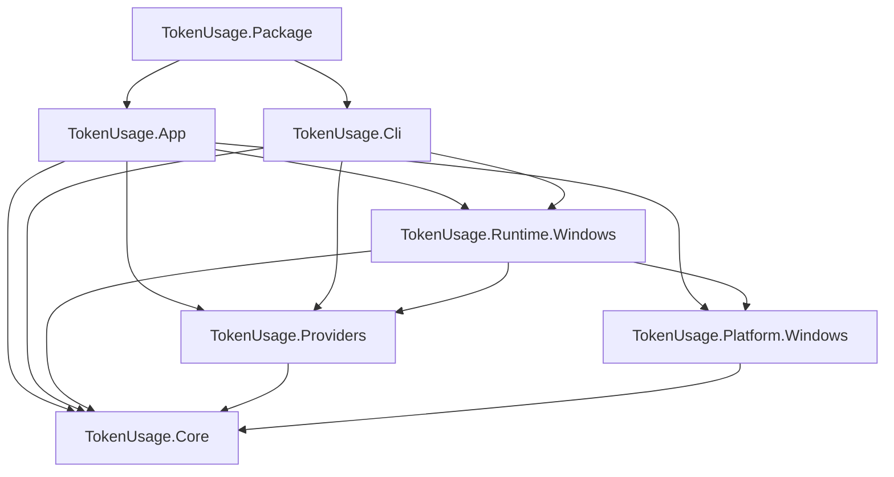
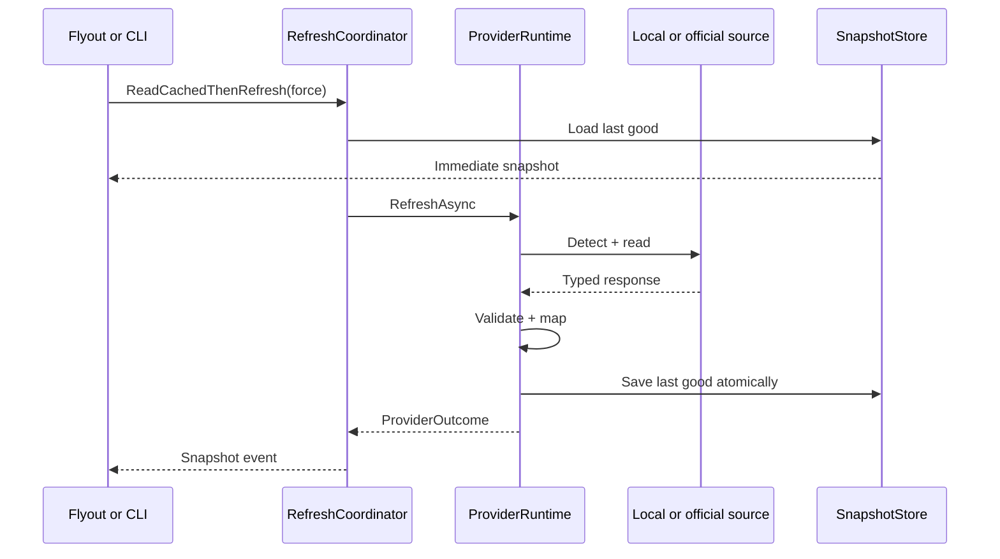

# ADR-0001: Native Windows baseline

Status: accepted

Date: 2026-07-21

## Decision

Use C#, WinUI 3, and Windows App SDK in a full-trust MSIX app. Keep the domain and providers outside the WinUI project. Integrate the tray and process lifetime with small first-party Win32 APIs. Start with Codex through its official `app-server` over `stdio`.

## Context

The product must replicate the core OpenUsage experience on Windows, reuse local sessions safely, and share data among the UI, CLI, and API. The shell must stay light in the background and work with the tray, multiple displays, DPI, start with Windows, and a signed package.

## Solution

```text
TokenUsage.slnx
├─ src/
│  ├─ TokenUsage.App/                WinUI, XAML, view models, and composition
│  ├─ TokenUsage.Package/            MSIX manifest, App, CLI, and tokenusage.exe alias
│  ├─ TokenUsage.Core/               domain, coordination, cache, and contracts
│  ├─ TokenUsage.Providers/          adapters and scanners per provider
│  ├─ TokenUsage.Platform.Windows/   tray, windows, processes, files, and secrets
│  ├─ TokenUsage.Runtime.Windows/    Windows composition shared by the app and CLI
│  └─ TokenUsage.Cli/                commands and stable JSON
├─ tests/
│  ├─ TokenUsage.Core.Tests/
│  ├─ TokenUsage.Providers.Tests/
│  ├─ TokenUsage.Platform.Windows.Tests/
│  ├─ TokenUsage.Architecture.Tests/
│  └─ TokenUsage.App.UiTests/
└─ docs/
```

The app started from `dotnet new winui-mvvm -n TokenUsage.App`. A Windows Application Packaging Project keeps the manifest and includes the app and CLI. Every build uses a specific architecture. `AnyCPU` is excluded.

## Dependencies



`Runtime.Windows` contains the composition that joins Windows processes and providers. It doesn't contain UI. `Core` doesn't reference WinUI, Windows App SDK, or provider implementations. An architecture test verifies these rules.

## Data flow



## Domain

### Identity

- `ProviderId`: stable lowercase identifier, for example `codex`.
- `AgentId`: client that produced the usage, for example `grok-build` or `opencode`.
- `ModelProviderId`: actual model provider when the agent reports it; it can be missing.
- `AccountId`: stable hash of the local identifier when there are multiple accounts; it never contains email.
- `ProviderInstanceId`: stable combination of provider, account, and origin.
- `MetricId`: stable within a provider; it doesn't depend on visible text.

### Snapshot

`ProviderSnapshot` is immutable and contains:

- identity, resolved title, and plan
- `FetchedAt`, `SourceObservedAt`, and time zone
- ordered list of `MetricSnapshot`
- `Provenance` per data group
- coverage and warnings
- adapter contract version

`MetricSnapshot` uses a closed payload:

- `ProgressMetric`: used, limit, percentage, start, end, and next reset
- `ScalarMetric`: value, unit, and precision
- `TrendMetric`: buckets with date, tokens, cost, and coverage
- `BadgeMetric`: text and semantic tone
- `TextMetric`: short status text

The UI never receives authentication tokens, credential paths, or the unmapped remote response.

### Provenance

Each value declares:

- `SourceKind`: `OfficialLocalApi`, `OfficialRemoteApi`, `LocalLog`, `LocalDatabase`, `PrivateRemoteApi`, `ManualKey`, or `Synthetic`; the last is reserved for samples and tests
- `MeasurementKind`: `Measured`, `ProviderReported`, `Estimated`, or `Derived`
- covered range
- parser or endpoint version
- omitted fields and the reason

This lets the UI distinguish provider-reported quota, measured tokens, and estimated cost.

### Local usage and spend

`UsageEvent` is the only detailed record the first-party engine keeps:

- `EventKey`: stable hash of provider, source, and the event's local identity
- `AgentId`, optional `ModelProviderId`, and `ModelId`
- `OccurredAt` in UTC and the time zone used when grouping
- input, output, reasoning, cache read, and cache write
- `ReportedCostUsd` or `EstimatedCostUsd`, never both as a single figure
- `CostKind`: `ProviderReported`, `CatalogEstimated`, or `Unavailable`
- parser version, catalog version, and exact price pattern
- `CoverageKind`: `Complete`, `Partial`, `SummaryOnly`, or `Unpriced`

The event doesn't contain text, tool, command, task, session, project, path, or account. `DailyUsageRollup` aggregates by date, agent, and model. The UI calculates total and coverage from those rollups.

The cost order is: source-reported value, reviewed exact override, embedded catalog, and `Unavailable`. Substring matches aren't used. An API-rate cost isn't transformed into a subscription invoice.

### Refresh result

`ProviderOutcome` is a closed union:

- `Success(snapshot)`
- `NotConfigured(reason)`
- `UnsupportedAccount(reason)`
- `PartialSuccess(snapshot, warnings)`; the suffix avoids the reserved name `partial` under .NET analyzers
- `Throttled(retryAt, lastGood)`
- `TransientFailure(error, lastGood)`
- `ContractFailure(error, lastGood)`
- `PolicyBlocked(reason)`

Exception messages aren't used to decide the visible state.

## Provider runtime

Each adapter implements:

```csharp
public interface IProviderRuntime
{
    ProviderDescriptor Descriptor { get; }
    ValueTask<ProviderDetection> DetectAsync(CancellationToken cancellationToken);
    Task<ProviderOutcome> RefreshAsync(RefreshContext context, CancellationToken cancellationToken);
}
```

`DetectAsync` uses only local sources. `RefreshAsync` receives a `RefreshContext`. The first cut uses .NET `TimeProvider` as an injectable clock. Network client, file reader, process, proxy, and price catalog are added through `Core` contracts when a real provider needs them.

Third-party plugins aren't loaded in the first cycle. Providers are registered in code to keep a known trust surface.

## Coordination

`RefreshCoordinator`:

- publishes cache before starting the network
- runs active providers in parallel
- limits to one execution per provider
- cancels on exit and when a manual refresh is replaced
- delivers partial results when each provider finishes
- uses `PeriodicTimer` with an injectable clock
- applies timeout and backoff per provider
- prevents one exception from closing the batch
- serializes events to the UI with `DispatcherQueue` only at the edge

The initial cadence is five minutes. A manual refresh ignores TTL. A recent activation can reuse the active run.

## Cache and settings

Versioned JSON documents are used under `ApplicationData.Current.LocalFolder`:

```text
LocalState/
├─ settings.v1.json
├─ layout.v1.json
├─ cache/
│  └─ snapshots.v1.json
├─ scanner/
│  ├─ index.v1.json
│  └─ usage.v1.db
└─ logs/
```

The write path:

1. Takes a named mutex per document.
2. Writes a temporary file in the same folder.
3. Flushes.
4. Replaces the destination atomically.
5. Keeps a previous copy when migrating a schema.

The CLI ships in the same package and uses the same identity, folder, and mutex. Migrations are incremental and idempotent, and they have tests with each fixture version.

The cache doesn't store credentials or full remote responses. The 07C `snapshots.v1.json` document stores only normalized snapshots. Warnings stay on the runtime outcome. A later schema can persist them only if they don't contain personal data.

`usage.v1.db` is a small first-party SQLite database. It contains `usage_event`, `daily_usage_rollup`, `source_cursor`, `pricing_catalog`, and a migrations table. It retains normalized events for 400 days and daily rollups until the user deletes their data. Cleanup runs in batches and never touches the provider source.

The UI and CLI open this database through a single repository layer. Writes use a short transaction, WAL, and `busy_timeout`. Readers don't hold a transaction while they wait for an external process.

## Tray and window

### Tray

`TrayIconHost` encapsulates:

- `NOTIFYICONDATA` and `Shell_NotifyIconW`
- `NIM_ADD`, `NIM_MODIFY`, `NIM_DELETE`, and `NIM_SETVERSION`
- the registered `TaskbarCreated` message, so the icon is restored after Explorer restarts
- `NIN_SELECT`, `NIN_KEYSELECT`, and `WM_CONTEXTMENU`
- a short, accessible tooltip
- icon resources per DPI and state

`LibraryImport` or `DllImport` is used in a single interop namespace. Windows Forms isn't added just for `NotifyIcon`.

### Flyout

The main WinUI window stays created and hidden. `AppWindow` controls size and position. The HWND is obtained with `WindowNative.GetWindowHandle`.

When opening:

1. Request the icon rectangle with `Shell_NotifyIconGetRect`.
2. Get the monitor, DPI, and work area.
3. Measure the content within the allowed range.
4. Place the window above or beside the icon based on the taskbar.
5. Limit the rectangle to the monitor.
6. Activate and move focus to the first useful control.

If no rectangle exists, the cursor's monitor is used. On deactivation, the window hides unless a modal dialog is open. Tests cover the taskbar on each edge, an expanded tray, two monitors, and scales of 100, 125, 150, and 200%.

`CompactOverlay` isn't used because its rules belong to picture-in-picture.

## Instance and activation

- `AppInstance.FindOrRegisterForKey` reserves a primary instance.
- Secondary instances redirect activation and then exit.
- Activation from the icon, shortcut, CLI alias, and notification carries a typed payload.
- `StartupTask` starts the process in tray mode without opening the panel.
- The user can turn off startup from settings or from Windows.

## Codex integration

`CodexAppServerClient` resolves an absolute executable and starts it without a shell or window:

```text
codex app-server --stdio
```

Controls:

- search in known paths and `PATH`, without accepting the working directory as an implicit origin
- `TOKENUSAGE_CODEX_EXECUTABLE` override that accepts only a local, absolute `.exe`; if the override is invalid, resolution fails without falling back to `PATH`
- suspended creation with its own pipes, assignment to the job object, and resume after `KILL_ON_JOB_CLOSE` is already active
- `PROC_THREAD_ATTRIBUTE_HANDLE_LIST` limits inheritance to the three stdio handles and avoids leaking another inheritable handle created by a concurrent thread
- process inside a job object with `KILL_ON_JOB_CLOSE`
- stdin/stdout redirected as UTF-8
- stderr in a short buffer with sanitization
- one reader task correlates responses by ID
- a single handshake of `initialize` + `initialized`
- timeout per request and a line limit
- parser tolerant of extra fields
- orderly shutdown, then kill of the tree if the deadline expires
- restart with backoff after a crash
- circuit breaker after repeated failures

The client calls only read methods:

- `account/read` with `refreshToken: false`, to classify session and account type without keeping email or account fields
- `account/rateLimits/read`
- `account/usage/read`

It doesn't call login, logout, reset consumption, email sending, or models. The user manages the session with Codex.

Verification of the Codex CLI 0.145.0 contract added `account/read` to the allowlist. Current official documentation defines it as the read that distinguishes a missing session, an API key, and a ChatGPT account. The adapter selects only `type`, `planType`, and `requiresOpenaiAuth`. It discards `email` and never requests a proactive refresh. This replaces fragile inference from a quota error.

Detection returns:

- `Available` if the binary exists and the handshake responds
- `NeedsLogin` if Codex reports that there is no ChatGPT account
- `UnsupportedAuth` if the account uses a mode without ChatGPT quota
- `Unavailable` if the binary is missing or the protocol isn't suitable

Tests use a fake JSONL process. An opt-in smoke test uses real Codex and prints only schema keys.

## Local scanners

A scanner receives explicit roots and limits:

- maximum file count and bytes
- frequent cancellation
- reparse-point cycles and depth
- streaming parser
- stable deduplication
- the user's time zone
- price catalog by date and model
- incremental index by relative path, size, date, and a short hash of relevant content

Parsers ignore prompt, response, project name, task, tool, and command. They materialize only `UsageEvent` fields. Tests include truncated files, invalid lines, schema changes, duplicates, subagents, time-zone changes, and models without a price.

Planned sources:

- Grok Build: `summary.json`, `signals.json`, `updates.jsonl`, and, as a fallback, `unified.jsonl`; the session source avoids double-counting the fallback
- OpenCode: `opencode.db` and legacy JSON storage; never `auth.json`. `opencode stats` serves as a differential oracle, not as a format to parse
- Antigravity CLI: only a local `.db` with `gen_metadata`, or a future statusline that the user configures. Encrypted `.pb` files, Credential Manager, tokens, CSRF, the language server, and private RPC are excluded

A third-party database is opened with SQLite in read-only mode, a minimal query, and a short timeout. A full database isn't copied to avoid duplicating large installations. A lock returns `Partial` with the last valid rollup.

## Network

One `HttpClient` per provider comes from `IHttpClientFactory` or an equivalent long-lived factory. A refresh doesn't create a new client.

- system proxy by default
- explicit proxy option without storing the password in JSON
- system TLS
- timeout per operation
- minimal headers
- redaction of `Authorization`, cookies, and sensitive query
- retry only on idempotent operations and suitable errors
- respect for `Retry-After`

## Local API

`LocalApiHost` uses `HttpListener` on a configurable loopback port. The feature starts turned off.

Controls:

- literal bind to `127.0.0.1`
- 256-bit bearer token in Credential Locker
- constant-time token comparison
- default rejection of any `Origin`
- optional exact allowlist
- `GET` only, no body, and a limited URL
- maximum of 16 active requests
- response and log without credentials or paths
- local rate limit and short timeout
- visible state if the port is busy

The base contract is:

```json
{
  "schemaVersion": "tokenusage.limits.v1",
  "generatedAt": "2026-07-21T00:00:00Z",
  "providers": [],
  "stale": false
}
```

The compatibility mode, if implemented, is enabled separately and explains the CORS difference.

## Manual keys

OpenRouter and any future provider approved for a manual key use `PasswordVault`:

- resource: package identifier + provider
- userName: stable identifier without email when possible
- password: the key
- never copied to the clipboard except by an explicit action
- reveal requires confirmation and then hides again
- delete removes the entry and the cache tied to that account

A third-party credential isn't stored in Credential Locker.

## Logging and diagnostics

Structured events with:

- timestamp, level, component, providerId, outcome, duration, and correlationId
- redaction by name and pattern
- no percentages, balances, tokens, emails, full paths, or HTTP bodies at the normal level
- rotated files with a total cap
- a button to export a sanitized diagnostic ZIP after previewing its contents

Debug mode is temporary and warns about its extra detail. Credentials are still redacted in debug.

## UI and view models

- Views contain XAML and visual adaptation.
- View models expose immutable state or observable collections on the UI thread.
- Commands use `async Task`. `async void` is avoided except for framework events.
- Services don't know about XAML controls.
- Visible strings live in resources from the first phase.
- Theme and high contrast use semantic resources, not fixed colors on each control.
- Animations respect the system setting.

## Packaging

- MSIX package with its own identity
- full trust for user files and local processes
- `x64` and `ARM64`
- `tokenusage.exe` alias for the CLI
- StartupTask when its ticket closes
- protocols or activations only when a feature needs them
- test signing in CI and production signing outside the repo
- beta and stable channels with separate identities, or a strategy that avoids accidental replacements
- third-party notices and the MIT license in the package

The repo keeps `Package.appxmanifest` under `TokenUsage.Package`. Development build and launch use `BuildAndRun.ps1`, Visual Studio MSBuild, and the package identity. The packaged executable isn't opened directly.

## Security

Trust boundaries:

1. XAML and domain: first-party code.
2. Adapters: untrusted data from files, processes, and the network.
3. Provider process: local binary resolved by path.
4. Local API: untrusted local client.
5. Persistence: profile files that can be damaged or edited.

Each boundary validates size, schema, timeout, and cancellation. The app doesn't execute log text or build shell commands with external data.

Passive scanners don't start login, don't read authentication files, and don't call private endpoints or services. In particular, Antigravity never uses Windows Credential Manager or its language server. Grok doesn't use `auth.json` or the internal billing endpoint.

Before a provider is published, a threat review is completed that covers credentials, rotation, endpoint, logs, multiple accounts, proxy, errors, and policy.

## Consequences

Advantages:

- native, accessible shell
- domain that's easy to test
- Codex integration with an official contract
- isolated providers
- CLI and API share semantics
- package with clean startup and updates

Costs:

- Win32 interop for tray and focus
- real tests of monitors, DPI, and the package
- supervised Codex child process
- each private provider can remain blocked by contract
- the macOS metrics strip needs a Windows adaptation

## Rejected alternatives

- Electron or WebView as the main shell: adds a runtime that doesn't add value to the requested native panel.
- Windows Forms for the whole app: limits the chosen WinUI design and accessibility path.
- Windows Forms `NotifyIcon` inside WinUI: adds a broad dependency for a small API.
- Direct reading of Codex `auth.json` in the MVP: duplicates login logic and increases rotation risk.
- Parsing the human output of `opencode stats`: the command doesn't promise a JSON contract, and the text can change. It is kept as a differential test.
- Copying OpenCode SQLite databases before each read: a real installation can occupy several GB, and the copy increases I/O and space.
- Decrypting Antigravity conversations or querying its daemon: expands access to content and login, and contradicts the chosen publication limit.
- Unpackaged app: complicates identity, startup, alias, notices, and updates.
- Local API with open CORS at install: allows reads from open pages.

## Change gates

- If `codex app-server` withdraws the stable methods, review an official fallback before reading tokens.
- If the package blocks a required path in a real test, document the case before considering an unpackaged variant.
- If Microsoft adds a complete WinUI tray API, the interop can be replaced without touching the domain.
- If a provider publishes a quota SDK or command, its adapter must prefer that over the private endpoint.
