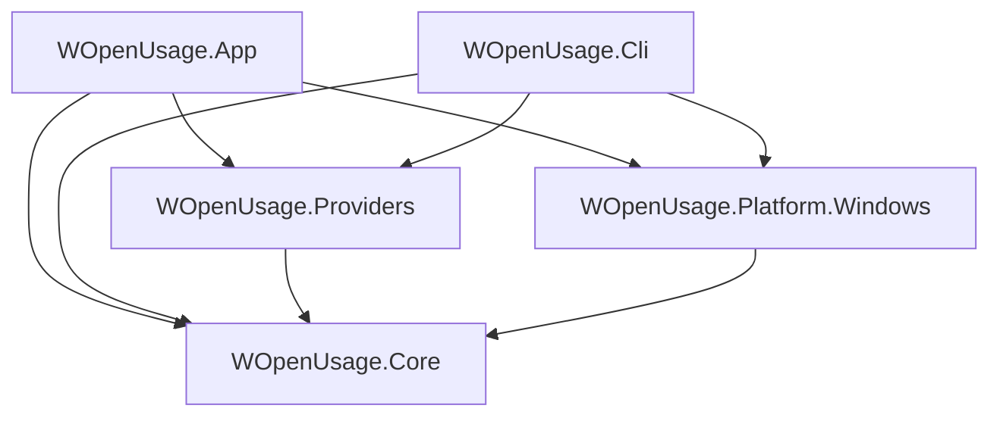
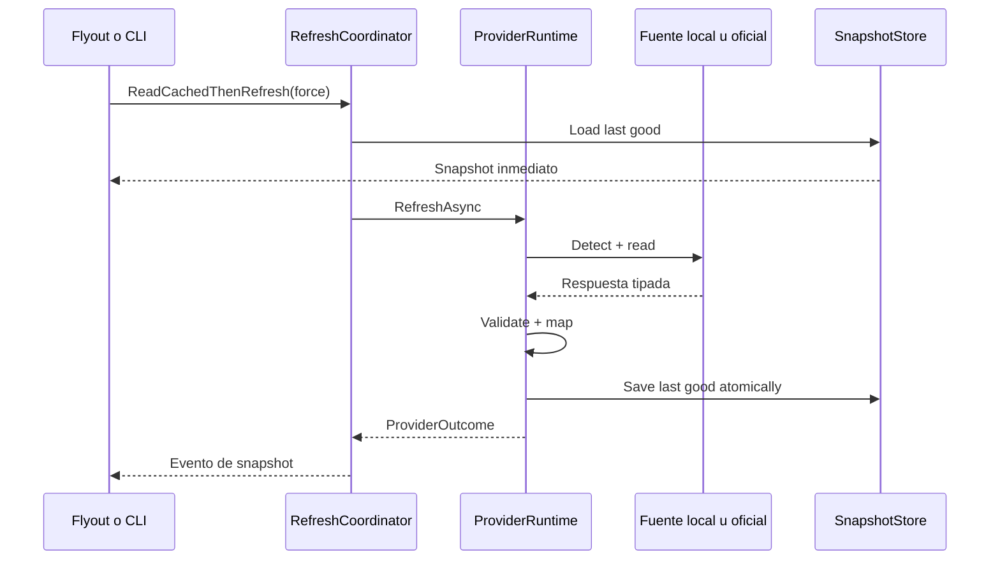

# ADR-0001: Base Windows nativa

Estado: aceptado

Fecha: 2026-07-21

## Contexto

El producto debe replicar la experiencia central de OpenUsage en Windows, reutilizar sesiones locales de forma segura y compartir datos entre UI, CLI y API. El shell tiene que permanecer ligero en segundo plano y operar con bandeja, varias pantallas, DPI, inicio con Windows y paquete firmado.

## Decisión

Usar C#, WinUI 3 y Windows App SDK en una app MSIX de confianza plena. Mantener el dominio y los proveedores fuera del proyecto WinUI. Integrar bandeja y ciclo de procesos con APIs Win32 pequeñas y propias. Empezar con Codex mediante su `app-server` oficial por `stdio`.

## Solución

```text
WOpenUsage.sln
├─ src/
│  ├─ WOpenUsage.App/                WinUI, XAML, ViewModels y composición
│  ├─ WOpenUsage.Core/               dominio, coordinación, caché y contratos
│  ├─ WOpenUsage.Providers/          adaptadores y scanners por proveedor
│  ├─ WOpenUsage.Platform.Windows/   bandeja, ventanas, procesos, archivos y secretos
│  └─ WOpenUsage.Cli/                comandos y JSON estable
├─ tests/
│  ├─ WOpenUsage.Core.Tests/
│  ├─ WOpenUsage.Providers.Tests/
│  ├─ WOpenUsage.Platform.Windows.Tests/
│  ├─ WOpenUsage.Architecture.Tests/
│  └─ WOpenUsage.App.UiTests/
├─ packaging/                        iconos, manifiesto y perfiles de publicación
└─ docs/
```

La app se crea con `dotnet new winui-mvvm -n WOpenUsage.App`. La solución conserva el manifiesto generado. Cada paquete NuGet se agrega sin fijar una versión manual para que el CLI elija la versión estable compatible. Todo build usa una arquitectura concreta; se excluye `AnyCPU`.

## Dependencias



`Core` no referencia WinUI, Windows App SDK ni implementaciones de proveedor. Una prueba de arquitectura verifica estas reglas.

## Flujo de datos



## Dominio

### Identidad

- `ProviderId`: identificador estable en minúsculas, por ejemplo `codex`.
- `AgentId`: cliente que produjo el uso, por ejemplo `grok-build` u `opencode`.
- `ModelProviderId`: proveedor real del modelo cuando el agente lo informa; puede faltar.
- `AccountId`: hash estable del identificador local cuando hay varias cuentas; nunca contiene correo.
- `ProviderInstanceId`: combinación estable de proveedor, cuenta y origen.
- `MetricId`: estable dentro de un proveedor; no depende del texto visible.

### Snapshot

`ProviderSnapshot` es inmutable y contiene:

- identidad, título resuelto y plan;
- `FetchedAt`, `SourceObservedAt` y zona horaria;
- lista ordenada de `MetricSnapshot`;
- `Provenance` por grupo de datos;
- cobertura y advertencias;
- versión de contrato del adaptador.

`MetricSnapshot` usa un payload cerrado:

- `ProgressMetric`: usado, límite, porcentaje, inicio, fin y próximo reinicio;
- `ScalarMetric`: valor, unidad y precisión;
- `TrendMetric`: buckets con fecha, tokens, costo y cobertura;
- `BadgeMetric`: texto y tono semántico;
- `TextMetric`: texto corto de estado.

La UI nunca recibe tokens de autenticación, rutas de credenciales ni la respuesta remota sin mapear.

### Procedencia

Cada valor declara:

- `SourceKind`: `OfficialLocalApi`, `OfficialRemoteApi`, `LocalLog`, `LocalDatabase`, `PrivateRemoteApi`, `ManualKey` o `Synthetic`; este último se reserva para muestras y tests;
- `MeasurementKind`: `Measured`, `ProviderReported`, `Estimated` o `Derived`;
- rango cubierto;
- versión del parser o endpoint;
- campos omitidos y motivo.

Esto permite que la UI distinga cuota informada por el proveedor, tokens medidos y costo estimado.

### Uso y gasto local

`UsageEvent` es el único registro detallado que conserva el motor propio:

- `EventKey`: hash estable de proveedor, fuente e identidad local del evento;
- `AgentId`, `ModelProviderId` opcional y `ModelId`;
- `OccurredAt` en UTC y zona horaria usada al agrupar;
- entrada, salida, razonamiento, lectura de caché y escritura de caché;
- `ReportedCostUsd` o `EstimatedCostUsd`, nunca ambos como una sola cifra;
- `CostKind`: `ProviderReported`, `CatalogEstimated` o `Unavailable`;
- versión de parser, versión de catálogo y patrón exacto de precio;
- `CoverageKind`: `Complete`, `Partial`, `SummaryOnly` o `Unpriced`.

El evento no contiene texto, herramienta, comando, tarea, sesión, proyecto, ruta o cuenta. `DailyUsageRollup` agrega por fecha, agente y modelo. La UI calcula total y cobertura desde esos rollups.

El orden de coste es: valor informado por la fuente, override exacto revisado, catálogo embebido y `Unavailable`. No se usan coincidencias por subcadena ni se transforma un coste de tarifa API en una factura de suscripción.

### Resultado de refresco

`ProviderOutcome` es una unión cerrada:

- `Success(snapshot)`;
- `NotConfigured(reason)`;
- `UnsupportedAccount(reason)`;
- `PartialSuccess(snapshot, warnings)`; el sufijo evita el nombre reservado `partial` bajo los analizadores de .NET;
- `Throttled(retryAt, lastGood)`;
- `TransientFailure(error, lastGood)`;
- `ContractFailure(error, lastGood)`;
- `PolicyBlocked(reason)`.

No se usan mensajes de excepción para decidir el estado visible.

## Runtime de proveedor

Cada adaptador implementa:

```csharp
public interface IProviderRuntime
{
    ProviderDescriptor Descriptor { get; }
    ValueTask<ProviderDetection> DetectAsync(CancellationToken cancellationToken);
    Task<ProviderOutcome> RefreshAsync(RefreshContext context, CancellationToken cancellationToken);
}
```

`DetectAsync` solo usa fuentes locales. `RefreshAsync` recibe un
`RefreshContext`. El primer corte usa `TimeProvider` de .NET como reloj
inyectable. Cliente de red, lector de archivos, proceso, proxy y catálogo de
precios se agregan mediante contratos de `Core` cuando un proveedor real los
necesite.

No se cargan plugins de terceros en el primer ciclo. Los proveedores se registran en código para mantener una superficie de confianza conocida.

## Coordinación

`RefreshCoordinator`:

- publica caché antes de iniciar red;
- ejecuta proveedores activos en paralelo;
- limita a una ejecución por proveedor;
- cancela al salir y en actualización manual reemplazada;
- entrega resultados parciales al terminar cada proveedor;
- usa `PeriodicTimer` con un reloj inyectable;
- aplica timeout y backoff por proveedor;
- evita que una excepción cierre el lote;
- serializa eventos hacia la UI con `DispatcherQueue` solo en el borde.

La cadencia inicial es cinco minutos. Manual refresh ignora TTL. Una activación reciente puede reutilizar la ejecución activa.

## Caché y ajustes

Se usan documentos JSON versionados bajo `ApplicationData.Current.LocalFolder`:

```text
LocalState/
├─ settings.v1.json
├─ layout.v1.json
├─ cache/
│  └─ snapshots.v1.json
├─ scanner/
│  ├─ index.v1.json
│  └─ usage.v1.db
└─ logs/
```

La escritura:

1. toma un mutex con nombre por documento;
2. escribe un temporal en la misma carpeta;
3. hace flush;
4. reemplaza el destino de forma atómica;
5. conserva una copia anterior cuando migra esquema.

La CLI se entrega dentro del mismo paquete y usa la misma identidad, carpeta y mutex. Las migraciones son incrementales, idempotentes y tienen pruebas con cada versión de fixture.

La caché no guarda credenciales ni respuestas remotas completas. El documento
`snapshots.v1.json` de 07C guarda solo snapshots normalizados. Los warnings siguen
en el outcome de runtime; un esquema posterior podrá persistirlos solo si no
contienen datos personales.

`usage.v1.db` es una SQLite propia y pequeña. Contiene `usage_event`, `daily_usage_rollup`, `source_cursor`, `pricing_catalog` y una tabla de migraciones. Retiene eventos normalizados durante 400 días y rollups diarios hasta que el usuario borre sus datos. Una limpieza se ejecuta por lotes y nunca toca la fuente del proveedor.

La UI y la CLI abren esta base por una sola capa de repositorio. Las escrituras usan transacción corta, WAL y `busy_timeout`; los readers no mantienen una transacción mientras esperan a un proceso externo.

## Bandeja y ventana

### Bandeja

`TrayIconHost` encapsula:

- `NOTIFYICONDATA` y `Shell_NotifyIconW`;
- `NIM_ADD`, `NIM_MODIFY`, `NIM_DELETE` y `NIM_SETVERSION`;
- mensaje registrado `TaskbarCreated` para restaurar el icono tras reiniciar Explorer;
- `NIN_SELECT`, `NIN_KEYSELECT` y `WM_CONTEXTMENU`;
- tooltip corto y accesible;
- recursos de icono por DPI y estado.

Se usa `LibraryImport` o `DllImport` en un único namespace de interop. No se agrega Windows Forms solo por `NotifyIcon`.

### Flyout

La ventana WinUI principal se mantiene creada y oculta. `AppWindow` controla tamaño y posición. El HWND se obtiene con `WindowNative.GetWindowHandle`.

Al abrir:

1. pedir el rectángulo del icono con `Shell_NotifyIconGetRect`;
2. obtener monitor, DPI y área de trabajo;
3. medir el contenido dentro del rango permitido;
4. colocar arriba o al lado del icono según el taskbar;
5. limitar el rectángulo al monitor;
6. activar y llevar foco al primer control útil.

Si no existe rectángulo, se usa el monitor del cursor. Al desactivar, la ventana se oculta salvo que haya un diálogo modal. Se prueba taskbar en cada borde, bandeja expandida, dos monitores y escalas de 100, 125, 150 y 200%.

No se usa `CompactOverlay`, ya que sus reglas pertenecen a picture-in-picture.

## Instancia y activación

- `AppInstance.FindOrRegisterForKey` reserva una instancia principal.
- Instancias secundarias redirigen activación y terminan.
- Activación por icono, atajo, alias CLI y notificación lleva un payload tipado.
- `StartupTask` inicia el proceso en modo bandeja, sin abrir el panel.
- El usuario puede desactivar el inicio desde ajustes o desde Windows.

## Integración Codex

`CodexAppServerClient` resuelve un ejecutable absoluto y lo inicia sin shell ni ventana:

```text
codex app-server --stdio
```

Controles:

- búsqueda en rutas conocidas y `PATH`, sin aceptar el directorio de trabajo como origen implícito;
- proceso dentro de un Job Object con `KILL_ON_JOB_CLOSE`;
- stdin/stdout redirigidos como UTF-8;
- stderr en buffer corto con sanitización;
- una tarea lectora correlaciona respuestas por ID;
- handshake único `initialize` + `initialized`;
- timeout por solicitud y límite de línea;
- parser tolerante a campos extra;
- cierre ordenado, luego kill del árbol si vence el plazo;
- reinicio con backoff tras crash;
- circuit breaker después de fallos repetidos.

El cliente llama solo a métodos de lectura:

- `account/read` con `refreshToken: false`, para clasificar sesión y tipo de
  cuenta sin conservar correo ni campos de cuenta;
- `account/rateLimits/read`;
- `account/usage/read`.

No llama login, logout, consumo de reset, envío de correo ni modelos. El usuario gestiona la sesión con Codex.

La verificación del contrato de Codex CLI 0.145.0 añadió `account/read` a la
lista permitida. La documentación oficial actual lo define como la lectura para
distinguir sesión ausente, API key y cuenta ChatGPT. El adaptador selecciona
solo `type`, `planType` y `requiresOpenaiAuth`; descarta `email` y nunca pide un
refresh proactivo. Esto reemplaza la inferencia frágil desde un error de cuota.

La detección devuelve:

- `Available` si el binario existe y el handshake responde;
- `NeedsLogin` si Codex informa que no hay cuenta ChatGPT;
- `UnsupportedAuth` si la cuenta usa un modo sin cuota ChatGPT;
- `Unavailable` si el binario falta o el protocolo no es apto.

Los tests usan un proceso fake JSONL. Un smoke opt-in usa el Codex real y solo imprime claves de esquema.

## Scanners locales

Un scanner recibe raíces explícitas y límites:

- cantidad máxima de archivos y bytes;
- cancelación frecuente;
- ciclo y profundidad de reparse points;
- parser streaming;
- deduplicación estable;
- zona horaria del usuario;
- catálogo de precios por fecha y modelo;
- índice incremental por ruta relativa, tamaño, fecha y hash corto de contenido relevante.

Los parsers ignoran prompt, respuesta, nombre de proyecto, tarea, herramienta y comando. Solo materializan los campos de `UsageEvent`. Los tests incluyen archivos truncados, línea inválida, cambio de esquema, duplicado, subagente, cambio de zona horaria y modelo sin precio.

Fuentes previstas:

- Grok Build: `summary.json`, `signals.json`, `updates.jsonl` y, como fallback, `unified.jsonl`; la fuente de sesión evita el doble conteo del fallback.
- OpenCode: `opencode.db` y el almacenamiento JSON legado; nunca `auth.json`. `opencode stats` sirve como oráculo diferencial, no como formato para parsear.
- Antigravity CLI: solo `.db` local con `gen_metadata` o una futura statusline que el usuario configure. Se excluyen `.pb` cifrados, Credential Manager, tokens, CSRF, language server y RPC privados.

Una base ajena se abre con SQLite en modo de solo lectura, consulta mínima y timeout corto. No se copia una base completa para evitar duplicar instalaciones grandes. Un bloqueo devuelve `Partial` con último rollup válido.

## Red

Un `HttpClient` por proveedor sale de `IHttpClientFactory` o de una fábrica equivalente de larga vida. Se evita crear clientes por refresco.

- proxy del sistema por defecto;
- opción de proxy explícito sin guardar contraseña en JSON;
- TLS del sistema;
- timeout por operación;
- headers mínimos;
- redacción de `Authorization`, cookies y query sensible;
- retry solo en operaciones idempotentes y errores aptos;
- respeto de `Retry-After`.

## API local

`LocalApiHost` usa `HttpListener` en un puerto configurable de loopback. La función empieza apagada.

Controles:

- bind literal a `127.0.0.1`;
- token bearer de 256 bits en Credential Locker;
- comparación constante del token;
- rechazo por defecto de cualquier `Origin`;
- allowlist exacta opcional;
- solo `GET`, cuerpo ausente y URL limitada;
- máximo de 16 solicitudes activas;
- respuesta y log sin credenciales ni rutas;
- rate limit local y timeout corto;
- estado visible si el puerto está ocupado.

Contrato base:

```json
{
  "schemaVersion": "wusage.limits.v1",
  "generatedAt": "2026-07-21T00:00:00Z",
  "providers": [],
  "stale": false
}
```

El modo de compatibilidad, si se implementa, se activa aparte y explica la diferencia de CORS.

## Claves manuales

OpenRouter y cualquier proveedor futuro aprobado para clave manual usan `PasswordVault`:

- resource: identificador de paquete + proveedor;
- userName: identificador estable sin correo cuando sea posible;
- password: clave;
- nunca se copia al clipboard salvo acción explícita;
- reveal exige confirmación y se vuelve a ocultar;
- borrar elimina la entrada y la caché ligada a esa cuenta.

No se guarda una credencial ajena en Credential Locker.

## Logging y diagnóstico

Eventos estructurados con:

- timestamp, nivel, componente, providerId, outcome, duración y correlationId;
- redacción por nombre y patrón;
- sin porcentajes, saldos, tokens, correos, rutas completas o cuerpos HTTP en nivel normal;
- archivos rotados con tope total;
- botón para exportar un ZIP de diagnóstico sanitizado después de previsualizar su contenido.

El modo debug es temporal y advierte su mayor detalle. Aun en debug se redaktan credenciales.

## UI y ViewModels

- Views contienen XAML y adaptación visual.
- ViewModels exponen estado inmutable o colecciones observables en el hilo UI.
- Comandos usan `async Task`; se evita `async void` salvo eventos del framework.
- Servicios no conocen controles XAML.
- Strings visibles viven en recursos desde la primera fase.
- Tema y alto contraste usan recursos semánticos, no colores fijos en cada control.
- Animaciones respetan la opción de sistema.

## Empaquetado

- paquete MSIX con identidad propia;
- confianza plena para archivos del usuario y procesos locales;
- `x64` y `ARM64`;
- alias de ejecución para CLI;
- StartupTask declarado en manifiesto;
- protocolos o activaciones solo cuando una función los necesita;
- firma de prueba en CI y firma de producción fuera del repo;
- canales beta y estable con identidades separadas o estrategia que evite reemplazos accidentales;
- avisos de terceros y licencia MIT en el paquete.

El repo conserva `Package.appxmanifest`. La build y el lanzamiento de desarrollo usan el script generado por la plantilla WinUI. El ejecutable empaquetado no se abre de forma directa.

## Seguridad

Límites de confianza:

1. XAML y dominio: código propio.
2. Adaptadores: datos no confiables de archivos, procesos y red.
3. Proceso proveedor: binario local resuelto por ruta.
4. API local: cliente local no confiable.
5. Persistencia: archivos del perfil que pueden estar dañados o editados.

Cada borde valida tamaño, esquema, timeout y cancelación. La app no ejecuta texto de logs ni construye comandos de shell con datos externos.

Los scanners pasivos no lanzan login, no leen archivos de autenticación y no llaman endpoints o servicios privados. En especial, Antigravity nunca usa Windows Credential Manager ni su language server; Grok no usa `auth.json` ni el endpoint interno de billing.

Antes de publicar un proveedor se completa una revisión de amenazas que cubre credenciales, rotación, endpoint, logs, cuenta múltiple, proxy, errores y política.

## Consecuencias

Ventajas:

- shell nativo y accesible;
- dominio fácil de probar;
- integración Codex con contrato oficial;
- proveedores aislados;
- CLI y API comparten semántica;
- paquete con inicio y actualización limpios.

Costos:

- interop Win32 para bandeja y foco;
- pruebas reales de monitores, DPI y paquete;
- proceso hijo Codex supervisado;
- cada proveedor privado puede quedar bloqueado por contrato;
- la tira de métricas de macOS necesita una adaptación Windows.

## Alternativas descartadas

- Electron o WebView como shell principal: añade un runtime que no aporta valor al panel nativo pedido.
- Windows Forms para toda la app: limita el diseño WinUI y la ruta de accesibilidad elegida.
- `NotifyIcon` de Windows Forms dentro de WinUI: agrega una dependencia amplia por una API pequeña.
- Lectura directa de `auth.json` Codex en el MVP: duplica la lógica de login y aumenta el riesgo de rotación.
- Parsear la salida humana de `opencode stats`: el comando no promete un contrato JSON y el texto puede cambiar; se conserva como prueba diferencial.
- Copiar bases SQLite de OpenCode antes de cada lectura: una instalación real puede ocupar varios GB y la copia aumenta I/O y espacio.
- Descifrar conversaciones Antigravity o consultar su daemon: amplía el acceso a contenido y login y contradice el límite de publicación elegido.
- App sin paquete: complica identidad, arranque, alias, avisos y actualización.
- API local con CORS abierto al instalar: permite lectura desde páginas abiertas.

## Gates para cambiar esta decisión

- Si `codex app-server` retira los métodos estables, revisar un fallback oficial antes de leer tokens.
- Si el paquete bloquea una ruta requerida en una prueba real, documentar el caso antes de considerar una variante sin paquete.
- Si Microsoft agrega una API WinUI de bandeja completa, se puede reemplazar el interop sin tocar el dominio.
- Si un proveedor publica un SDK o comando de cuota, su adaptador debe preferirlo frente al endpoint privado.
