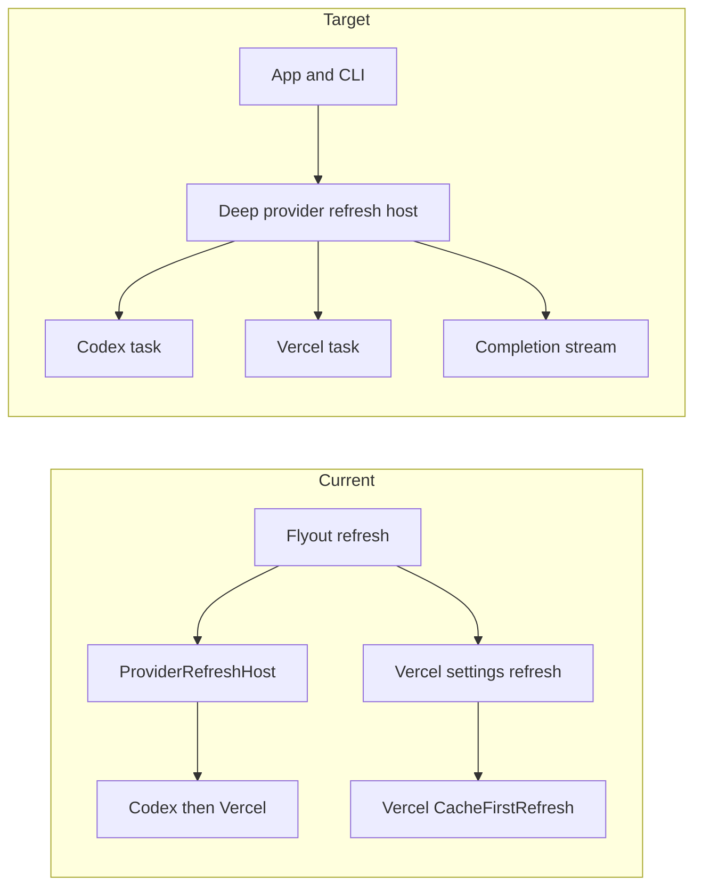
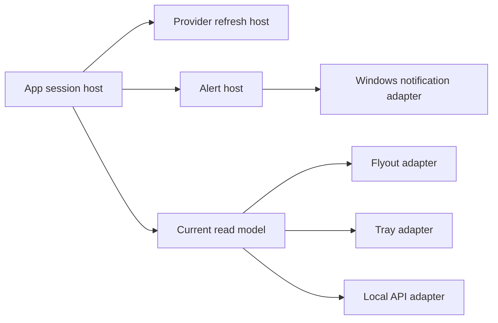
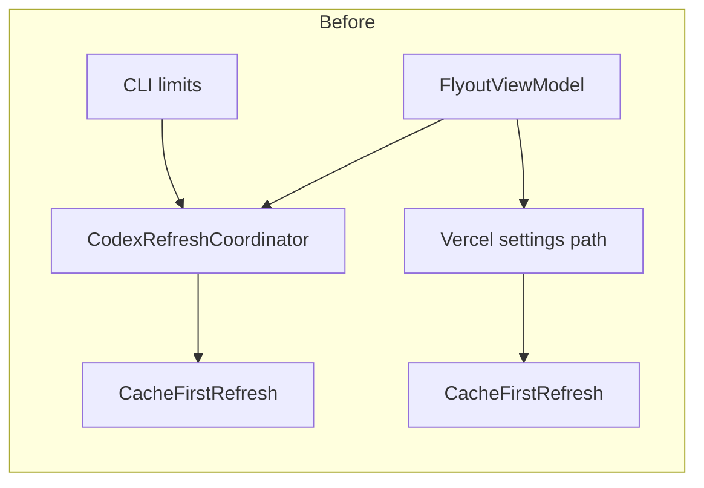
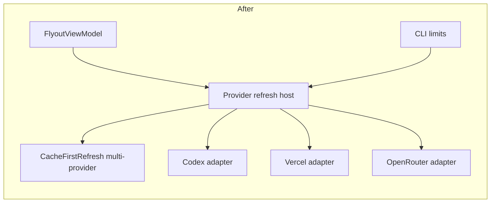

# Architecture review — TokenUsage / TokenUsage

Date: 2026-07-24

Updated: 2026-07-25

Reviewed source: `d734594b3d75bdee0f1c2d33ab10cd87af9578de`

Companion HTML: `.scratch/reports/architecture-tokenusage/index.html`

## Implementation status (2026-07-24)

| Rec | Strength | Status |
| --- | --- | --- |
| F3 Document store protocol | Strong | **done** — `VersionedDocumentFile` shared by Snapshot/Appearance/Layout (+ alert stores) |
| F4 Local usage refresh | Strong | **done** — `LocalUsageRefresh` domain result; App/CLI adapters |
| F1 Multi-provider refresh host | Strong | **done** — `ProviderRefreshHost`; App live + CLI limits |
| F7 Alert host | Medium | **done** — facts builder, decision/settings stores, `AlertHost` intents |
| F2 Flyout sessions | Strong | **done** — `AppearanceSession` + `DashboardLayoutEditor` + `LiveDashboardSession` + `SampleDashboardSession` wired as product path in `FlyoutViewModel` |
| F6 Composition root | Medium | **done** — `AppComposition` / MainPage no longer builds product graph |
| F5 Sample* rename | Medium | **done** — live models under `ViewModels/Dashboard/`; `DashboardMetricItem` (no Sample* live metric type) |
| F8 Local scan helpers | Weak | **done** — `LocalScanBudget`/`LocalScanState` used by Claude/Grok/OpenCode |

Cache partition decision: keep per-provider directories (wayfinder ticket 001).

## Follow-up review — 2026-07-25

Status: F9–F13 accepted and implemented in the local working tree on 2026-07-25.

### Executive summary

- HEAD implements F1–F8 and keeps the project graph within ADR-0001.
- The main current fault sits in refresh execution. `ProviderRefreshHost` runs
  providers in order, while the product contract says one slow provider cannot
  block another. Manual refresh also sends Vercel through two force-refresh
  paths.
- Provider identity, capabilities, cache paths, detection, and composition sit
  in separate App and CLI tables. The CLI diagnostics contract still omits
  Vercel while the App and `limits` command support it.
- App lifetime work starts in `FlyoutViewModel`. `AlertHost` has no product
  caller, and no five-minute refresh owner exists. Alerts, tray summaries, and
  the planned local API need an App session seam.
- The prior session split removed store work from `FlyoutViewModel`, yet XAML
  still binds to one 1,620-line module with 90 public declarations. The page
  remains one 1,924-line XAML file with 857 lines of code-behind.
- CLI wire documents and read models live inside the CLI project. Ticket 26
  would have to copy them or depend on CLI code.

**Owner decision (2026-07-25)**: accepted F9–F13 as a batch. The implementation
and proof are recorded in `docs/evidence/architecture-f9-f13.md`.

### Scope and method

- Read: `README.md`, product spec, provider matrix, ADR-0001, active tracker
  issues 14, 15, 23–27, and 74, the prior review, source, and focused tests.
- Walked the product graph across Core, Providers, Platform, Runtime, App, and
  CLI at HEAD.
- Applied the deletion test from `codebase-design` to refresh coordinators,
  provider tables, App lifetime work, UI sessions, and CLI documents.
- Counted source interface size and repeated provider/outcome mappings with
  bounded PowerShell and `rg` checks.
- Ran focused Release/x64 tests for project rules, refresh/alerts, and CLI
  diagnostics.
- Excluded final interface design, product code changes, packaged UI proof,
  external provider research, signing, and release work.

### Evidence ledger

| ID | Observation | Evidence |
| --- | --- | --- |
| E1 | Project edges and current source rules pass | `dotnet test tests/TokenUsage.Architecture.Tests/... --filter FullyQualifiedName~ArchitectureRulesTests`: 6/6 |
| E2 | Current refresh order and Alert host behavior pass their tests | Core focused run: 6/6; `ProviderRefreshHostTests` requires providers to complete in registration order |
| E3 | Current four-provider CLI diagnostics contract is green | CLI focused run: 26/26; process test expects 4 providers and 6 doctor checks |
| E4 | Refresh host is sequential | `ProviderRefreshHost.RunAsync` loops registrations and awaits one `CacheFirstRefresh` before starting the next; ADR-0001 lines 185–192 and product spec lines 212–223 require parallel progress |
| E5 | Manual Vercel refresh has two force paths | `FlyoutViewModel.RefreshAsync` starts `RefreshDashboardAsync` and `Vercel.RefreshAsync`; the live host already contains the Vercel registration |
| E6 | Provider catalog has drifted | App and CLI limits register Codex + Vercel; `LocalProviderDiagnosticsAccess` and `ProviderDiagnosticsValidator` list Claude, Codex, Grok, and OpenCode |
| E7 | WinUI interface remains broad | `FlyoutViewModel`: 1,620 lines, 30 observable properties, 10 relay commands, 90 public declaration lines; `MainPage`: 1,924 XAML lines, 71 named elements, 97 automation IDs, 857 code-behind lines, 28 event handlers |
| E8 | App lifetime has no deep owner | initial refresh starts in `FlyoutViewModel` constructor; tray refresh calls its command; no periodic refresh timer exists; `AlertHost` has no product caller |
| E9 | Automation contracts sit in CLI | `LimitsDocument` is internal; usage/provider/doctor documents are private nested records; `/v1/limits`, `/v1/usage`, and `/v1/health` remain planned |
| E10 | Core project size alone is not friction | `UsageRepository` and `DashboardLayout` expose compact domain interfaces and hide SQLite, migration, rollup, reconciliation, and invariant work |

### Current recommendations

#### F9. Make the provider refresh host the sole refresh path

**Severity**: High

**Recommendation strength**: Strong

**Files**

- `src/TokenUsage.Core/Cache/ProviderRefreshHost.cs`
- `src/TokenUsage.Core/Cache/CacheFirstRefresh.cs`
- `src/TokenUsage.Runtime.Windows/Codex/CodexRefreshCoordinator.cs`
- `src/TokenUsage.Runtime.Windows/VercelAiGateway/VercelGatewayRefreshCoordinator.cs`
- `src/TokenUsage.App/ViewModels/LiveDashboardSession.cs`
- `src/TokenUsage.App/ViewModels/VercelGatewaySettingsViewModel.cs`
- `src/TokenUsage.App/ViewModels/FlyoutViewModel.cs`
- `tests/TokenUsage.Core.Tests/Cache/ProviderRefreshHostTests.cs`

**Problem**

`ProviderRefreshHost` is the right seam, but its implementation starts each
provider after the prior provider completes. This breaks the product rule that
a slow provider cannot delay other results. The test suite fixes this order as
the current contract.

Vercel also keeps a private `CacheFirstRefresh` beside its host registration.
Manual refresh calls the host and `Vercel.RefreshAsync(forceRefresh: true)` in
the same command. The shared operation gate serializes the calls, so a forced
request can run twice.

Deletion test: removing the per-provider `RunAsync` paths leaves refresh
complexity in the host, where App and CLI already need it. Removing the host
spreads cache merge, force selection, gates, and event handling back into both
callers. The host earns depth; the extra coordinator paths do not.

**Solution**

Deepen `ProviderRefreshHost` so every App and CLI refresh enters one module.
The implementation should start eligible providers without registration-order
blocking, publish each completion, keep per-provider gates, and support one
provider request through the same seam. Connection settings should request a
refresh through the host.

Final method names and event types belong to the interface design phase.

**Benefits**

- locality: refresh order, force behavior, cache publication, and gates live in
  one module
- leverage: one interface serves App, CLI, alerts, tray, and local API
- tests cross one seam for slow, fast, canceled, and per-provider work
- duplicate Vercel calls disappear

**Before / After**

**Dependencies / sequencing**

- First current recommendation.
- Preserve per-provider cache directories and operation gates.
- Replace the ordered-completion test with a controlled slow/fast test.
- Add a manual-refresh test that counts one Vercel runtime call.

**Documentation follow-ups**

- Reconcile ADR-0001 coordination text with the accepted execution contract.
- Add `provider refresh pass` to shared domain terms.
- Link the implementation task to this finding.

---

#### F10. Deepen one provider catalog and Windows composition module

**Severity**: High

**Recommendation strength**: Strong

**Files**

- `src/TokenUsage.App/Composition/AppComposition.cs`
- `src/TokenUsage.Cli/LocalLimitsCliAccess.cs`
- `src/TokenUsage.Cli/LocalProviderDiagnosticsAccess.cs`
- `src/TokenUsage.Cli/ProviderDiagnosticsValidator.cs`
- `src/TokenUsage.App/ViewModels/FlyoutViewModel.cs`
- `src/TokenUsage.App/ViewModels/LocalUsageCardProjector.cs`
- `src/TokenUsage.App/ViewModels/VercelGatewaySettingsViewModel.cs`
- `src/TokenUsage.App/Controls/ProviderColorPalette.cs`
- `src/TokenUsage.App/Controls/ProviderMarkImage.xaml.cs`

**Problem**

Provider identity and capability knowledge has many owners. App composition and
CLI limits know Codex and Vercel. CLI diagnostics and its validator know Claude,
Codex, Grok, and OpenCode. App status rows build a third catalog. Visual marks,
colors, names, detection, cache paths, and runtime factories use more tables.

The drift is visible now: `tokenusage providers` omits Vercel, while the App and
`tokenusage limits` support it. OpenRouter runtime work would add another set of
edits before it reaches a user.

Deletion test: removing the diagnostics catalog leaves the same expected IDs
in its validator. Removing App registration leaves CLI registration intact.
These shallow tables repeat knowledge across callers.

**Solution**

Deepen one provider catalog module for canonical IDs, names, capabilities,
detection hooks, refresh registration, and Windows data paths. App, CLI, and the
future API should consume the catalog. Provider-specific UI marks, credential
forms, and text remain adapters at the App seam.

The interface design phase must decide how local agents and remote quota
providers share the catalog while keeping their distinct source rules.

**Benefits**

- locality: adding or disabling a provider changes one catalog
- leverage: App, CLI, diagnostics, and API see the same provider set
- provider policy remains explicit while visual adapters stay in App
- tests verify catalog completeness once

**Before / After**

Current: App composition, CLI limits, CLI diagnostics, validator, and status UI
each keep provider lists. Target: one catalog feeds host adapters; App keeps
only presentation assets and forms.

**Dependencies / sequencing**

- Follow F9 so catalog entries target the accepted refresh seam.
- Do before OpenRouter runtime and Ticket 26.
- Keep provider gates and publication flags in the catalog data or linked
  policy records.

**Documentation follow-ups**

- Add `provider catalog` and `provider capability` to shared domain terms.
- Update the project map if Runtime.Windows owns the catalog composition.
- Record a task that closes the Vercel CLI diagnostics gap.

---

#### F11. Add a deep App session host for background product work

**Severity**: High

**Recommendation strength**: Strong

**Files**

- `src/TokenUsage.App/ViewModels/FlyoutViewModel.cs`
- `src/TokenUsage.App/MainWindow.xaml.cs`
- `src/TokenUsage.App/MainPage.xaml.cs`
- `src/TokenUsage.App/Composition/AppComposition.cs`
- `src/TokenUsage.Core/Alerts/AlertHost.cs`
- `.scratch/tokenusage/issues/14-avisar-por-cuota-ritmo-y-datos-vencidos.md`
- `.scratch/tokenusage/issues/15-integrar-arranque-y-atajo-global.md`
- `.scratch/tokenusage/issues/26-exponer-una-api-local-opt-in.md`

**Problem**

App-wide work has no lifetime module. `FlyoutViewModel` starts the first refresh
in its constructor. `MainWindow` sends tray refresh through the ViewModel. The
only repeating timers update relative text and system visuals. The five-minute
refresh contract has no owner. `AlertHost` passes focused tests but has no App
caller.

Alerts, tray summaries, startup/hotkey state, and the local API all need product
state while the flyout is hidden. Adding them to `MainWindow` or
`FlyoutViewModel` would join background work to view lifetime.

Deletion test: removing the constructor refresh leaves no product refresh
owner. Each new background feature must choose a view or window, so lifetime
complexity reappears in UI callers.

**Solution**

Deepen an App session host that owns refresh cadence, cancellation, the latest
app-wide result, and alert evaluation. UI, tray, notifications, and local API
become adapters that observe or request work through this seam. The host should
use injected time and avoid WinUI types so its lifetime tests run without the
packaged app.

Final ownership of startup tasks, hotkeys, and API hosting remains an interface
design choice.

**Benefits**

- locality: refresh cadence, shutdown, and alert evaluation share one lifetime
- leverage: hidden flyout, tray, CLI/API readers, and notifications use one
  current result
- tests control time and cancellation without WinUI
- `MainWindow` stays focused on window and tray interaction

**Before / After**

**Dependencies / sequencing**

- After F9 and the first F10 catalog slice.
- Before Ticket 14 UI wiring and Ticket 26.
- Add fake-time tests for initial, periodic, manual, canceled, and shutdown
  refreshes.

**Documentation follow-ups**

- Add `App session` and `current result` to shared domain terms.
- Update ADR-0001 coordination and App lifetime sections.
- Link Tickets 14, 15, and 26 to the accepted host task.

---

#### F12. Turn UI sessions into real child surface modules

**Severity**: Medium

**Recommendation strength**: Strong

**Files**

- `src/TokenUsage.App/ViewModels/FlyoutViewModel.cs`
- `src/TokenUsage.App/ViewModels/LiveDashboardSession.cs`
- `src/TokenUsage.App/ViewModels/SampleDashboardSession.cs`
- `src/TokenUsage.App/ViewModels/AppearanceSession.cs`
- `src/TokenUsage.App/ViewModels/DashboardLayoutEditor.cs`
- `src/TokenUsage.App/ViewModels/VercelGatewaySettingsViewModel.cs`
- `src/TokenUsage.App/MainPage.xaml`
- `src/TokenUsage.App/MainPage.xaml.cs`
- `tests/TokenUsage.Providers.Tests/Sessions/SessionModuleTests.cs`

**Problem**

F2 extracted useful implementation, but the XAML interface remains the whole
product. `FlyoutViewModel` mirrors session state, localization, projection,
layout actions, provider status, options navigation, and refresh outcomes. It
has 90 public declaration lines. `LiveDashboardSession.RunAsync` accepts a
Vercel ViewModel and a callback, so provider UI leaks across its seam.

`MainPage.xaml` contains every surface and provider form. Its code-behind owns
focus routing, options depth, 28 handlers, test paths, and Vercel fake adapters.
No focused test constructs `FlyoutViewModel`; architecture tests check source
strings instead.

Deletion test: `AppearanceSession` and `DashboardLayoutEditor` keep real depth
because deleting them returns persistence work to the shell. The flat shell
cannot be deleted without moving its interface to every view. Its interface
nearly matches all UI implementation.

**Solution**

Promote the existing sessions into bindable child modules with their own state,
commands, and tests. Split MainPage into child views for dashboard, general,
appearance, personalization, providers, and provider connection forms. Keep a
small shell for surface navigation and shared close/back behavior. Move debug
adapters and test path parsing into composition fixtures.

The interface design phase should preserve current automation IDs, focus
behavior, localization, and compiled bindings.

**Benefits**

- locality: provider form changes stop touching dashboard and appearance code
- leverage: child modules run in focused tests and can host more providers
- interface size matches each visible surface
- XAML and focus code follow the same ownership as ViewModels

**Before / After**

| Current owner | Target module |
| --- | --- |
| Flat options flags and commands | Options navigation shell |
| Appearance mirrors and save queue | Appearance child module |
| Layout actions and projection | Personalization child module |
| Codex/Vercel/local publish state | Live dashboard child module |
| Vercel form inside MainPage | Provider connection child view |

**Dependencies / sequencing**

- Move provider outcome handling after F9/F10.
- Split options views first; they have clearer ownership and lower refresh risk.
- Move live dashboard state after F11 defines the App result seam.
- Keep current UIA scripts as regression proof at each slice.

**Documentation follow-ups**

- Update the UI architecture section in ADR-0001 if child ViewModel ownership is
  accepted.
- Add `surface module` to shared App terms.
- Create one task per view slice; keep AutomationId preservation in acceptance.

---

#### F13. Share automation queries before the local API

**Severity**: Medium

**Recommendation strength**: Medium

**Files**

- `src/TokenUsage.Cli/LocalLimitsCliAccess.cs`
- `src/TokenUsage.Cli/LocalUsageCliAccess.cs`
- `src/TokenUsage.Cli/LocalProviderDiagnosticsAccess.cs`
- `src/TokenUsage.Cli/LimitsDocument.cs`
- `src/TokenUsage.Cli/UsageCommand.cs`
- `src/TokenUsage.Cli/ProvidersCommand.cs`
- `src/TokenUsage.Cli/DoctorCommand.cs`
- `docs/PRODUCT-SPEC.md` local API section
- `.scratch/tokenusage/issues/26-exponer-una-api-local-opt-in.md`

**Problem**

The CLI owns both data queries and stable automation documents.
`LimitsDocument` is internal. Usage, provider, and doctor wire records are
private nested types. Diagnostics domain records live in the CLI namespace.
The planned local API needs the same limits, usage, provider, and health facts.

Deletion test: deleting CLI serialization removes the only source form for the
wire contract apart from golden JSON. A local API module would copy query and
validation logic or reference the CLI project.

**Solution**

Deepen a shared automation query module that returns typed limits, usage,
provider, and health read models. CLI and HTTP remain transport adapters. Keep
argument parsing and terminal text in CLI. Keep bearer, Origin, method, and
concurrency rules in the local HTTP host.

During interface design, decide whether CLI and HTTP share exact wire documents
or only the typed query model. Their version rules may differ.

**Benefits**

- locality: query rules and redaction-safe fields live in one module
- leverage: CLI and local API use the same read path
- golden CLI files stay stable while HTTP tests cover transport rules
- avoids a project reference from the API host to CLI

**Before / After**

Current: CLI access reads stores and private CLI records serialize the result.
Target: shared query read models feed CLI JSON/human and HTTP JSON adapters.

**Dependencies / sequencing**

- After the F10 catalog fixes the provider set.
- Before Ticket 26 implementation.
- Preserve all four current CLI golden files and exit codes.

**Documentation follow-ups**

- Add `automation query` and `automation read model` to shared domain terms.
- Add an ADR only if CLI and HTTP share a wire schema or version lifecycle.
- Split Ticket 26 into query reuse, HTTP security, lifecycle, and packaged proof.

### Decisions and trade-offs

| Item | State | Reason |
| --- | --- | --- |
| F1–F8 | Accepted and implemented at HEAD | Prior batch landed in `d734594`; focused proof is green |
| Per-provider cache directories | Accepted | Preserves fault and schema isolation |
| F9–F13 | Accepted and implemented locally | Full Release/x64 gate and packaged UIA are green; awaiting human diff review and commit authority |
| Full merge of local parsers | Rejected | Claude, Grok, and OpenCode formats need provider locality |
| Split `UsageRepository` by file size | Rejected | One interface hides SQLite, migration, tombstones, transactions, and rollups |
| Split `DashboardLayout` by file size | Rejected | One domain interface owns layout invariants and reconciliation |
| Exact CLI/API wire sharing | Deferred | Choose during F13 interface design |

### Prioritized workplan

| Order | Finding | Work | Depends on | Acceptance | Verification | Authority |
| ---: | --- | --- | --- | --- | --- | --- |
| 1 | F9 | One concurrent refresh path | Current stores/gates | slow provider cannot delay a fast provider; one Vercel call per manual refresh | Core controlled-concurrency tests; App refresh call-count test | Agent after owner accepts |
| 2 | F10 | Canonical provider catalog and Windows composition | F9 registration seam | App, limits, providers, and doctor derive one provider set; Vercel appears in diagnostics | catalog tests; CLI goldens/process tests; App status tests | Agent after owner accepts |
| 3 | F11 | App session host | F9, first F10 slice | initial/periodic/manual refresh, cancellation, alert evaluation, and shutdown have one owner | fake-time host tests; alert intent tests; tray adapter test | Agent after owner accepts |
| 4 | F13 | Shared automation query read models | F10 | CLI uses shared queries with unchanged wire files; HTTP host has no CLI reference | four CLI goldens; query tests; architecture rule | Agent after owner accepts |
| 5 | F12 | Child surface modules and views | F9–F11 | focused child tests; shell owns navigation only; UIA IDs and focus stay stable | ViewModel tests; architecture rules; packaged x64 UIA per slice | Agent after owner accepts |

### Verification

| Check | Result |
| --- | --- |
| `git status --short --branch` before edits | clean `main...origin/main` |
| Architecture rules, Release/x64 | 6 passed |
| Core `ProviderRefreshHostTests` + `AlertHostTests`, Release/x64 | 6 passed |
| CLI provider diagnostics command/access tests, Release/x64 | 26 passed |
| Source inventory and interface counts | passed; values recorded in E4–E9 |
| HTML Lab validation | passed; self-contained report with no external references |
| Chrome at 1440×1000 and 390×844 | passed; no horizontal overflow, filters and theme work, focus order starts at skip link, no console warnings/errors, one report network request |
| Lighthouse desktop snapshot | accessibility 100, best practices 100, agentic browsing 100, SEO 100 after adding a meta description |
| Full solution build | skipped; no product code changed |
| Packaged App/UIA | skipped; report work does not change user UI |
| External research | skipped; current repo contracts were enough |

### Residual risks

- Static source proves two Vercel force paths. A call-count product test should
  confirm the runtime effect before the F9 change.
- Tracker state has drift. Ticket 74 still says quota UI is pending while its
  evidence and README say it works. F10 work should refresh affected tracker
  records.
- No current test measures first fast-provider publication under a blocked
  provider.
- No current App test proves alert evaluation, periodic refresh, or shutdown.
- The WinUI split carries focus and UIA risk; preserve selectors and validate
  each view in the packaged x64 app.

## Prior review summary (2026-07-24, pre-implementation)

- Project graph (Core / Providers / Platform / Runtime / App / CLI) matches ADR-0001 and is enforced by architecture tests.
- Friction sits **inside** those projects: live refresh is still codex-centric, the flyout ViewModel is a god module, JSON document stores copy the same lock/write skeleton three times, and local usage refresh mixes Core I/O with App projection.
- Shallow modules: per-provider refresh coordinators (thin `CacheFirstRefresh` shells), composition rooted in `MainPage`, and `Sample*` dashboard models used for live UI.
- This review matters now because OpenRouter is client-only, alerts evaluator is unhosted, and each new provider/settings feature currently expands `FlyoutViewModel` and App wiring instead of one deep seam.

## Prior recommendations (historical evidence)

### 1. Deepen multi-provider refresh coordination

**Recommendation strength**: Strong

**Files**

- `src/TokenUsage.Core/Cache/CacheFirstRefresh.cs`
- `src/TokenUsage.Runtime.Windows/Codex/CodexRefreshCoordinator.cs`
- `src/TokenUsage.Runtime.Windows/VercelAiGateway/VercelGatewayRefreshCoordinator.cs`
- `src/TokenUsage.App/Services/SampleRefreshCoordinator.cs`
- `src/TokenUsage.App/ViewModels/FlyoutViewModel.cs` (`RefreshDashboardAsync`, live path only runs Codex)
- `src/TokenUsage.Cli/LocalLimitsCliAccess.cs` (force-refresh codex-only)
- `docs/architecture/ADR-0001-windows-native-baseline.md` (describes multi-provider `RefreshCoordinator`)

**Problem**

ADR-0001 describes one cache-first coordinator that runs active providers in parallel and streams partial results. The implementation is N shallow adapters (`CodexRefreshCoordinator`, `VercelGatewayRefreshCoordinator`, `SampleRefreshCoordinator`) plus App orchestration that only awaits Codex for live refresh. Vercel runs on its own path inside `VercelGatewaySettingsViewModel`. CLI limits force-refresh only knows `codex`. Adding OpenRouter (client already exists) would open a third App/CLI branch.

Deletion test: deleting `CodexRefreshCoordinator` / `VercelGatewayRefreshCoordinator` removes almost no complexity — callers still need store path, resilient wrap, and event consumption. Complexity reappears at every host.

**Solution**

Deepen a single **provider refresh host** module in Core or Runtime:

- one interface: register providers, run cache-first (optionally parallel), stream `CacheFirstEvent`, share `SnapshotStore` policy and operation gates;
- adapters: Codex factory, Vercel runtime, sample fake, future OpenRouter runtime;
- hosts (App, CLI) consume one event stream, not per-provider coordinators.

Keep provider-specific connection services (e.g. Vercel credentials) as adapters behind that host, not as separate refresh graphs.

**Benefits**

- locality: refresh policy, cache write status, and force-refresh live in one module
- leverage: one interface for App flyout, CLI limits, diagnostics, future local API
- tests cross one seam instead of three coordinator + two hosts

**Before / After**

**Dependencies / sequencing**

- Do this before OpenRouter runtime + UI and before multi-provider CLI limits.
- Unblocks alerts fact collection from a single refresh pass.
- Depends on shared snapshot cache layout decision (one file vs per-provider partitions — document in ADR if changed).

**Documentation follow-ups**

- Update ADR-0001 coordination section if parallel semantics or cache partition change
- Add domain term: `provider refresh host`
- Task in workplan / issues when accepted

---

### 2. Split `FlyoutViewModel` into deep surface modules

**Recommendation strength**: Strong

**Files**

- `src/TokenUsage.App/ViewModels/FlyoutViewModel.cs` (~1490 lines)
- `src/TokenUsage.App/ViewModels/VercelGatewaySettingsViewModel.cs`
- `src/TokenUsage.App/ViewModels/DashboardLayoutSessionHistory.cs`
- `src/TokenUsage.App/MainPage.xaml.cs` (binds many surface concerns)

**Problem**

`FlyoutViewModel` is one shallow module whose interface is the whole product: surface state machine, sample vs live, Codex publish path, local usage, Vercel glue, appearance load/save, language restart, dashboard layout mutations/history, provider status rows, relative time, options navigation. Every new feature edits this file. Tests and UI must understand the whole graph.

**Solution**

Deepen by extracting modules with small interfaces and clear ownership:

| Module | Owns |
| --- | --- |
| `FlyoutSurfaceController` | Empty / Loading / Sample / Options / Unavailable transitions |
| `LiveDashboardSession` | cache-first events → combined live cards + data state |
| `SampleDashboardSession` | sample scenarios + fake refresh |
| `DashboardLayoutEditor` | layout load/mutate/undo/persist (already partly separate stores) |
| `AppearanceSession` | appearance load/save/busy/readonly |
| `OptionsNavigation` | options section stack |

Keep `FlyoutViewModel` as a thin composition of those modules for XAML binding, or replace with a shell ViewModel + child ViewModels if binding needs locality.

**Benefits**

- locality: appearance bugs no longer touch refresh; layout undo no longer touches Codex
- leverage: `LiveDashboardSession` reusable from tests without options UI
- interface shrinks per module; implementation absorbs orchestration helpers

**Before / After**

Before: one class, ~30 private fields, ~25 commands/properties coupled by `NotifyPropertyChangedFor` chains.

After: shell binds children; each child has one refresh or persist path and its own tests.

**Dependencies / sequencing**

- Prefer after recommendation 1 so live session has a single refresh host to bind.
- Can start with `AppearanceSession` and `DashboardLayoutEditor` (already semi-isolated) without waiting on refresh host.
- Do before stuffing alerts into the flyout.

**Documentation follow-ups**

- CONTEXT / domain: name live session vs sample session
- UI architecture note under `docs/architecture/` if binding pattern changes

---

### 3. Deepen versioned document store infrastructure

**Recommendation strength**: Strong

**Files**

- `src/TokenUsage.Core/Cache/SnapshotStore.cs`
- `src/TokenUsage.Core/Appearance/AppearanceSettingsStore.cs`
- `src/TokenUsage.Core/Layout/DashboardLayoutStore.cs`
- Future: alert settings / preference persistence

**Problem**

Three stores reimplement the same module shape: path validation, named mutex, bounded read, schema version probe, quarantine corrupt, temp file + `File.Move` atomic write, `RunLocked`. Domain schema differs; lock/write protocol does not. Alert preferences will likely spawn a fourth copy.

Deletion test: delete one store's `RunLocked` and the complexity reappears identically in the others — pass-through of protocol, not domain depth.

**Solution**

Deepen a **versioned document store** module in Core:

- interface: `LoadAsync` / `SaveAsync` / optional `ProbeAsync` with typed results for missing, loaded, unsupported version, corrupt quarantined, IO, lock timeout;
- implementation: mutex naming, timeout, atomic replace, size/depth limits, quarantine rename;
- adapters: snapshot document, appearance document, layout document, future alert settings.

Keep domain serialization and migration rules in each document adapter.

**Benefits**

- locality: lock timeout and quarantine policy fix once
- leverage: new JSON documents get safety without copying 100+ lines
- tests prove protocol once; adapters test schema only

**Before / After**

Before: three near-copy `RunLocked` / `CreateMutexName` implementations.

After: one protocol module; three thin serializers.

**Dependencies / sequencing**

- Safe to do anytime; low product-surface risk if behavior-preserving.
- Do before alert settings persistence and any new LocalState JSON.

**Documentation follow-ups**

- ADR only if mutex naming or quarantine paths change in a breaking way
- Mention store protocol in ADR-0001 cache section as shared, not snapshot-only

---

### 4. Move local usage refresh behind a Core/Runtime seam

**Recommendation strength**: Strong

**Files**

- `src/TokenUsage.App/Services/LocalUsageCoordinator.cs`
- `src/TokenUsage.App/ViewModels/LocalUsageCardProjector.cs`
- `src/TokenUsage.Core/Usage/UsageRepository.cs`
- `src/TokenUsage.Core/Usage/IUsageEventSource.cs`
- `src/TokenUsage.Cli/LocalUsageCliAccess.cs`
- `src/TokenUsage.App/MainPage.xaml.cs` (wires Claude/Grok/OpenCode sources)

**Problem**

Local usage refresh lives in App: opens repository, classifies snapshot vs windowed sources, reconciles, applies retention, then projects a UI card with `Func<string,string> getString`. CLI reimplements rollup aggregation in `LocalUsageCliAccess` without the coordinator. Ingest policy and UI formatting share one class. Domain depth is real but the seam is in the wrong project and leaks presentation.

**Solution**

Deepen a **local usage refresh** module in Core (or Runtime if path defaults need Windows):

- interface: refresh registered `IUsageEventSource` list → structured result (rollups, per-source diagnostics, overall status, period bounds);
- implementation: repository open, snapshot/windowed ingest rules, retention, diagnostics;
- App adapter: `LocalUsageCardProjector` maps structured result + strings → card;
- CLI adapter: maps same result → JSON/summary without string resources.

**Benefits**

- locality: reconciliation bugs live next to `UsageRepository`, not ViewModels
- leverage: App and CLI share one refresh path
- interface is pure domain; presentation adapters stay thin

**Before / After**

Before: App coordinator returns `LocalUsageCard`; CLI queries repository with different math surface.

After: both call `LocalUsageRefresh.RunAsync` then format.

**Dependencies / sequencing**

- Independent of refresh host; can ship in parallel.
- Helps provider status rows and heatmaps stay fed from one result type.

**Documentation follow-ups**

- Domain term: distinguish **local usage refresh** from **provider refresh**
- Update ADR usage section if repository open modes become part of the interface

---

### 5. Promote live dashboard models out of `Sample*`

**Recommendation strength**: Medium

**Files**

- `src/TokenUsage.App/ViewModels/Sample/SampleDashboardModels.cs`
- `src/TokenUsage.App/ViewModels/LiveDashboardComposer.cs`
- `src/TokenUsage.App/ViewModels/CodexDashboardProjector.cs`
- `src/TokenUsage.App/ViewModels/VercelGatewayCardProjector.cs`
- `src/TokenUsage.App/ViewModels/LocalUsageCardProjector.cs`
- XAML bindings to `SampleProviderCard`, `SampleQuotaWindow`, etc.

**Problem**

Live Codex, Vercel, and local spend compose into `SampleDashboardSnapshot` / `SampleProviderCard`. Sample mode and production UI share the same types. The name says sample; the depth is the real dashboard projection. Callers must know that "sample" means "card model." Naming leak across the seam.

**Solution**

Deepen a **dashboard projection** module with neutral names (`DashboardSnapshot`, `ProviderCard`, `QuotaWindow`, `SpendSlice`). Sample mode becomes one adapter that fills the same model from fake scenarios. Live composers already almost do this via `LiveDashboardComposer`.

**Benefits**

- locality: projection rules stop living under a Sample folder
- leverage: one card model for sample, live, and design QA
- reduces false “sample-only” mental model for new contributors

**Dependencies / sequencing**

- Best after or with recommendation 2 (session split) to avoid a mega-rename in the god ViewModel.
- Pure rename + move is acceptable if types stay shape-compatible.

**Documentation follow-ups**

- PRODUCT-SPEC / design docs: call out dashboard projection vs sample catalog
- No ADR unless serialization of these models is introduced

---

### 6. Extract App composition root from `MainPage`

**Recommendation strength**: Medium

**Files**

- `src/TokenUsage.App/MainPage.xaml.cs` (constructs coordinators, stores, sources, debug Vercel fakes)
- `src/TokenUsage.App/Program.cs` / `App.xaml.cs`
- Debug helpers embedded in `MainPage` (`DebugVercelCredentialStore`, etc.)

**Problem**

`MainPage` is both view and composition root: LocalFolder paths, source list, coordinators, layout/appearance stores, optional debug Vercel doubles. Composition knowledge is hard to test and hard to reuse (e.g. secondary window, headless smoke). Deletion of page construction logic would force reassembly in every host.

**Solution**

Deepen an **App composition** module (factory or small builder):

- inputs: local data root, clock, optional debug switches;
- outputs: fully wired `FlyoutViewModel` (or session graph) + disposable refresh host;
- `MainPage` only receives the ViewModel and handles view concerns (theme, animation, measure root).

**Benefits**

- locality: path layout and provider registration in one place
- leverage: UI tests and debug modes swap adapters without page code
- keeps view code about interaction, not product graph

**Dependencies / sequencing**

- Natural follow-on to recommendations 1 and 4 (those produce the objects the factory wires).
- Debug Vercel doubles move to test/debug adapters, not nested private classes on the page.

**Documentation follow-ups**

- ADR-0001 “UI y ViewModels” bullet on composition edge
- Evidence note for ticket wiring when factories change

---

### 7. Design alert host seam before UI wiring

**Recommendation strength**: Medium

**Files**

- `src/TokenUsage.Core/Alerts/AlertEvaluator.cs` (pure, deep)
- `src/TokenUsage.Core/Alerts/AlertFacts.cs`, `AlertCandidate.cs`, `AlertConditionKey.cs`, `AlertSettings.cs`
- Untracked WIP relative to last commit; not yet composed from App
- Future: notification / tray / preference store

**Problem**

`AlertEvaluator` is already a deep pure module. Risk is wiring it the shallow way: call from `FlyoutViewModel` after each publish, with ad-hoc fact mapping and no dedupe store. That would couple alerts to UI lifetime and scatter fact extraction across Codex/Vercel/local paths.

**Solution**

Before UI:

1. **Alert facts builder** module: `ProviderSnapshot` / `ProviderOutcome` / freshness → `ProviderAlertFacts`.
2. **Alert decision store** module: remember fired condition keys / snooze across sessions (document store from recommendation 3).
3. **Alert host** module: on refresh completion, evaluate, filter already-notified, emit notification intents.
4. UI and tray become adapters for intents.

**Benefits**

- locality: threshold policy stays in Core; hosts only present
- leverage: same host for tray toast, flyout badge, CLI doctor
- keeps `FlyoutViewModel` from growing another 200 lines

**Dependencies / sequencing**

- Depends on recommendation 1 for multi-provider facts in one pass (or facts builder accepts partial inputs).
- Settings persistence benefits from recommendation 3.
- Do not block pure evaluator tests; block only host integration on seams above.

**Documentation follow-ups**

- Domain terms: alert candidate, condition key, facts
- ADR if notification delivery chooses a specific Windows API with trade-offs

---

### 8. Shared local scan limits (optional deepen, not full parser merge)

**Recommendation strength**: Weak / opportunistic

**Files**

- `src/TokenUsage.Providers/Claude/ClaudeUsageEventSource.cs` (~640 lines)
- `src/TokenUsage.Providers/Grok/GrokUsageEventSource.cs` (~753 lines)
- `src/TokenUsage.Providers/OpenCode/OpenCodeUsageEventSource.cs` (~648 lines)

**Problem**

Sources share constructor patterns (max files/bytes, grouping TZ, root unavailable → `NoData`) and scan partial flags, but parsers and file shapes differ. Full unification would be shallow abstraction over unlike formats.

**Solution**

Extract only repeated **scan budget** / diagnostic helpers if a fourth source lands. Keep parsers as deep provider modules. Do not force a common parser interface beyond `IUsageEventSource`.

**Benefits**

- locality stays with each parser for format bugs
- small leverage on limits and diagnostics only

**Dependencies / sequencing**

- After recommendation 4 so diagnostics type is stable
- Skip until a new local agent source is scheduled

**Documentation follow-ups**

- None unless a shared helper module is added

---

## Prior suggested execution order

1. **Document store infrastructure (rec 3)** — lowest product risk, stops fourth-copy stores (alerts/settings).
2. **Local usage refresh seam (rec 4)** — App/CLI already diverge; pure domain move with projector adapter.
3. **Multi-provider refresh host (rec 1)** — unblocks OpenRouter, multi-provider CLI, unified alerts facts.
4. **Alert host design (rec 7)** — after refresh host + document store; before UI.
5. **Split FlyoutViewModel (rec 2)** — peel Appearance + Layout first; then Live/Sample sessions on top of refresh host.
6. **App composition root (rec 6)** — once sessions and hosts exist, MainPage stops building the graph.
7. **Sample → dashboard model rename (rec 5)** — mechanical deepen after split to avoid double churn.
8. **Scan helpers (rec 8)** — only when the next local source lands.

## Prior documentation fan-out

Pending acceptance (step 3 of architecture skill). When accepted:

- `CONTEXT.md` or domain section: provider refresh host, local usage refresh, dashboard projection, alert facts/host
- ADR: only for cache partition change, alert delivery, or composition ownership moves that surprise future agents
- Task tracker: `.scratch/tokenusage/issues/` or `docs/architecture/WORKPLAN.md` linking each accepted rec back here
- Keep this file as the index; update status of accepted/rejected/deferred decisions in place

## Prior evidence notes

| Observation | Evidence |
| --- | --- |
| Project graph matches ADR | `tests/TokenUsage.Architecture.Tests/ArchitectureRules.cs`, ADR-0001 |
| FlyoutViewModel size | ~1490 lines; owns surface, layout, appearance, sample, live, vercel |
| Live refresh only awaits Codex | `FlyoutViewModel.RefreshDashboardAsync` uses `_codexRefreshCoordinator` when `scenario is null` |
| Per-provider coordinators are thin | `CodexRefreshCoordinator` ~35 lines wrapping `CacheFirstRefresh` |
| CLI limits codex-only | `LocalLimitsCliAccess` early-return non-codex; force path constructs Codex only |
| Triple store protocol | `RunLocked` + mutex + atomic move in Snapshot/Appearance/Layout stores |
| Local usage in App | `App/Services/LocalUsageCoordinator.cs` returns `LocalUsageCard` via projector |
| OpenRouter incomplete | `OpenRouterClient` only; no `IProviderRuntime` / Runtime host |
| Alerts pure, unhosted | `Core/Alerts/*` evaluator; no App references yet |
| Sample models used live | `LiveDashboardComposer`, `CodexDashboardProjector` → `SampleProviderCard` |

## Prior out of scope / non-findings

- Platform tray/process interop: deep modules with real Windows adapters; no change urged.
- `ResilientProviderRuntime`: earns keep (backoff, single-flight); keep as decorator.
- Provider project isolation and Core net10.0 purity: already enforced; preserve.
- Full rewrite of Claude/Grok/OpenCode parsers: rejected as shallow unify (rec 8).
