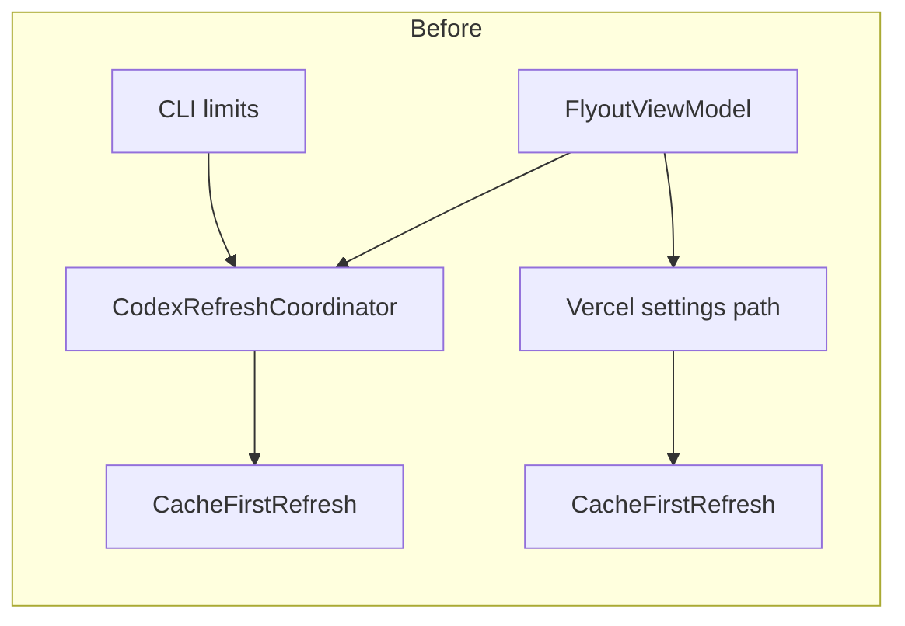
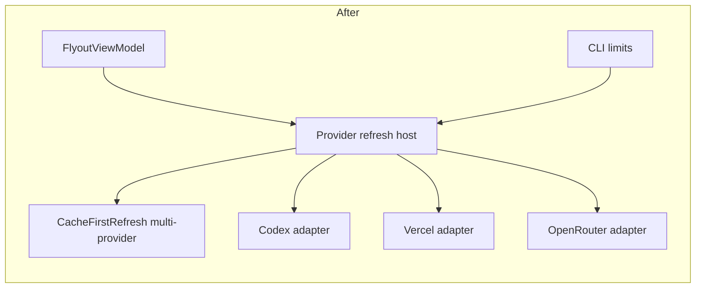

# Architecture review — TokenUsage / WOpenUsage

Date: 2026-07-24

Companion HTML: `.scratch/reports/architecture-wopenusage/index.html`

## Implementation status (2026-07-24)

| Rec | Strength | Status |
| --- | --- | --- |
| F3 Document store protocol | Strong | **done** — `VersionedDocumentFile` shared by Snapshot/Appearance/Layout (+ alert stores) |
| F4 Local usage refresh | Strong | **done** — `LocalUsageRefresh` domain result; App/CLI adapters |
| F1 Multi-provider refresh host | Strong | **done** — `ProviderRefreshHost`; App live + CLI limits |
| F7 Alert host | Medium | **done** — facts builder, decision/settings stores, `AlertHost` intents |
| F2 Flyout sessions | Strong | **done** — `AppearanceSession` + `DashboardLayoutEditor` + `LiveDashboardSession` + `SampleDashboardSession` wired as product path in `FlyoutViewModel` |
| F6 Composition root | Medium | **done** — `AppComposition` / MainPage no longer builds product graph |
| F5 Sample* rename | Medium | **done** — live models under `ViewModels/Dashboard/`; `DashboardMetricItem` (no Sample* live metric type) |
| F8 Local scan helpers | Weak | **done** — `LocalScanBudget`/`LocalScanState` used by Claude/Grok/OpenCode |

Cache partition decision: keep per-provider directories (wayfinder ticket 001).

## Summary

- Project graph (Core / Providers / Platform / Runtime / App / CLI) matches ADR-0001 and is enforced by architecture tests.
- Friction sits **inside** those projects: live refresh is still codex-centric, the flyout ViewModel is a god module, JSON document stores copy the same lock/write skeleton three times, and local usage refresh mixes Core I/O with App projection.
- Shallow modules: per-provider refresh coordinators (thin `CacheFirstRefresh` shells), composition rooted in `MainPage`, and `Sample*` dashboard models used for live UI.
- This review matters now because OpenRouter is client-only, alerts evaluator is unhosted, and each new provider/settings feature currently expands `FlyoutViewModel` and App wiring instead of one deep seam.

## Recommendations

### 1. Deepen multi-provider refresh coordination

**Recommendation strength**: Strong

**Files**

- `src/WOpenUsage.Core/Cache/CacheFirstRefresh.cs`
- `src/WOpenUsage.Runtime.Windows/Codex/CodexRefreshCoordinator.cs`
- `src/WOpenUsage.Runtime.Windows/VercelAiGateway/VercelGatewayRefreshCoordinator.cs`
- `src/WOpenUsage.App/Services/SampleRefreshCoordinator.cs`
- `src/WOpenUsage.App/ViewModels/FlyoutViewModel.cs` (`RefreshDashboardAsync`, live path only runs Codex)
- `src/WOpenUsage.Cli/LocalLimitsCliAccess.cs` (force-refresh codex-only)
- `docs/architecture/ADR-0001-windows-native-baseline.md` (describes multi-provider `RefreshCoordinator`)

**Problem**

ADR-0001 describes one cache-first coordinator that runs active providers in parallel and streams partial results. The implementation is N shallow adapters (`CodexRefreshCoordinator`, `VercelGatewayRefreshCoordinator`, `SampleRefreshCoordinator`) plus App orchestration that only awaits Codex for live refresh. Vercel runs on its own path inside `VercelGatewaySettingsViewModel`. CLI limits force-refresh only knows `codex`. Adding OpenRouter (client already exists) would open a third App/CLI branch.

Deletion test: deleting `CodexRefreshCoordinator` / `VercelGatewayRefreshCoordinator` removes almost no complexity — callers still need store path, resilient wrap, and event consumption. Complexity reappears at every host.

**Solution**

Deepen a single **provider refresh host** module in Core or Runtime:

- one interface: register providers, run cache-first (optionally parallel), stream `CacheFirstEvent`, share `SnapshotStore` policy and operation gates;
- adapters: Codex factory, Vercel runtime, sample fake, future OpenRouter runtime;
- hosts (App, CLI) consume one event stream, not per-provider coordinators.

Keep provider-specific connection services (e.g. Vercel credentials) as adapters behind that host, not as separate refresh graphs.

**Benefits**

- locality: refresh policy, cache write status, and force-refresh live in one module
- leverage: one interface for App flyout, CLI limits, diagnostics, future local API
- tests cross one seam instead of three coordinator + two hosts

**Before / After**

**Dependencies / sequencing**

- Do this before OpenRouter runtime + UI and before multi-provider CLI limits.
- Unblocks alerts fact collection from a single refresh pass.
- Depends on shared snapshot cache layout decision (one file vs per-provider partitions — document in ADR if changed).

**Documentation follow-ups**

- Update ADR-0001 coordination section if parallel semantics or cache partition change
- Add domain term: `provider refresh host`
- Task in workplan / issues when accepted

---

### 2. Split `FlyoutViewModel` into deep surface modules

**Recommendation strength**: Strong

**Files**

- `src/WOpenUsage.App/ViewModels/FlyoutViewModel.cs` (~1490 lines)
- `src/WOpenUsage.App/ViewModels/VercelGatewaySettingsViewModel.cs`
- `src/WOpenUsage.App/ViewModels/DashboardLayoutSessionHistory.cs`
- `src/WOpenUsage.App/MainPage.xaml.cs` (binds many surface concerns)

**Problem**

`FlyoutViewModel` is one shallow module whose interface is the whole product: surface state machine, sample vs live, Codex publish path, local usage, Vercel glue, appearance load/save, language restart, dashboard layout mutations/history, provider status rows, relative time, options navigation. Every new feature edits this file. Tests and UI must understand the whole graph.

**Solution**

Deepen by extracting modules with small interfaces and clear ownership:

| Module | Owns |
| --- | --- |
| `FlyoutSurfaceController` | Empty / Loading / Sample / Options / Unavailable transitions |
| `LiveDashboardSession` | cache-first events → combined live cards + data state |
| `SampleDashboardSession` | sample scenarios + fake refresh |
| `DashboardLayoutEditor` | layout load/mutate/undo/persist (already partly separate stores) |
| `AppearanceSession` | appearance load/save/busy/readonly |
| `OptionsNavigation` | options section stack |

Keep `FlyoutViewModel` as a thin composition of those modules for XAML binding, or replace with a shell ViewModel + child ViewModels if binding needs locality.

**Benefits**

- locality: appearance bugs no longer touch refresh; layout undo no longer touches Codex
- leverage: `LiveDashboardSession` reusable from tests without options UI
- interface shrinks per module; implementation absorbs orchestration helpers

**Before / After**

Before: one class, ~30 private fields, ~25 commands/properties coupled by `NotifyPropertyChangedFor` chains.

After: shell binds children; each child has one refresh or persist path and its own tests.

**Dependencies / sequencing**

- Prefer after recommendation 1 so live session has a single refresh host to bind.
- Can start with `AppearanceSession` and `DashboardLayoutEditor` (already semi-isolated) without waiting on refresh host.
- Do before stuffing alerts into the flyout.

**Documentation follow-ups**

- CONTEXT / domain: name live session vs sample session
- UI architecture note under `docs/architecture/` if binding pattern changes

---

### 3. Deepen versioned document store infrastructure

**Recommendation strength**: Strong

**Files**

- `src/WOpenUsage.Core/Cache/SnapshotStore.cs`
- `src/WOpenUsage.Core/Appearance/AppearanceSettingsStore.cs`
- `src/WOpenUsage.Core/Layout/DashboardLayoutStore.cs`
- Future: alert settings / preference persistence

**Problem**

Three stores reimplement the same module shape: path validation, named mutex, bounded read, schema version probe, quarantine corrupt, temp file + `File.Move` atomic write, `RunLocked`. Domain schema differs; lock/write protocol does not. Alert preferences will likely spawn a fourth copy.

Deletion test: delete one store's `RunLocked` and the complexity reappears identically in the others — pass-through of protocol, not domain depth.

**Solution**

Deepen a **versioned document store** module in Core:

- interface: `LoadAsync` / `SaveAsync` / optional `ProbeAsync` with typed results for missing, loaded, unsupported version, corrupt quarantined, IO, lock timeout;
- implementation: mutex naming, timeout, atomic replace, size/depth limits, quarantine rename;
- adapters: snapshot document, appearance document, layout document, future alert settings.

Keep domain serialization and migration rules in each document adapter.

**Benefits**

- locality: lock timeout and quarantine policy fix once
- leverage: new JSON documents get safety without copying 100+ lines
- tests prove protocol once; adapters test schema only

**Before / After**

Before: three near-copy `RunLocked` / `CreateMutexName` implementations.

After: one protocol module; three thin serializers.

**Dependencies / sequencing**

- Safe to do anytime; low product-surface risk if behavior-preserving.
- Do before alert settings persistence and any new LocalState JSON.

**Documentation follow-ups**

- ADR only if mutex naming or quarantine paths change in a breaking way
- Mention store protocol in ADR-0001 cache section as shared, not snapshot-only

---

### 4. Move local usage refresh behind a Core/Runtime seam

**Recommendation strength**: Strong

**Files**

- `src/WOpenUsage.App/Services/LocalUsageCoordinator.cs`
- `src/WOpenUsage.App/ViewModels/LocalUsageCardProjector.cs`
- `src/WOpenUsage.Core/Usage/UsageRepository.cs`
- `src/WOpenUsage.Core/Usage/IUsageEventSource.cs`
- `src/WOpenUsage.Cli/LocalUsageCliAccess.cs`
- `src/WOpenUsage.App/MainPage.xaml.cs` (wires Claude/Grok/OpenCode sources)

**Problem**

Local usage refresh lives in App: opens repository, classifies snapshot vs windowed sources, reconciles, applies retention, then projects a UI card with `Func<string,string> getString`. CLI reimplements rollup aggregation in `LocalUsageCliAccess` without the coordinator. Ingest policy and UI formatting share one class. Domain depth is real but the seam is in the wrong project and leaks presentation.

**Solution**

Deepen a **local usage refresh** module in Core (or Runtime if path defaults need Windows):

- interface: refresh registered `IUsageEventSource` list → structured result (rollups, per-source diagnostics, overall status, period bounds);
- implementation: repository open, snapshot/windowed ingest rules, retention, diagnostics;
- App adapter: `LocalUsageCardProjector` maps structured result + strings → card;
- CLI adapter: maps same result → JSON/summary without string resources.

**Benefits**

- locality: reconciliation bugs live next to `UsageRepository`, not ViewModels
- leverage: App and CLI share one refresh path
- interface is pure domain; presentation adapters stay thin

**Before / After**

Before: App coordinator returns `LocalUsageCard`; CLI queries repository with different math surface.

After: both call `LocalUsageRefresh.RunAsync` then format.

**Dependencies / sequencing**

- Independent of refresh host; can ship in parallel.
- Helps provider status rows and heatmaps stay fed from one result type.

**Documentation follow-ups**

- Domain term: distinguish **local usage refresh** from **provider refresh**
- Update ADR usage section if repository open modes become part of the interface

---

### 5. Promote live dashboard models out of `Sample*`

**Recommendation strength**: Medium

**Files**

- `src/WOpenUsage.App/ViewModels/Sample/SampleDashboardModels.cs`
- `src/WOpenUsage.App/ViewModels/LiveDashboardComposer.cs`
- `src/WOpenUsage.App/ViewModels/CodexDashboardProjector.cs`
- `src/WOpenUsage.App/ViewModels/VercelGatewayCardProjector.cs`
- `src/WOpenUsage.App/ViewModels/LocalUsageCardProjector.cs`
- XAML bindings to `SampleProviderCard`, `SampleQuotaWindow`, etc.

**Problem**

Live Codex, Vercel, and local spend compose into `SampleDashboardSnapshot` / `SampleProviderCard`. Sample mode and production UI share the same types. The name says sample; the depth is the real dashboard projection. Callers must know that "sample" means "card model." Naming leak across the seam.

**Solution**

Deepen a **dashboard projection** module with neutral names (`DashboardSnapshot`, `ProviderCard`, `QuotaWindow`, `SpendSlice`). Sample mode becomes one adapter that fills the same model from fake scenarios. Live composers already almost do this via `LiveDashboardComposer`.

**Benefits**

- locality: projection rules stop living under a Sample folder
- leverage: one card model for sample, live, and design QA
- reduces false “sample-only” mental model for new contributors

**Dependencies / sequencing**

- Best after or with recommendation 2 (session split) to avoid a mega-rename in the god ViewModel.
- Pure rename + move is acceptable if types stay shape-compatible.

**Documentation follow-ups**

- PRODUCT-SPEC / design docs: call out dashboard projection vs sample catalog
- No ADR unless serialization of these models is introduced

---

### 6. Extract App composition root from `MainPage`

**Recommendation strength**: Medium

**Files**

- `src/WOpenUsage.App/MainPage.xaml.cs` (constructs coordinators, stores, sources, debug Vercel fakes)
- `src/WOpenUsage.App/Program.cs` / `App.xaml.cs`
- Debug helpers embedded in `MainPage` (`DebugVercelCredentialStore`, etc.)

**Problem**

`MainPage` is both view and composition root: LocalFolder paths, source list, coordinators, layout/appearance stores, optional debug Vercel doubles. Composition knowledge is hard to test and hard to reuse (e.g. secondary window, headless smoke). Deletion of page construction logic would force reassembly in every host.

**Solution**

Deepen an **App composition** module (factory or small builder):

- inputs: local data root, clock, optional debug switches;
- outputs: fully wired `FlyoutViewModel` (or session graph) + disposable refresh host;
- `MainPage` only receives the ViewModel and handles view concerns (theme, animation, measure root).

**Benefits**

- locality: path layout and provider registration in one place
- leverage: UI tests and debug modes swap adapters without page code
- keeps view code about interaction, not product graph

**Dependencies / sequencing**

- Natural follow-on to recommendations 1 and 4 (those produce the objects the factory wires).
- Debug Vercel doubles move to test/debug adapters, not nested private classes on the page.

**Documentation follow-ups**

- ADR-0001 “UI y ViewModels” bullet on composition edge
- Evidence note for ticket wiring when factories change

---

### 7. Design alert host seam before UI wiring

**Recommendation strength**: Medium

**Files**

- `src/WOpenUsage.Core/Alerts/AlertEvaluator.cs` (pure, deep)
- `src/WOpenUsage.Core/Alerts/AlertFacts.cs`, `AlertCandidate.cs`, `AlertConditionKey.cs`, `AlertSettings.cs`
- Untracked WIP relative to last commit; not yet composed from App
- Future: notification / tray / preference store

**Problem**

`AlertEvaluator` is already a deep pure module. Risk is wiring it the shallow way: call from `FlyoutViewModel` after each publish, with ad-hoc fact mapping and no dedupe store. That would couple alerts to UI lifetime and scatter fact extraction across Codex/Vercel/local paths.

**Solution**

Before UI:

1. **Alert facts builder** module: `ProviderSnapshot` / `ProviderOutcome` / freshness → `ProviderAlertFacts`.
2. **Alert decision store** module: remember fired condition keys / snooze across sessions (document store from recommendation 3).
3. **Alert host** module: on refresh completion, evaluate, filter already-notified, emit notification intents.
4. UI and tray become adapters for intents.

**Benefits**

- locality: threshold policy stays in Core; hosts only present
- leverage: same host for tray toast, flyout badge, CLI doctor
- keeps `FlyoutViewModel` from growing another 200 lines

**Dependencies / sequencing**

- Depends on recommendation 1 for multi-provider facts in one pass (or facts builder accepts partial inputs).
- Settings persistence benefits from recommendation 3.
- Do not block pure evaluator tests; block only host integration on seams above.

**Documentation follow-ups**

- Domain terms: alert candidate, condition key, facts
- ADR if notification delivery chooses a specific Windows API with trade-offs

---

### 8. Shared local scan limits (optional deepen, not full parser merge)

**Recommendation strength**: Weak / opportunistic

**Files**

- `src/WOpenUsage.Providers/Claude/ClaudeUsageEventSource.cs` (~640 lines)
- `src/WOpenUsage.Providers/Grok/GrokUsageEventSource.cs` (~753 lines)
- `src/WOpenUsage.Providers/OpenCode/OpenCodeUsageEventSource.cs` (~648 lines)

**Problem**

Sources share constructor patterns (max files/bytes, grouping TZ, root unavailable → `NoData`) and scan partial flags, but parsers and file shapes differ. Full unification would be shallow abstraction over unlike formats.

**Solution**

Extract only repeated **scan budget** / diagnostic helpers if a fourth source lands. Keep parsers as deep provider modules. Do not force a common parser interface beyond `IUsageEventSource`.

**Benefits**

- locality stays with each parser for format bugs
- small leverage on limits and diagnostics only

**Dependencies / sequencing**

- After recommendation 4 so diagnostics type is stable
- Skip until a new local agent source is scheduled

**Documentation follow-ups**

- None unless a shared helper module is added

---

## Suggested execution order

1. **Document store infrastructure (rec 3)** — lowest product risk, stops fourth-copy stores (alerts/settings).
2. **Local usage refresh seam (rec 4)** — App/CLI already diverge; pure domain move with projector adapter.
3. **Multi-provider refresh host (rec 1)** — unblocks OpenRouter, multi-provider CLI, unified alerts facts.
4. **Alert host design (rec 7)** — after refresh host + document store; before UI.
5. **Split FlyoutViewModel (rec 2)** — peel Appearance + Layout first; then Live/Sample sessions on top of refresh host.
6. **App composition root (rec 6)** — once sessions and hosts exist, MainPage stops building the graph.
7. **Sample → dashboard model rename (rec 5)** — mechanical deepen after split to avoid double churn.
8. **Scan helpers (rec 8)** — only when the next local source lands.

## Documentation fan-out

Pending acceptance (step 3 of architecture skill). When accepted:

- `CONTEXT.md` or domain section: provider refresh host, local usage refresh, dashboard projection, alert facts/host
- ADR: only for cache partition change, alert delivery, or composition ownership moves that surprise future agents
- Task tracker: `.scratch/wopenusage/issues/` or `docs/architecture/WORKPLAN.md` linking each accepted rec back here
- Keep this file as the index; update status of accepted/rejected/deferred decisions in place

## Evidence notes

| Observation | Evidence |
| --- | --- |
| Project graph matches ADR | `tests/WOpenUsage.Architecture.Tests/ArchitectureRules.cs`, ADR-0001 |
| FlyoutViewModel size | ~1490 lines; owns surface, layout, appearance, sample, live, vercel |
| Live refresh only awaits Codex | `FlyoutViewModel.RefreshDashboardAsync` uses `_codexRefreshCoordinator` when `scenario is null` |
| Per-provider coordinators are thin | `CodexRefreshCoordinator` ~35 lines wrapping `CacheFirstRefresh` |
| CLI limits codex-only | `LocalLimitsCliAccess` early-return non-codex; force path constructs Codex only |
| Triple store protocol | `RunLocked` + mutex + atomic move in Snapshot/Appearance/Layout stores |
| Local usage in App | `App/Services/LocalUsageCoordinator.cs` returns `LocalUsageCard` via projector |
| OpenRouter incomplete | `OpenRouterClient` only; no `IProviderRuntime` / Runtime host |
| Alerts pure, unhosted | `Core/Alerts/*` evaluator; no App references yet |
| Sample models used live | `LiveDashboardComposer`, `CodexDashboardProjector` → `SampleProviderCard` |

## Out of scope / non-findings

- Platform tray/process interop: deep modules with real Windows adapters; no change urged.
- `ResilientProviderRuntime`: earns keep (backoff, single-flight); keep as decorator.
- Provider project isolation and Core net10.0 purity: already enforced; preserve.
- Full rewrite of Claude/Grok/OpenCode parsers: rejected as shallow unify (rec 8).
