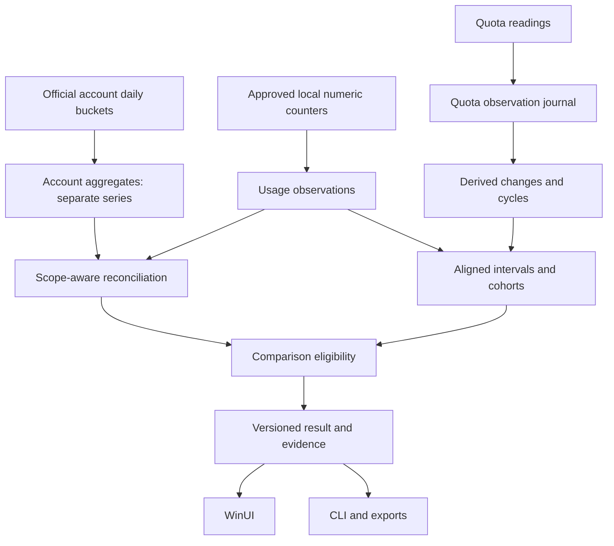

# RFC: reliable longitudinal usage comparisons

**Status:** proposed; acceptance of this document does not activate any feature. **Baseline:** `27d36e2b95aeb8ef4111f02233143ca6e2e87aaf`. See [audit](AUDIT.md) for evidence and [backlog](BACKLOG.md) for delivery.

## 1. Product questions

Separate three intentions: descriptive A/B totals; drift of the same observed model across time; and selection between different models doing the same evaluated work. They require different eligibility rules. Model equality is a control for drift and the experimental variable for model selection.

Non-goals: uncovering a private quota formula, equating API value with subscription billing, judging answer quality from token count, collecting conversation content, installing a mandatory daemon/cloud database, consuming reset credits, or running paid evaluations without an explicit opt-in.

## 2. Architecture and boundaries

Keep existing C#/WinUI/SQLite. Place pure policies, cohort definitions and calculations in Core; provider adapters produce permitted numeric observations; Presentation formats; App orchestrates; CLI consumes the same result. Prefer a few cohesive modules to a generic analytics platform.



Overlapping local/account series must never be summed as independent activity. An account summary can cover unseen clients. A separate app-server instance is not automatically a global observer of every other thread/client. Treat source scope as part of the adapter contract, not a UI guess. [Official protocol](https://learn.chatgpt.com/docs/app-server).

## 3. Observation contracts

Names are design proposals; do not assume these tables already exist.

### UsageObservation

| Field group | Required meaning |
|---|---|
| Identity | Source key, local observation ID, source generation and measurement revision; stable across retries. |
| Time | Actual event time or known interval, source observation time, ingestion time, source timezone/day definition. |
| Precision | Request, turn, cumulative delta, session aggregate, daily aggregate, or unknown; exact/bounded/aggregate/unknown temporal precision. |
| Attribution | Direct, counter delta, account summary, legacy proportional allocation, or unknown. |
| Model | Requested and observed model, original permitted identifier and canonical alias separately; never infer an internal backend revision. |
| Configuration | Available effort, speed, service tier, numeric context size and client version; absent stays absent. |
| Tokens | Disjoint normalized categories and per-field availability; source semantics/version retained. |
| Cost | Existing CostObservation plus financial meaning: verified charge, client estimate, catalog API-equivalent value, unknown. |
| Optional correlation | Local pseudonymous session/task/project references under a reviewed policy, not command text or filesystem paths. |

A cumulative delta can cover several calls. Store its actual granularity; do not label the event count as requests. An unexposed reasoning/cache counter is not a measured zero. Store only allowlisted numeric/configuration projections, never raw conversation payloads for future analysis.

### AccountUsageAggregate

Represent the interval and provider day definition explicitly. Do not stamp it at noon. Keep account-level totals and provenance independent of local model observations. A signed discrepancy is meaningful only for aligned coverage, units, timestamps and scopes. It does not reveal quota attribution and must not be distributed proportionally over local models.

### QuotaObservation

Include provider, metered pool identity, window role, local profile epoch, entitlement/capacity epoch when known, source/received times, raw used/limit/units when available, meter resolution, expected reset, duration, source version and freshness. Keep semantics explicit: fixed, activity-anchored, rolling, replenishing bucket, or unknown.

A percentage does not reveal its absolute capacity. Changing capacity can change intensity without changing the model. Unknown profile/entitlement identity must remain a comparison limitation. Never obtain identities by copying another application's private credentials. A user-selected local profile is an acceptable explicit grouping.

Order complete snapshots at provider level before reconciling metric membership. Persist enough ordering metadata even for a complete empty snapshot. Archive inactive pools; do not erase their histories. Distinct pool IDs stay distinct when their readings happen to coincide. Preserve known aliases through an explicit mapping.

### QuotaChange and CycleMeasurement

Classify observed/reconstructed consumption, replenishment, inferred scheduled reset, officially evidenced reset, capacity change, correction and unknown change. Reference supporting observations and method version. When the instant is unknown, store a bounded interval between bracketing readings rather than an exact time.

Separate lifecycle (open/closed), boundary evidence, observed coverage, largest gap, freshness, token attribution, pool alignment and data watermark. Multiple missed windows are an unknown span, not one long fully observed cycle. A postponed reset expectation needs new evidence before closing a cycle. Do not fabricate intermediate resets.

### Quota membership

Represent usage-to-pool membership as a relation with evidence, potentially many-to-many: one activity can affect both a short and a weekly allowance. Percentages from distinct pools cannot be added. If the selected pool's activity cannot be isolated, disable model-specific quota intensity while retaining descriptive token and quota views.

### ComparisonDefinition and ComparisonResult

Freeze intention, A/B filters, intervals, equal-exposure policy, included/excluded observations, source/measurement revisions, eligibility version and optional fixed pricing reference. Result fields carry value, unit, evidence references and reasons, not only a global success badge. Independent units are tasks/sessions/cycles, not tokens.

## 4. Eligibility and metrics

| Condition | Descriptive view | Normalized model quota claim |
|---|---|---|
| Daily aggregate intersecting part of a cycle | Show whole supported aggregate separately. | Block; no invented prorating. |
| Token scope differs from quota scope | Parallel labeled series. | Block attribution. |
| Different/unknown entitlement or pool | Show context. | Block or state not identifiable. |
| Cycle closed with gaps/missing boundaries | Show observed quantities and limits. | Withhold exact intensity. |
| Same configuration, aligned evidence | Show matched exposure. | Conditionally comparable, never causal proof by itself. |
| Different cache/context/effort | Show changed factors. | Stratify or mark confounded. |
| Parser/catalog changed | Original and recomputed revisions. | No silent cross-revision comparison. |
| Fine evidence expired/read failed | Show retained summary/last reliable view. | Null with typed reason, never exact zero. |

Suggested reasons: `aggregate-timing`, `pool-membership-unknown`, `scope-mismatch`, `entitlement-unknown`, `observation-gap`, `boundary-uncertain`, `source-stale`, `measurement-revision-mismatch`, `history-unavailable`, `evidence-expired`, `below-meter-resolution`. Keep reason codes stable in machine output. Eligibility is not a statistical confidence score.

For valid aligned intervals:

```text
I = 1,000,000 * consumed_quota_points / corresponding_tokens
E = corresponding_tokens / consumed_quota_points
relative_change_I = 100 * (I_B / I_A - 1)
```

I is percentage points of a particular allowance per million corresponding tokens; E is tokens per percentage point. A 1M-token baseline consuming 20 points versus 30 points gives +50% intensity and -33.3% inverse efficiency, with unchanged token volume. Use explicit A=baseline, B=current direction everywhere.

No positive denominator means no ratio. No observed quota movement at coarse resolution is not free use. A measured zero, unknown field, rounded observation, no activity and missing data must remain distinct.

For a fully known sequence 0→40→20→60, consumption is 80 points, replenishment 20, final meter 60. Do not universally sum positive differences: rounding, rolling expiration, simultaneous consumption/refill and unobserved resets require provider-specific handling. A lower-bound label is defensible only under stated assumptions; unmodeled noise can invalidate even that bound. When observation begins mid-cycle, align tokens to the observed baseline rather than charging earlier quota to later events.

Show input/cache-read/cache-write/output/reasoning composition. For the existing disjoint input contract, cache-read fraction uses `cacheRead / (input + cacheRead + cacheWrite)`, not output-inclusive total. Tokens are not a universal unit of completed work across models.

## 5. Comparisons across time

Default to equal elapsed exposure from an evidenced reset, such as the first 60 minutes, and a common settled-data watermark. A running cycle remains provisional. Compare only the common overlap when delayed data prevents equal coverage; disclose excluded exposure. Use a UTC storage timeline and explicit display timezone; DST and provider day boundaries need tests.

For observational drift, require enough common support in model/configuration/workload strata. Show the excluded fraction and the largest confounders. A result may say 'observed change remains unexplained'; do not force every difference into an invented explanatory waterfall. Different hour-of-day usage is descriptive unless other conditions are controlled. Do not cherry-pick only periods supporting a suspicion.

## 6. Monetary comparisons and useful work

Keep recorded cost separate from a recalculation at fixed reference prices. Preserve catalog evidence, effective date and host billing scope. A daily total cannot recover per-request context tiers or intraday price changes; coverage remains partial. Where granular pricing is unavailable, show a bound/unknown rather than pricing a day's aggregate as one large request.

For compatible quantity/rate vectors, one declared decomposition is:

```text
C_B - C_A = sum(p_A * (x_B - x_A)) + sum(x_B * (p_B - p_A))
```

The first term includes volume and composition at A's rates; the second is price change at B's quantities. The order is a declared accounting choice, not a unique causal explanation. Never use API prices as private quota multipliers.

For model selection, record optional accepted-task outcomes, retries, failures and elapsed time. Compare total resource cost per accepted task while counting failed attempts. A commit, edit or one-shot response is not proof of quality. Use versioned tasks and acceptance criteria, alternating/randomizing model order within blocks and separating warm/cold cache. No benchmark executions or payments are authorized by this documentation PR.

Statistical intervals need independent tasks/sessions/cycles and dependence-aware resampling, not a sample size equal to token count. Calibrate drift alerts on null and known-change series, practical effect thresholds and repeated testing. Two cycles and an arbitrary 10% threshold do not establish a provider policy change.

## 7. Storage, migration and retention

Fix history-preservation defects before new analytics. A newer parser is not a supersession proof. Retire a known obsolete representation only with an explicit versioned supersession rule and either verified replacement or a declared invalid-data exclusion. Source failure/no-data cannot authorize replacement. Preserve as-recorded evidence or a safe revision/snapshot sufficient for report replay.

Daily rollups can outlive fine events. Record aggregate-only partitions and never rebuild them from partial surviving events. A no-op prune performs no historical rewrite. For actual corrections, select affected partitions and rebuild only when complete source evidence is available; otherwise retain a separate correction/provenance record. Avoid repeated full-history rebuilding per batch.

Observation writes and checkpoint advancement need recoverable atomicity: crash before/after either operation cannot lose or duplicate events. Keep source generation/rotation handling and stable dedup keys. Do not hash arbitrary content or timestamps as a replacement for source identity.

Migrate incrementally with a backup/recovery procedure, repeat-run idempotence, schema-too-new protection and explicit legacy precision. Do not turn old noon timestamps into exact events. Reprocess original logs only when still available and policy-permitted; report before/after totals, exclusions and revision. Fine evidence expiration changes eligibility, not the past numerical meaning of an exported comparison.

## 8. Collection, privacy and lightweight operation

Do not introduce cloud infrastructure or a mandatory always-on service. Reuse the existing host lifecycle; when collection is off, record the gap. Closing a window does not itself establish ongoing collection. Use bounded incremental reads, adaptive authorized polling/backoff and coalescing; do not spawn an app-server per second or rescan entire logs per chart interaction.

A constant meter can be compressed only while retaining actual observation times/coverage. Silence is not a zero sample. Limit writes, query only selected ranges, and use projected aggregates for charts. Performance acceptance is to measure idle CPU/memory, ingest throughput, p95 query latency, storage growth and cancellation against the same hardware/fixture baseline; do not invent measured budgets. Establish explicit numeric budgets before enabling higher-frequency collection.

Optional Claude OpenTelemetry requires a source/policy review, local configuration consent, an allowlist before persistence, bounded payloads, backoff, counter temporality/restart handling and a single authoritative representation per activity. Existing OTel endpoints must not be overwritten. Standard attributes can include account IDs/email and custom resource attributes; discard them, plus prompts, responses, commands, paths and tool content. Numeric session/task linkage must be separately approved. [Official monitoring](https://code.claude.com/docs/en/monitoring-usage).

Preview exports, redact paths/identifiers, version schemas and preserve units/limitations. CSV exports must handle formula-like text safely if added. Retain separate MSIX/portable stores. No original third-party source data is deleted by TokenUsage. No authentication or provider scope is broadened by this RFC.

## 9. UX and release gates

Keep the tray a quick view: current quota, next expected reset, freshness, and a link to evidence. The detailed comparison surface has A/B selectors, intention, exposure, primary metric and an evidence drawer. Distinguish resets from replenishments; show unobserved spans instead of continuous lines through gaps. A blocked normalized metric explains why while retaining safely labeled descriptions. Preserve selection across refresh and distinguish history-read errors from genuinely empty history.

The previous conversation's HTML comparison lab is a synthetic exploratory prototype, not a production WinUI component or production test oracle. This PR's RFC and fixtures stand alone without requiring that artifact.

Implementation must satisfy the repository's contributor-testing guide, targeted C# fixtures, parser→storage→cycle→report replay, migration/retention composition tests, CLI/UI parity and packaged Windows checks. Do not call roadmap tickets done merely because this RFC is merged.
